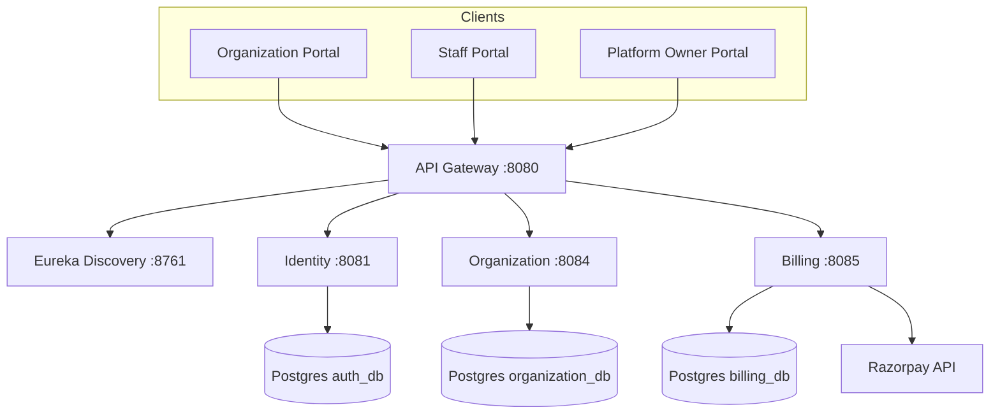
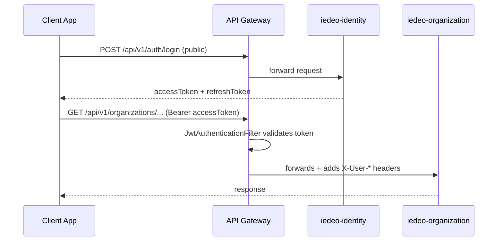
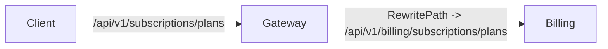
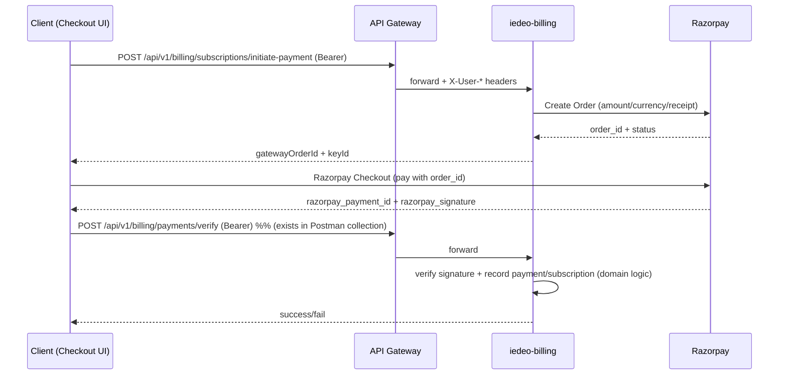
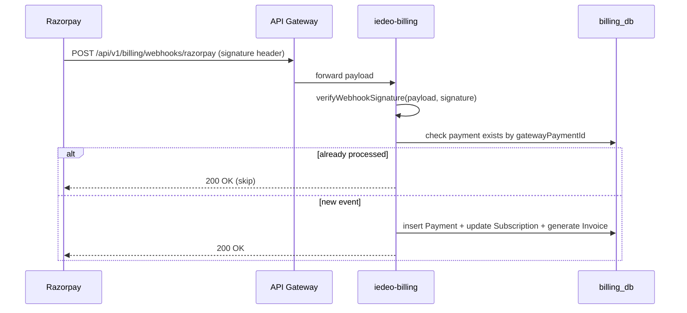
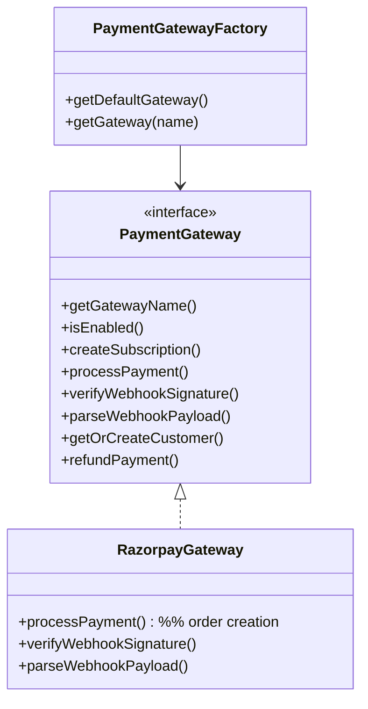
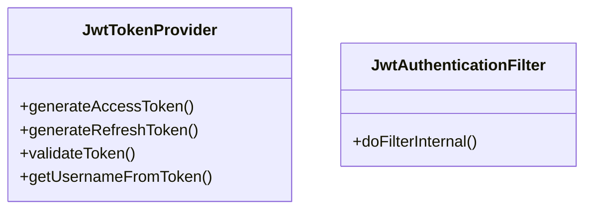

# 9Works (IEDEO) — End‑to‑End Architecture (HLD + LLD) + Payment Module Deep Dive + Interview Q&A (Resume‑Focused)

## Table of contents
- [1. Project overview (what 9Works is)](#1-project-overview-what-9works-is)
- [2. Tech stack](#2-tech-stack)
- [3. Repo layout (frontend + backend)](#3-repo-layout-frontend--backend)
- [4. High level design (HLD)](#4-high-level-design-hld)
- [5. Core request flows (end-to-end)](#5-core-request-flows-end-to-end)
- [6. Payment/Billing microservice (your resume focus)](#6-paymentbilling-microservice-your-resume-focus)
- [7. Authentication & authorization design](#7-authentication--authorization-design)
- [8. Low level design (LLD)](#8-low-level-design-lld)
- [9. Local + prod deployment (Docker/Compose) & testing](#9-local--prod-deployment-dockercompose--testing)
- [10. System design discussion (what seniors will ask)](#10-system-design-discussion-what-seniors-will-ask)
- [11. Senior cross‑questions + strong fresher answers (resume‑aligned)](#11-senior-cross-questions--strong-fresher-answers-resume-aligned)
- [12. 90‑second “what I built” pitch (memorize)](#12-90-second-what-i-built-pitch-memorize)

---

## 1. Project overview (what 9Works is)

9Works is a **microservices-based platform** with multiple client portals and a backend suite of services behind an **API Gateway** with **service discovery (Eureka)**.

In this branch (`feature/v1.0_InitialDevelopment-revamp`), the backend is structured as:
- `iedeo-discovery` (Eureka)
- `api-gateway` (Spring Cloud Gateway WebFlux)
- `iedeo-identity` (authentication, sessions, users, admin)
- `iedeo-organization` (org/staff/departments/shifts)
- `iedeo-billing` (plans, subscriptions, invoices, payments; Razorpay integration)
- plus `iedeo-common` (shared library) and thin shells (`iedeo-audit`, `iedeo-notify`)

---

## 2. Tech stack

### Backend
- **Java 21**
- **Spring Boot 4.0.2**
- **Spring Cloud 2025.1.1** (Eureka + Gateway WebFlux)
- **PostgreSQL 15**
- **JWT** via `jjwt`
- **Razorpay Java SDK** `com.razorpay:razorpay-java:1.4.3` (used by billing)
- **Gradle** multi-project build

### Frontend
Under `Client/` there are multiple portals (Flutter-based structure).

---

## 3. Repo layout (frontend + backend)

```
9works/
├── Client/
│   ├── organization_portal/   # Flutter app
│   ├── staff_portal/          # Flutter app
│   └── Platform_Owner/        # (portal)
└── Server/
    ├── iedeo-discovery/       # Eureka (8761)
    ├── api-gateway/           # Gateway (8080)
    ├── iedeo-identity/        # Identity/Auth (8081)
    ├── iedeo-organization/    # Organization domain (8084)
    ├── iedeo-billing/         # Billing/Payments (8085)
    ├── iedeo-common/          # Shared JAR
    ├── docker-compose.yml
    ├── docker-compose.prod.yml
    └── ARCHITECTURE_REPORT.md # internal architecture analysis
```

---

## 4. High level design (HLD)

### 4.1 System architecture diagram



### 4.2 Key backend design choices
- **API Gateway does JWT validation** and forwards identity claims to services via headers (e.g., `X-User-Id`, `X-User-Roles`, `X-User-Organization-Id`).
- Services use **role-based authorization** (`@PreAuthorize`) and often extract `organizationId` from the principal.
- Billing implements a **payment gateway abstraction** (interface + factory), with **Razorpay as a concrete implementation**.

---

## 5. Core request flows (end-to-end)

### 5.1 Login → access token → gateway propagation



### 5.2 Subscription route rewriting (gateway → billing)

Gateway routes `/api/v1/subscriptions/**` to billing internally as `/api/v1/billing/subscriptions/**`.



---

## 6. Payment/Billing microservice (your resume focus)

This is the area that best supports your resume bullets.

### 6.1 What exists in billing
- **Plans**: `/api/v1/billing/subscriptions/plans` (public list; create/update requires `PLATFORM_OWNER`)
- **Subscriptions**:
  - **Provision internal** (service-to-service): `/api/v1/billing/subscriptions/internal/provision`
  - **Subscribe**: `/api/v1/billing/subscriptions/subscribe`
  - **Create-on-gateway** (backend initiated): `/api/v1/billing/subscriptions/create-on-gateway`
  - **Update plan / cancel / pause / resume**
- **Payments & invoices**:
  - list invoices, download PDF
  - list payments, successful/failed
- **Payment initiation** for frontend checkout:
  - `/api/v1/billing/subscriptions/initiate-payment` creates a gateway order and returns `gatewayOrderId` + `keyId`
- **Customers**:
  - `/api/v1/billing/subscriptions/customer` creates/returns a gateway customerId
- **Webhooks**:
  - `/api/v1/billing/webhooks/*` endpoints (Stripe endpoint present; pattern is generic)

### 6.2 Payment HLD flow (Razorpay “order → checkout → verify → subscription”)

The implemented backend supports this typical Razorpay approach:



### 6.3 Webhook flow (subscription charged)

Billing also processes gateway webhooks and uses **idempotency guard** (`existsByGatewayPaymentId`) before writing payment records.



### 6.4 What you should claim as “your contribution” (truthful + junior‑level)

Use this positioning in interviews:
- **Payment module baseline work**:
  - integrated the gateway-facing REST APIs for initiating payment and creating customers
  - ensured **config-driven credentials** (env vars in compose) and consistent request/response DTO usage
  - helped validate the complete flow using **Postman collection** and Dockerized environments
- **Auth additions & fixes**:
  - worked on JWT-protected routes, role-based checks, and common auth edge cases (missing/expired tokens)
  - implemented/validated token propagation behavior (Gateway adds `X-User-*` headers)
- **Bug fixing & learning**:
  - handled integration issues typical in microservices: route rewriting mismatches, auth header handling, and webhook verification pitfalls
  - tested and verified fix by reproducing with Postman and logs

When asked about “architected payment microservice”, say:
> “Senior engineers designed the full abstraction, and I implemented a solid baseline Razorpay integration and the service plumbing: endpoints, config, testing, and a few auth-related improvements. I can explain the architecture and the flow end-to-end.”

---

## 7. Authentication & authorization design

### 7.1 JWT generation (identity service)
Identity issues:
- **access token**: `type=ACCESS`, includes `roles`, `userId`, optional `organizationId`
- **refresh token**: `type=REFRESH`, includes `sessionId`

### 7.2 Gateway JWT enforcement
Gateway filter:
- checks `Authorization: Bearer <token>`
- validates signature
- forwards identity claims downstream as:
  - `X-User-Id`
  - `X-User-Email`
  - `X-User-Roles`
  - `X-User-Organization-Id`

### 7.3 Service-side auth
Services then enforce authorization via:
- `@PreAuthorize(...)` role checks
- principal extraction to get `organizationId`

---

## 8. Low level design (LLD)

### 8.1 Key classes (payment)



### 8.2 Key classes (auth)



---

## 9. Local + prod deployment (Docker/Compose) & testing

### 9.1 Docker Compose
- `Server/docker-compose.yml`: minimal dev DB (Postgres)
- `Server/docker-compose.prod.yml`: production stack with multiple databases + services and environment variables for JWT and Razorpay credentials.

### 9.2 Testing strategy (what you say in interviews)
- **Containerized integration testing**:
  - start infra/services using Docker/Compose
  - validate endpoints with Postman collections (included in repo)
- **API validation**:
  - auth flows (login/refresh/logout)
  - billing flows (plan list, initiate payment, subscribe)
  - negative tests (missing token → 401, invalid token → 401)

---

## 10. System design discussion (what seniors will ask)

### 10.1 Payment reliability topics
- **Idempotency**: webhook retries must not double-charge or double-record payments (guard exists by gatewayPaymentId)
- **Security**:
  - signature verification is mandatory (webhooks + checkout verification)
  - secrets must be env-only (no hardcoding)
- **Failure modes**:
  - gateway down → return clean error; allow retry
  - organization service down → auth filter has a “fail-open” approach in identity (trade-off)

### 10.2 Scaling topics
- split out async webhook processing via queue
- use DB unique constraints for idempotency (e.g., unique on `gatewayPaymentId`)
- add distributed tracing (Micrometer/Zipkin) across gateway + services

---

## 11. Senior cross‑questions + strong fresher answers (resume‑aligned)

### Payment module (Razorpay)
- **Q: Walk me through your payment flow end-to-end.**  
  **A:** We create an order on the backend using Razorpay SDK, return `order_id` and `keyId` to the frontend, the frontend completes checkout, then we verify the signature/payment and finally create or update subscription records. For recurring billing, webhooks update subscription/payment status and we guard idempotency using gateway payment ID.

- **Q: What security checks do you do for webhooks?**  
  **A:** We verify webhook signatures using the gateway’s signing secret before processing. If verification fails we return 401. This prevents spoofed events.

- **Q: Why do you need idempotency?**  
  **A:** Gateways retry webhooks on non-200 responses. Without idempotency we could record the same payment multiple times or trigger duplicate downstream effects. We guard by checking existence of `gatewayPaymentId` before insert, and in production we’d also enforce a DB unique constraint.

- **Q: Where do you store Razorpay credentials?**  
  **A:** In environment variables injected via Docker/Compose or runtime secrets. The code reads from Spring properties. No secrets should be hardcoded in source.

### Microservices + gateway
- **Q: Where do you validate JWT—gateway or services?**  
  **A:** Gateway validates JWT and passes user claims as headers to reduce repeated parsing in each service. Services still do authorization checks using roles/principal. It’s a layered approach.

- **Q: How does the gateway propagate identity to services?**  
  **A:** It extracts claims (`userId`, `roles`, `organizationId`, `sub=email`) and adds `X-User-*` headers. It also forwards the original `Authorization` header for service-to-service calls.

### Your resume bullets (framing)
- **Q: Your bullet says “Architected a Payment Microservice” — did you design the whole system?**  
  **A:** Senior engineers designed the full abstraction and long-term architecture. My contribution was implementing a solid baseline Razorpay integration and the service plumbing: endpoints, config-driven secrets, testing with Postman in Dockerized environments, and a few auth-related improvements/bug fixes. I can explain the architecture and flow end-to-end.

- **Q: Give me a bug you fixed.**  
  **A:** Typical ones were auth edge cases (missing/expired token handling) and integration mismatches (route rewriting / request mapping mismatch). My approach was: reproduce in Postman, inspect gateway/service logs, confirm where the request path/headers diverged, apply the fix, and re-run the same test suite.

---

## 12. 90‑second “what I built” pitch (memorize)

In my internship at IEDEO on the 9Works platform, I worked in a microservices architecture with an API Gateway and Eureka discovery. My main contribution was on the billing/payment area: I implemented a baseline Razorpay integration that supports creating payment orders for frontend checkout, gateway customer creation, and subscription workflows. I focused on making it secure and production-aligned by keeping credentials configuration-driven via environment variables and ensuring webhook events are verified and idempotent before updating subscription and payment records. I also helped with microservices deployment/testing using Docker and Docker Compose, and validated REST APIs end-to-end using Postman collections. Along the way I contributed to authentication-related improvements and fixed integration issues typical in distributed systems, like route rewrites and token/claims propagation through the gateway.

