# CareerHubs - Complete Architecture & System Design Document

## Table of Contents
1. [Project Overview](#1-project-overview)
2. [Tech Stack](#2-tech-stack)
3. [High-Level Design (HLD)](#3-high-level-design-hld)
4. [Low-Level Design (LLD)](#4-low-level-design-lld)
5. [Microservices Deep Dive](#5-microservices-deep-dive)
6. [Frontend Architecture](#6-frontend-architecture)
7. [Authentication & Authorization Flow](#7-authentication--authorization-flow)
8. [Database Design](#8-database-design)
9. [API Gateway & Routing](#9-api-gateway--routing)
10. [Feature Flows (End-to-End)](#10-feature-flows-end-to-end)
11. [Deployment Architecture](#11-deployment-architecture)
12. [Key Design Decisions & Trade-offs](#12-key-design-decisions--trade-offs)

---

## 1. Project Overview

**CareerHubs** is a full-stack career growth platform built with a **microservices architecture**. It offers:

| Feature | Description |
|---------|-------------|
| **Resume Builder (LaTeX)** | Pick from professional LaTeX templates, edit in a Monaco code editor, compile to PDF server-side |
| **Resume Builder (Form)** | Form-based resume builder with multiple templates |
| **Resume ATS Analyzer** | Upload a resume PDF, analyze ATS compatibility using Google Gemini AI |
| **DSA Sheet** | Curated coding problems grouped by topic with per-user progress tracking (done/favorite) |
| **Tutorials & Courses** | 25+ tutorial pages covering languages, frameworks, core CS, databases, data science |
| **Roadmaps** | Career roadmaps for different tech roles |
| **Resources** | Curated learning resources and links |
| **Peer Mocks / AI Interview** | AI-powered mock interview preparation (external service) |
| **User Profiles** | User dashboard with DSA progress heatmap, charts, completed questions, favorites |
| **Payments/Donations** | Cashfree payment integration |

**Live URL:** [www.careerhubs.info](https://www.careerhubs.info)

---

## 2. Tech Stack

### Frontend
| Technology | Purpose |
|-----------|---------|
| React 19 | UI library |
| Vite 6 | Build tool & dev server |
| Tailwind CSS 4 | Utility-first CSS |
| Redux Toolkit | Global state management (auth) |
| React Router DOM 7 | Client-side routing |
| Axios + SWR | HTTP client + data fetching with caching |
| Framer Motion | Animations |
| Monaco Editor | LaTeX code editing |
| Chart.js + Recharts | Profile analytics & charts |
| React-PDF + pdf-lib | PDF rendering & manipulation |
| React Markdown | Markdown rendering for tutorials |
| Headless UI + Radix UI | Accessible UI primitives |
| Vercel | Frontend hosting |

### Backend
| Technology | Purpose |
|-----------|---------|
| Java 21 | Language |
| Spring Boot 3.2/3.3 | Microservice framework |
| Spring Cloud 2023.x | Service discovery, gateway, Feign |
| Spring Cloud Netflix Eureka | Service registry & discovery |
| Spring Cloud Gateway | API gateway & request routing |
| Spring Security | Authentication & authorization |
| Spring Data JPA | ORM / database access |
| MySQL 8.0 | Relational database |
| JWT (jjwt 0.11.5) | Token-based authentication |
| Spring Boot Starter Mail | Email verification |
| WebFlux (WebClient) | Non-blocking HTTP for Gemini API |
| pdflatex | LaTeX-to-PDF compilation |
| Docker Compose | Container orchestration |

### External Services
| Service | Purpose |
|---------|---------|
| Google Gemini API | AI-powered resume analysis & content generation |
| Google OAuth 2.0 | Social login |
| Cashfree Payments | Payment processing |
| LiveKit | Real-time video for peer mock interviews |

---

## 3. High-Level Design (HLD)

### 3.1 System Architecture Diagram

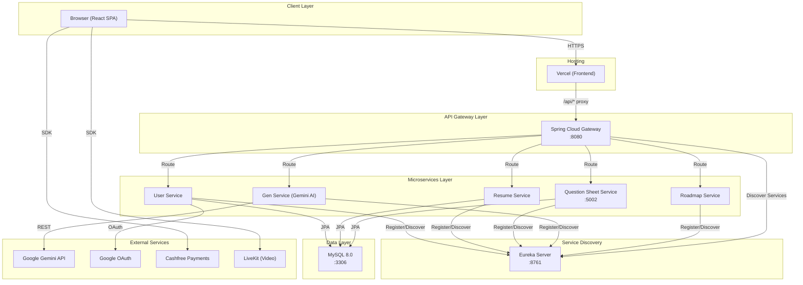
```mermaid
graph TB
    subgraph "Client Layer"
        Browser["Browser (React SPA)"]
    end

    subgraph "Hosting"
        Vercel["Vercel (Frontend)"]
    end

    subgraph "API Gateway Layer"
        Gateway["Spring Cloud Gateway<br/>:8080"]
    end

    subgraph "Service Discovery"
        Eureka["Eureka Server<br/>:8761"]
    end

    subgraph "Microservices Layer"
        US["User Service"]
        RS["Resume Service"]
        QS["Question Sheet Service<br/>:5002"]
        GS["Gen Service (Gemini AI)"]
        RMS["Roadmap Service"]
    end

    subgraph "Data Layer"
        MySQL["MySQL 8.0<br/>:3306"]
    end

    subgraph "External Services"
        Gemini["Google Gemini API"]
        Google["Google OAuth"]
        CF["Cashfree Payments"]
        LK["LiveKit (Video)"]
    end

    Browser -->|HTTPS| Vercel
    Vercel -->|"/api/*" proxy| Gateway
    Gateway -->|Route| US
    Gateway -->|Route| RS
    Gateway -->|Route| QS
    Gateway -->|Route| GS
    Gateway -->|Route| RMS

    US -->|Register/Discover| Eureka
    RS -->|Register/Discover| Eureka
    QS -->|Register/Discover| Eureka
    GS -->|Register/Discover| Eureka
    RMS -->|Register/Discover| Eureka
    Gateway -->|Discover Services| Eureka

    US -->|JPA| MySQL
    RS -->|JPA| MySQL
    QS -->|JPA| MySQL

    GS -->|REST| Gemini
    US -->|OAuth| Google
    Browser -->|SDK| CF
    Browser -->|SDK| LK
```

### 3.2 Request Flow (High Level)

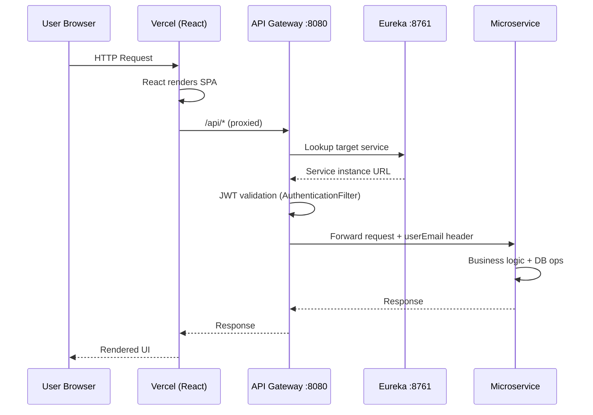
```mermaid
sequenceDiagram
    participant U as User Browser
    participant V as Vercel (React)
    participant G as API Gateway :8080
    participant E as Eureka :8761
    participant S as Microservice

    U->>V: HTTP Request
    V->>V: React renders SPA
    V->>G: /api/* (proxied)
    G->>E: Lookup target service
    E-->>G: Service instance URL
    G->>G: JWT validation (AuthenticationFilter)
    G->>S: Forward request + userEmail header
    S->>S: Business logic + DB ops
    S-->>G: Response
    G-->>V: Response
    V-->>U: Rendered UI
```

### 3.3 Service Port Mapping

| Service | Port | Docker Container |
|---------|------|------------------|
| API Gateway | 8080 | gateway-server |
| Eureka Server | 8761 | eureka-server |
| Question Sheet | 5002 | question-sheet |
| MySQL | 3307 (host) -> 3306 (container) | mysql-db |
| User Service | dynamic | user-service |
| Resume Service | dynamic | resume-service |
| Gen Service | dynamic | gen-service |
| Roadmap Service | dynamic | roadmap-service |

---

## 4. Low-Level Design (LLD)

### 4.1 User Service - Class Diagram

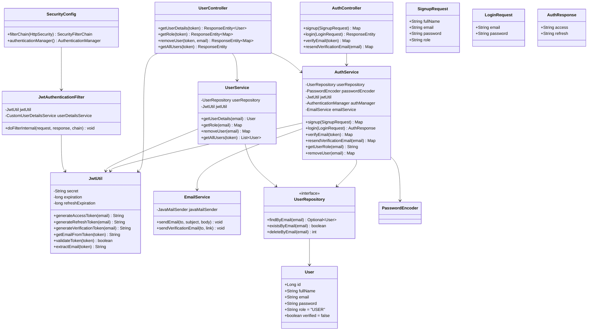
```mermaid
classDiagram
    class User {
        +Long id
        +String fullName
        +String email
        +String password
        +String role = "USER"
        +boolean verified = false
    }

    class AuthController {
        +signup(SignupRequest) Map
        +login(LoginRequest) ResponseEntity
        +verifyEmail(token) Map
        +resendVerificationEmail(email) Map
    }

    class UserController {
        +getUserDetails(token) ResponseEntity~User~
        +getRole(token) ResponseEntity~Map~
        +removeUser(token, email) ResponseEntity~Map~
        +getAllUsers(token) ResponseEntity
    }

    class AuthService {
        -UserRepository userRepository
        -PasswordEncoder passwordEncoder
        -JwtUtil jwtUtil
        -AuthenticationManager authManager
        -EmailService emailService
        +signup(SignupRequest) Map
        +login(LoginRequest) AuthResponse
        +verifyEmail(token) Map
        +resendVerificationEmail(email) Map
        +getUserRole(email) String
        +removeUser(email) Map
    }

    class UserService {
        -UserRepository userRepository
        -JwtUtil jwtUtil
        +getUserDetails(email) User
        +getRole(email) Map
        +removeUser(email) Map
        +getAllUsers(token) List~User~
    }

    class JwtUtil {
        -String secret
        -long expiration
        -long refreshExpiration
        +generateAccessToken(email) String
        +generateRefreshToken(email) String
        +generateVerificationToken(email) String
        +getEmailFromToken(token) String
        +validateToken(token) boolean
        +extractEmail(token) String
    }

    class EmailService {
        -JavaMailSender javaMailSender
        +sendEmail(to, subject, body) void
        +sendVerificationEmail(to, link) void
    }

    class JwtAuthenticationFilter {
        -JwtUtil jwtUtil
        -CustomUserDetailsService userDetailsService
        +doFilterInternal(request, response, chain) void
    }

    class SecurityConfig {
        +filterChain(HttpSecurity) SecurityFilterChain
        +authenticationManager() AuthenticationManager
    }

    class UserRepository {
        <<interface>>
        +findByEmail(email) Optional~User~
        +existsByEmail(email) boolean
        +deleteByEmail(email) int
    }

    class SignupRequest {
        +String fullName
        +String email
        +String password
        +String role
    }

    class LoginRequest {
        +String email
        +String password
    }

    class AuthResponse {
        +String access
        +String refresh
    }

    AuthController --> AuthService
    UserController --> AuthService
    UserController --> UserService
    UserController --> JwtUtil
    AuthService --> UserRepository
    AuthService --> JwtUtil
    AuthService --> EmailService
    AuthService --> PasswordEncoder
    UserService --> UserRepository
    UserService --> JwtUtil
    UserRepository --> User
    SecurityConfig --> JwtAuthenticationFilter
    JwtAuthenticationFilter --> JwtUtil
```

### 4.2 Resume Service - Class Diagram

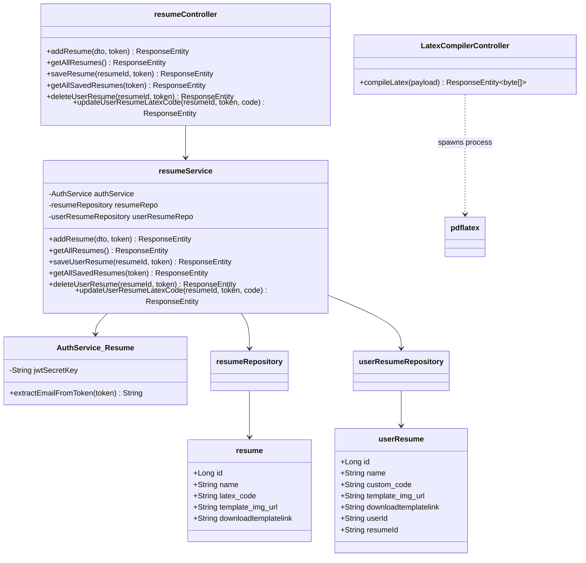
```mermaid
classDiagram
    class resume {
        +Long id
        +String name
        +String latex_code
        +String template_img_url
        +String downloadtemplatelink
    }

    class userResume {
        +Long id
        +String name
        +String custom_code
        +String template_img_url
        +String downloadtemplatelink
        +String userId
        +String resumeId
    }

    class resumeController {
        +addResume(dto, token) ResponseEntity
        +getAllResumes() ResponseEntity
        +saveResume(resumeId, token) ResponseEntity
        +getAllSavedResumes(token) ResponseEntity
        +deleteUserResume(resumeId, token) ResponseEntity
        +updateUserResumeLatexCode(resumeId, token, code) ResponseEntity
    }

    class LatexCompilerController {
        +compileLatex(payload) ResponseEntity~byte[]~
    }

    class resumeService {
        -AuthService authService
        -resumeRepository resumeRepo
        -userResumeRepository userResumeRepo
        +addResume(dto, token) ResponseEntity
        +getAllResumes() ResponseEntity
        +saveUserResume(resumeId, token) ResponseEntity
        +getAllSavedResumes(token) ResponseEntity
        +deleteUserResume(resumeId, token) ResponseEntity
        +updateUserResumeLatexCode(resumeId, token, code) ResponseEntity
    }

    class AuthService_Resume {
        -String jwtSecretKey
        +extractEmailFromToken(token) String
    }

    resumeController --> resumeService
    resumeService --> AuthService_Resume
    resumeService --> resumeRepository
    resumeService --> userResumeRepository
    resumeRepository --> resume
    userResumeRepository --> userResume
    LatexCompilerController ..> pdflatex : spawns process
```

### 4.3 Question Sheet Service - Class Diagram

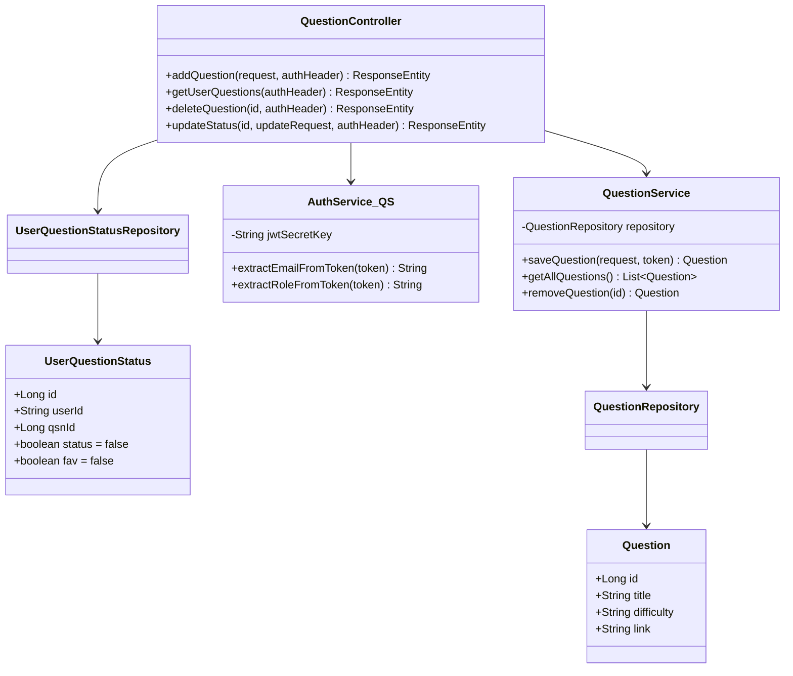
```mermaid
classDiagram
    class Question {
        +Long id
        +String title
        +String difficulty
        +String link
    }

    class UserQuestionStatus {
        +Long id
        +String userId
        +Long qsnId
        +boolean status = false
        +boolean fav = false
    }

    class QuestionController {
        +addQuestion(request, authHeader) ResponseEntity
        +getUserQuestions(authHeader) ResponseEntity
        +deleteQuestion(id, authHeader) ResponseEntity
        +updateStatus(id, updateRequest, authHeader) ResponseEntity
    }

    class QuestionService {
        -QuestionRepository repository
        +saveQuestion(request, token) Question
        +getAllQuestions() List~Question~
        +removeQuestion(id) Question
    }

    class AuthService_QS {
        -String jwtSecretKey
        +extractEmailFromToken(token) String
        +extractRoleFromToken(token) String
    }

    QuestionController --> QuestionService
    QuestionController --> AuthService_QS
    QuestionController --> UserQuestionStatusRepository
    QuestionService --> QuestionRepository
    QuestionRepository --> Question
    UserQuestionStatusRepository --> UserQuestionStatus
```

### 4.4 Gen Service (Gemini AI) - Class Diagram

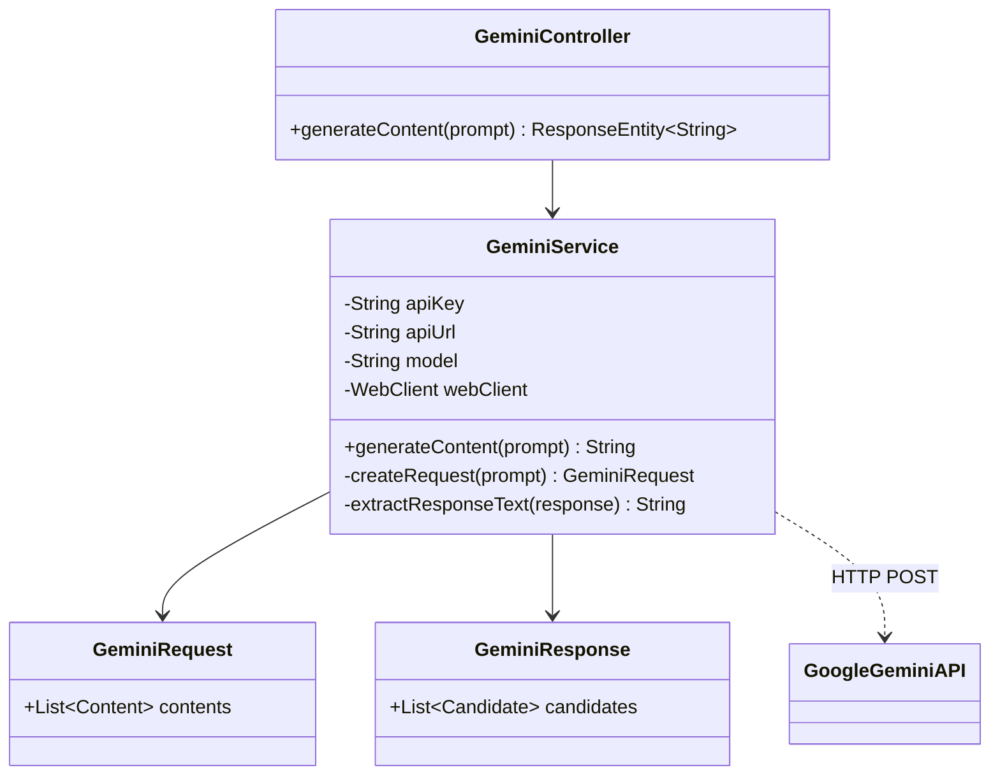
```mermaid
classDiagram
    class GeminiController {
        +generateContent(prompt) ResponseEntity~String~
    }

    class GeminiService {
        -String apiKey
        -String apiUrl
        -String model
        -WebClient webClient
        +generateContent(prompt) String
        -createRequest(prompt) GeminiRequest
        -extractResponseText(response) String
    }

    class GeminiRequest {
        +List~Content~ contents
    }

    class GeminiResponse {
        +List~Candidate~ candidates
    }

    GeminiController --> GeminiService
    GeminiService --> GeminiRequest
    GeminiService --> GeminiResponse
    GeminiService ..> GoogleGeminiAPI : HTTP POST
```

### 4.5 API Gateway - Class Diagram

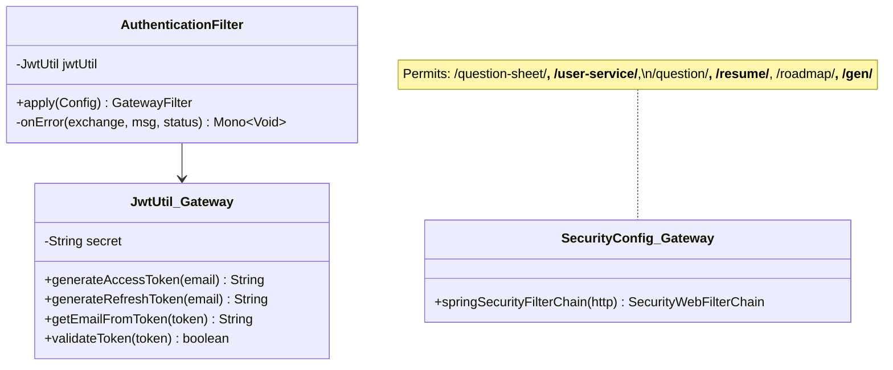
```mermaid
classDiagram
    class AuthenticationFilter {
        -JwtUtil jwtUtil
        +apply(Config) GatewayFilter
        -onError(exchange, msg, status) Mono~Void~
    }

    class JwtUtil_Gateway {
        -String secret
        +generateAccessToken(email) String
        +generateRefreshToken(email) String
        +getEmailFromToken(token) String
        +validateToken(token) boolean
    }

    class SecurityConfig_Gateway {
        +springSecurityFilterChain(http) SecurityWebFilterChain
    }

    AuthenticationFilter --> JwtUtil_Gateway
    note for SecurityConfig_Gateway "Permits: /question-sheet/**, /user-service/**,\n/question/**, /resume/**, /roadmap/**, /gen/**"
```

---

## 5. Microservices Deep Dive

### 5.1 User Service

**Responsibility:** User registration, login, email verification, JWT issuance, user profile management, role-based access control.

**API Endpoints:**

| Method | Endpoint | Auth | Description |
|--------|----------|------|-------------|
| POST | `/api/auth/signup` | Public | Register new user (sends verification email) |
| POST | `/api/auth/login` | Public | Login (returns access + refresh JWT) |
| GET | `/api/auth/verify?token=` | Public | Verify email via token link |
| POST | `/api/auth/resend-verification?email=` | Public | Resend verification email |
| GET | `/api/users/profile` | Bearer JWT | Get logged-in user's profile |
| GET | `/api/users/role` | Bearer JWT | Get user's role |
| DELETE | `/api/users/remove?email=` | Bearer JWT (ADMIN/SUPER_ADMIN) | Delete a user |
| GET | `/api/users/all` | Bearer JWT (ADMIN/SUPER_ADMIN) | List all users |

**Security:**
- Passwords hashed with BCrypt (via Spring Security `PasswordEncoder`)
- Stateless sessions (no server-side session storage)
- JWT filter (`JwtAuthenticationFilter`) intercepts every request except `/api/auth/**`
- Roles: `USER`, `ADMIN`, `SUPER_ADMIN`

### 5.2 Resume Service

**Responsibility:** Manage global resume templates, user-specific saved resumes with custom LaTeX code, compile LaTeX to PDF.

**API Endpoints:**

| Method | Endpoint | Auth | Description |
|--------|----------|------|-------------|
| GET | `/resume/all` | Public | Get all global resume templates |
| POST | `/resume/add` | Bearer JWT (admin only) | Add a new global template |
| POST | `/resume/save/{resumeId}` | Bearer JWT | Save a template to user's collection |
| GET | `/resume/saved` | Bearer JWT | Get user's saved resumes |
| DELETE | `/resume/delete/{resumeId}` | Bearer JWT | Delete a saved resume |
| POST | `/resume/update/custom_code/{resumeId}` | Bearer JWT | Update user's custom LaTeX code |
| POST | `/latex/compile` | Bearer JWT | Compile LaTeX code to PDF |

**LaTeX Compilation Flow:**
1. Receives LaTeX code as JSON `{ "code": "..." }`
2. Writes to temp `.tex` file
3. Spawns `pdflatex` process
4. Reads generated `.pdf` bytes
5. Returns PDF as `application/pdf` binary response
6. Cleans up temp files

### 5.3 Question Sheet Service

**Responsibility:** CRUD for DSA questions, per-user tracking of completion status and favorites.

**API Endpoints:**

| Method | Endpoint | Auth | Description |
|--------|----------|------|-------------|
| POST | `/api/question` | Bearer JWT (ADMIN) | Add a new question |
| GET | `/api/question` | Bearer JWT | Get all questions with user's status |
| DELETE | `/api/question/{id}` | Bearer JWT (ADMIN) | Delete a question |
| PATCH | `/api/question/{id}/status` | Bearer JWT | Update done/favorite status |

### 5.4 Gen Service (Gemini AI)

**Responsibility:** Proxy to Google Gemini API for AI content generation (resume analysis, etc.)

**API Endpoints:**

| Method | Endpoint | Auth | Description |
|--------|----------|------|-------------|
| POST | `/api/gemini/generate` | - | Generate content via Gemini |

### 5.5 Eureka Server

**Responsibility:** Service discovery and registration. All microservices register here on startup. The API Gateway queries Eureka to resolve service instances dynamically.

**Port:** 8761

### 5.6 Roadmap Service

**Responsibility:** Health check endpoint (minimal service, likely serves static/dynamic roadmap data).

---

## 6. Frontend Architecture

### 6.1 Folder Structure

```
client/
├── public/              # Static assets (logos, images)
├── src/
│   ├── app/
│   │   └── store.js     # Redux store configuration
│   ├── auth/
│   │   ├── authService.js    # API calls for auth (login, signup, OAuth, etc.)
│   │   ├── authSlice.js      # Redux slice (async thunks + reducers)
│   │   └── authMiddleware.js # Auto-refresh JWT every 40 minutes
│   ├── components/
│   │   ├── NavBar.jsx        # Global navigation bar
│   │   ├── ProtectedRoute.jsx # Auth guard (redirects to /login)
│   │   ├── Hero.jsx          # Landing page hero section
│   │   ├── FeaturesGrid.jsx  # Feature cards
│   │   ├── Footer.jsx        # Global footer
│   │   ├── problems.jsx      # DSA problems preview
│   │   ├── ResumeAnalysisCharts.jsx # Charts for ATS analysis
│   │   ├── feedback/         # Feedback form components
│   │   └── ...
│   ├── pages/
│   │   ├── Login.jsx         # Login page (email + Google OAuth)
│   │   ├── Register.jsx      # Registration page
│   │   ├── ForgotPassword.jsx
│   │   ├── GoogleCallback.jsx
│   │   ├── profile.jsx       # User dashboard (lazy-loaded tabs)
│   │   ├── dsa.jsx           # DSA sheet page
│   │   ├── roadmap.jsx       # Roadmaps page
│   │   ├── Resources.jsx     # Resources page
│   │   ├── Resume_ATS.jsx    # ATS analyzer (Gemini AI)
│   │   ├── Tutorials.jsx     # Tutorials listing
│   │   ├── payment.jsx       # Cashfree donation modal
│   │   ├── RESUME/
│   │   │   ├── template_list.jsx   # Browse templates
│   │   │   ├── LatexEditor.jsx     # Monaco editor + PDF preview
│   │   │   ├── saved_template.jsx  # User's saved resumes
│   │   │   └── Resume_Form.jsx     # Form-based resume builder
│   │   ├── interview_pages/
│   │   ├── profile_components/     # Profile sub-tabs (lazy)
│   │   └── AboutUS/
│   ├── templates/resume/     # JS template generators
│   ├── tutorial_pages/       # 25+ tutorial pages
│   ├── utils/
│   │   ├── localStorageUtils.js
│   │   └── tutorialLogic.jsx
│   ├── App.jsx              # Root component (routing)
│   ├── config.js            # Environment config
│   └── main.jsx             # Entry point
├── vite.config.js           # Vite config (proxy /api -> backend)
├── vercel.json              # Vercel SPA rewrites
└── package.json
```

### 6.2 State Management Flow

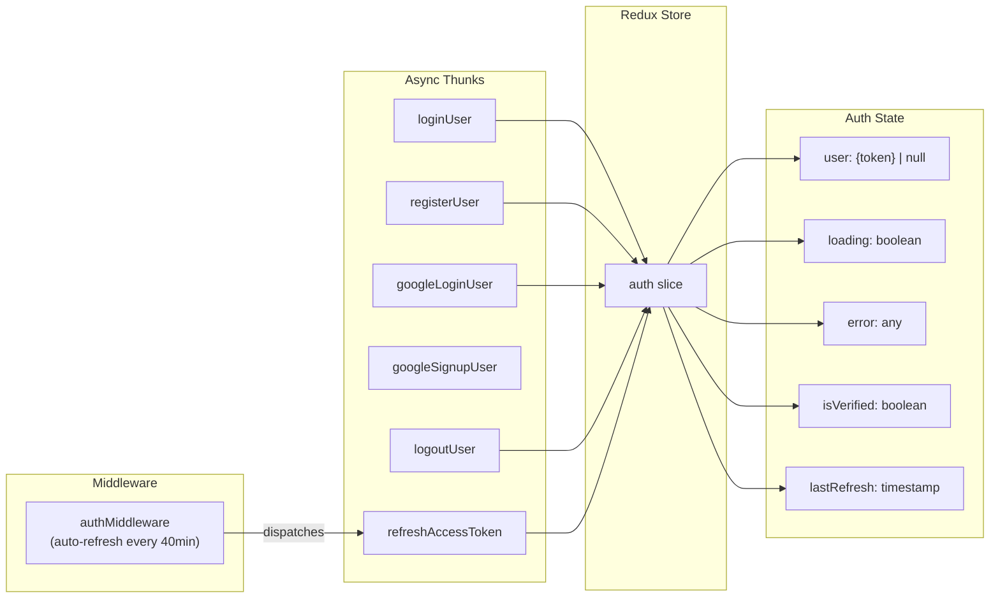
```mermaid
graph LR
    subgraph "Redux Store"
        AS["auth slice"]
    end

    subgraph "Auth State"
        direction TB
        U["user: {token} | null"]
        L["loading: boolean"]
        E["error: any"]
        V["isVerified: boolean"]
        LR["lastRefresh: timestamp"]
    end

    subgraph "Async Thunks"
        LU["loginUser"]
        RU["registerUser"]
        GLU["googleLoginUser"]
        GSU["googleSignupUser"]
        LO["logoutUser"]
        RAT["refreshAccessToken"]
    end

    subgraph "Middleware"
        AM["authMiddleware<br/>(auto-refresh every 40min)"]
    end

    LU --> AS
    RU --> AS
    GLU --> AS
    LO --> AS
    RAT --> AS
    AM -->|dispatches| RAT

    AS --> U
    AS --> L
    AS --> E
    AS --> V
    AS --> LR
```

### 6.3 Routing Map

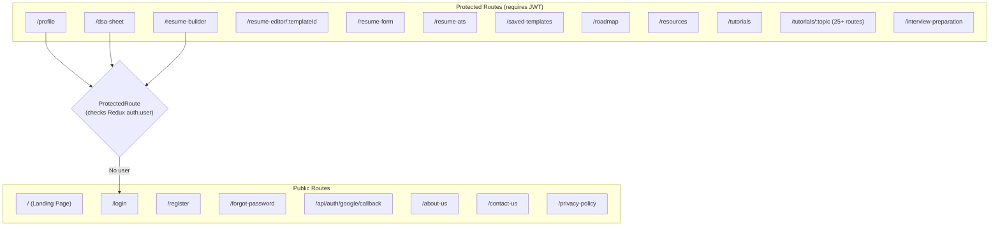
```mermaid
graph TD
    subgraph "Public Routes"
        R1["/ (Landing Page)"]
        R2["/login"]
        R3["/register"]
        R4["/forgot-password"]
        R5["/api/auth/google/callback"]
        R6["/about-us"]
        R7["/contact-us"]
        R8["/privacy-policy"]
    end

    subgraph "Protected Routes (requires JWT)"
        P1["/profile"]
        P2["/dsa-sheet"]
        P3["/resume-builder"]
        P4["/resume-editor/:templateId"]
        P5["/resume-form"]
        P6["/resume-ats"]
        P7["/saved-templates"]
        P8["/roadmap"]
        P9["/resources"]
        P10["/tutorials"]
        P11["/tutorials/:topic (25+ routes)"]
        P12["/interview-preparation"]
    end

    Guard{"ProtectedRoute\n(checks Redux auth.user)"}
    P1 --> Guard
    P2 --> Guard
    P3 --> Guard
    Guard -->|No user| R2
```

### 6.4 API Proxy Configuration

In development, Vite proxies all `/api/*` requests to the backend:

```javascript
// vite.config.js
server: {
  proxy: {
    '/api': {
      target: env.VITE_BACKEND_API,  // e.g. http://localhost:8080
      changeOrigin: true,
      secure: false,
    }
  }
}
```

In production, Vercel handles the proxy/rewrites to the backend server.

---

## 7. Authentication & Authorization Flow

### 7.1 Signup + Email Verification Flow

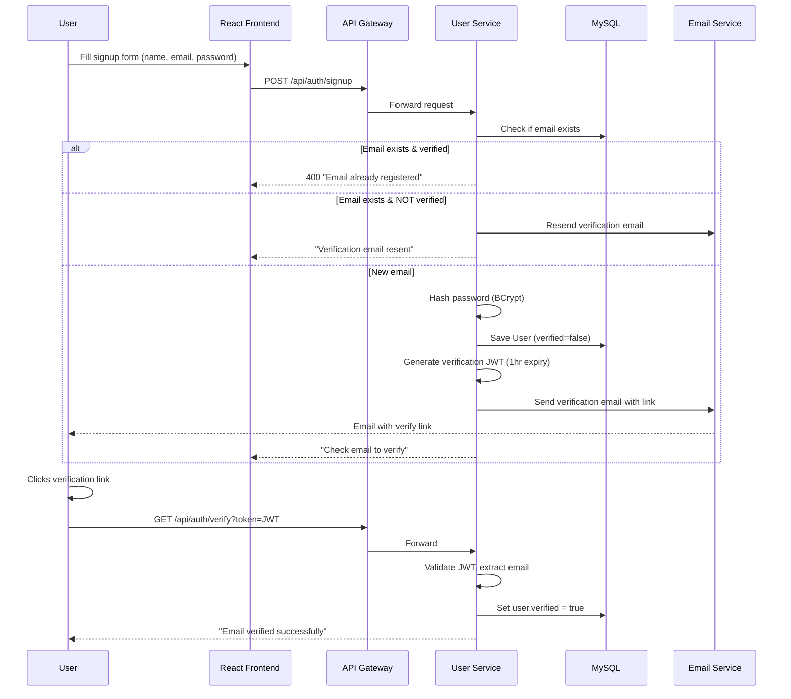
```mermaid
sequenceDiagram
    participant U as User
    participant FE as React Frontend
    participant GW as API Gateway
    participant US as User Service
    participant DB as MySQL
    participant EM as Email Service

    U->>FE: Fill signup form (name, email, password)
    FE->>GW: POST /api/auth/signup
    GW->>US: Forward request
    US->>DB: Check if email exists
    alt Email exists & verified
        US-->>FE: 400 "Email already registered"
    else Email exists & NOT verified
        US->>EM: Resend verification email
        US-->>FE: "Verification email resent"
    else New email
        US->>US: Hash password (BCrypt)
        US->>DB: Save User (verified=false)
        US->>US: Generate verification JWT (1hr expiry)
        US->>EM: Send verification email with link
        EM-->>U: Email with verify link
        US-->>FE: "Check email to verify"
    end

    U->>U: Clicks verification link
    U->>GW: GET /api/auth/verify?token=JWT
    GW->>US: Forward
    US->>US: Validate JWT, extract email
    US->>DB: Set user.verified = true
    US-->>U: "Email verified successfully"
```

### 7.2 Login Flow (JWT)

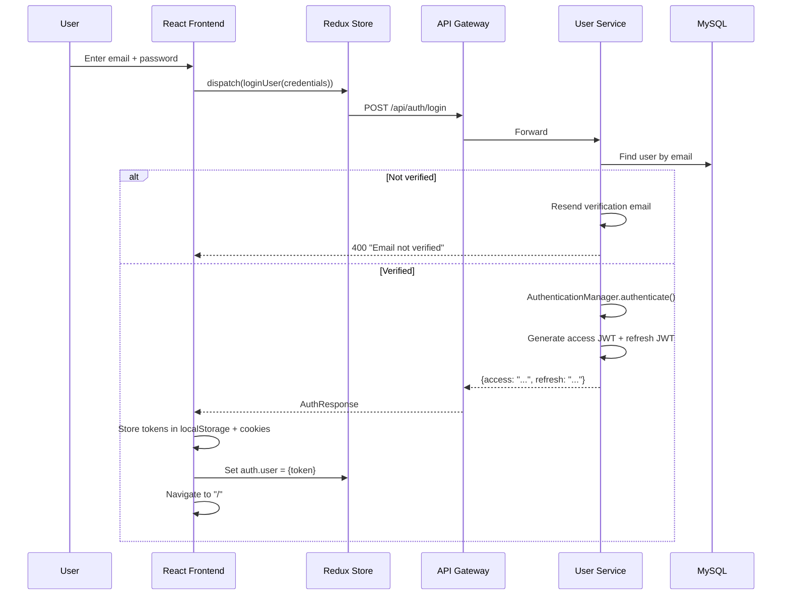
```mermaid
sequenceDiagram
    participant U as User
    participant FE as React Frontend
    participant RX as Redux Store
    participant GW as API Gateway
    participant US as User Service
    participant DB as MySQL

    U->>FE: Enter email + password
    FE->>RX: dispatch(loginUser(credentials))
    RX->>GW: POST /api/auth/login
    GW->>US: Forward
    US->>DB: Find user by email
    alt Not verified
        US->>US: Resend verification email
        US-->>FE: 400 "Email not verified"
    else Verified
        US->>US: AuthenticationManager.authenticate()
        US->>US: Generate access JWT + refresh JWT
        US-->>GW: {access: "...", refresh: "..."}
        GW-->>FE: AuthResponse
        FE->>FE: Store tokens in localStorage + cookies
        FE->>RX: Set auth.user = {token}
        FE->>FE: Navigate to "/"
    end
```

### 7.3 JWT Token Lifecycle

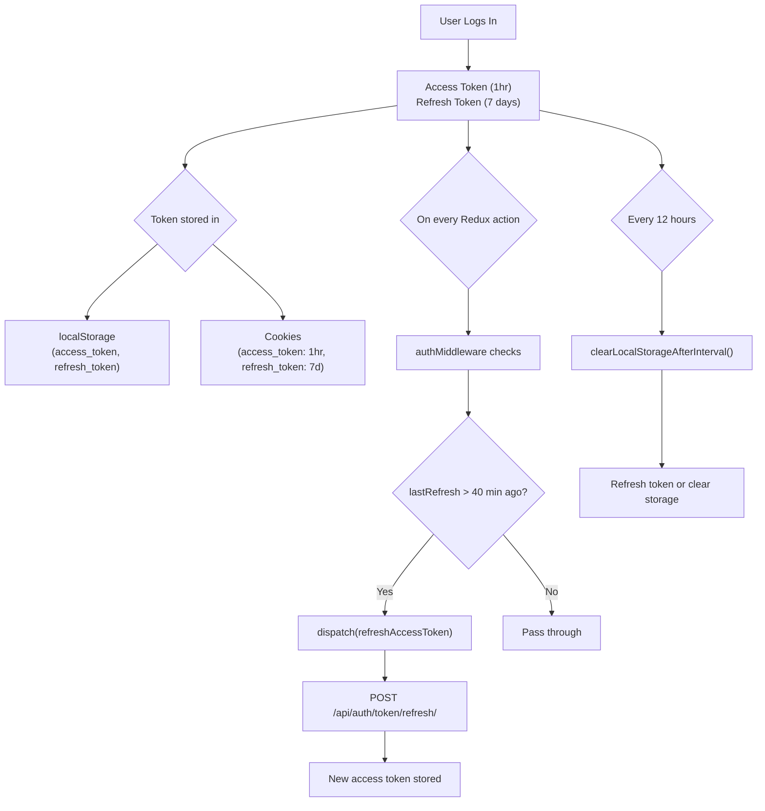
```mermaid
graph TD
    A["User Logs In"] --> B["Access Token (1hr)<br/>Refresh Token (7 days)"]
    B --> C{"Token stored in"}
    C --> D["localStorage<br/>(access_token, refresh_token)"]
    C --> E["Cookies<br/>(access_token: 1hr, refresh_token: 7d)"]

    B --> F{"On every Redux action"}
    F --> G["authMiddleware checks"]
    G --> H{"lastRefresh > 40 min ago?"}
    H -->|Yes| I["dispatch(refreshAccessToken)"]
    H -->|No| J["Pass through"]
    I --> K["POST /api/auth/token/refresh/"]
    K --> L["New access token stored"]

    B --> M{"Every 12 hours"}
    M --> N["clearLocalStorageAfterInterval()"]
    N --> O["Refresh token or clear storage"]
```

### 7.4 Gateway Authentication Filter

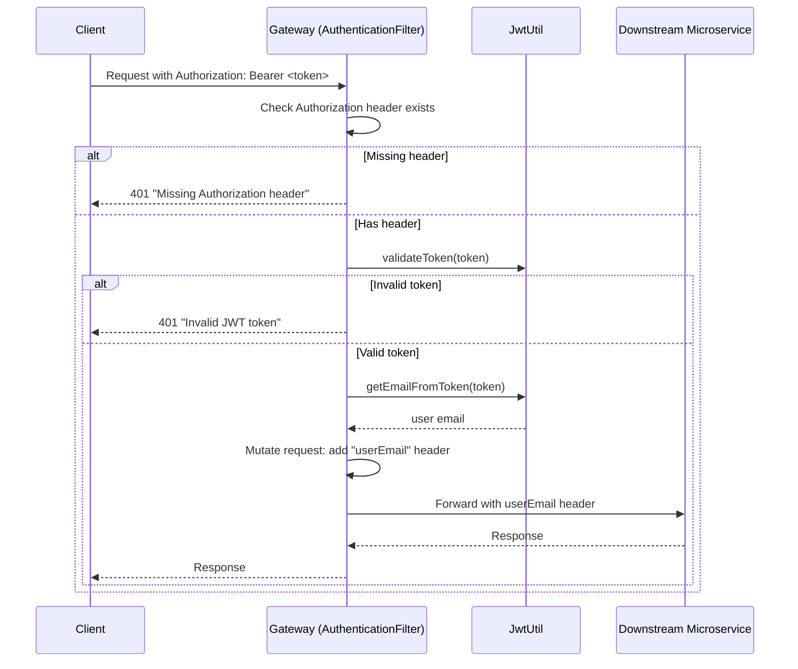
```mermaid
sequenceDiagram
    participant C as Client
    participant GW as Gateway (AuthenticationFilter)
    participant JWT as JwtUtil
    participant MS as Downstream Microservice

    C->>GW: Request with Authorization: Bearer <token>
    GW->>GW: Check Authorization header exists
    alt Missing header
        GW-->>C: 401 "Missing Authorization header"
    else Has header
        GW->>JWT: validateToken(token)
        alt Invalid token
            GW-->>C: 401 "Invalid JWT token"
        else Valid token
            GW->>JWT: getEmailFromToken(token)
            JWT-->>GW: user email
            GW->>GW: Mutate request: add "userEmail" header
            GW->>MS: Forward with userEmail header
            MS-->>GW: Response
            GW-->>C: Response
        end
    end
```

### 7.5 Role-Based Access Control

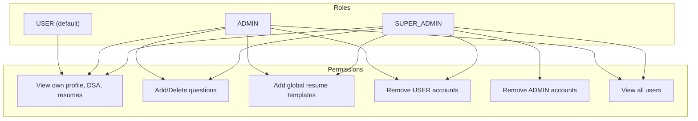
```mermaid
graph TD
    subgraph "Roles"
        R1["USER (default)"]
        R2["ADMIN"]
        R3["SUPER_ADMIN"]
    end

    subgraph "Permissions"
        P1["View own profile, DSA, resumes"]
        P2["Add/Delete questions"]
        P3["Add global resume templates"]
        P4["Remove USER accounts"]
        P5["Remove ADMIN accounts"]
        P6["View all users"]
    end

    R1 --> P1
    R2 --> P1
    R2 --> P2
    R2 --> P3
    R2 --> P4
    R2 --> P6
    R3 --> P1
    R3 --> P2
    R3 --> P3
    R3 --> P4
    R3 --> P5
    R3 --> P6
```

---

## 8. Database Design

### 8.1 Entity-Relationship Diagram

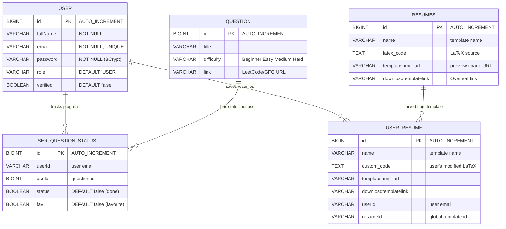
```mermaid
erDiagram
    USER {
        BIGINT id PK "AUTO_INCREMENT"
        VARCHAR fullName "NOT NULL"
        VARCHAR email "NOT NULL, UNIQUE"
        VARCHAR password "NOT NULL (BCrypt)"
        VARCHAR role "DEFAULT 'USER'"
        BOOLEAN verified "DEFAULT false"
    }

    QUESTION {
        BIGINT id PK "AUTO_INCREMENT"
        VARCHAR title
        VARCHAR difficulty "Beginner|Easy|Medium|Hard"
        VARCHAR link "LeetCode/GFG URL"
    }

    USER_QUESTION_STATUS {
        BIGINT id PK "AUTO_INCREMENT"
        VARCHAR userId "user email"
        BIGINT qsnId "question id"
        BOOLEAN status "DEFAULT false (done)"
        BOOLEAN fav "DEFAULT false (favorite)"
    }

    RESUMES {
        BIGINT id PK "AUTO_INCREMENT"
        VARCHAR name "template name"
        TEXT latex_code "LaTeX source"
        VARCHAR template_img_url "preview image URL"
        VARCHAR downloadtemplatelink "Overleaf link"
    }

    USER_RESUME {
        BIGINT id PK "AUTO_INCREMENT"
        VARCHAR name "template name"
        TEXT custom_code "user's modified LaTeX"
        VARCHAR template_img_url
        VARCHAR downloadtemplatelink
        VARCHAR userId "user email"
        VARCHAR resumeId "global template id"
    }

    USER ||--o{ USER_QUESTION_STATUS : "tracks progress"
    QUESTION ||--o{ USER_QUESTION_STATUS : "has status per user"
    USER ||--o{ USER_RESUME : "saves resumes"
    RESUMES ||--o{ USER_RESUME : "forked from template"
```

### 8.2 Database Details

- **Engine:** MySQL 8.0
- **Connection:** All services connect to the same MySQL instance via JDBC
- **Schema creation:** JPA auto DDL (likely `spring.jpa.hibernate.ddl-auto=update`)
- **Docker port mapping:** Host `3307` -> Container `3306`
- **User identification across services:** Email (string), not foreign key to User table. Services are loosely coupled via JWT email claim.

---

## 9. API Gateway & Routing

### 9.1 Gateway Architecture

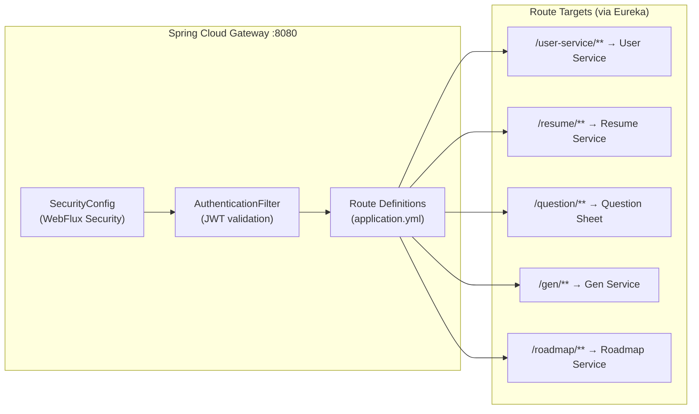
```mermaid
graph LR
    subgraph "Spring Cloud Gateway :8080"
        direction TB
        SC["SecurityConfig<br/>(WebFlux Security)"]
        AF["AuthenticationFilter<br/>(JWT validation)"]
        RD["Route Definitions<br/>(application.yml)"]
    end

    subgraph "Route Targets (via Eureka)"
        US["/user-service/** → User Service"]
        RS["/resume/** → Resume Service"]
        QS["/question/** → Question Sheet"]
        GS["/gen/** → Gen Service"]
        RM["/roadmap/** → Roadmap Service"]
    end

    SC --> AF
    AF --> RD
    RD --> US
    RD --> RS
    RD --> QS
    RD --> GS
    RD --> RM
```

### 9.2 Gateway Security Config

The gateway permits these patterns without authentication at the gateway level:
- `/question-sheet/**`
- `/user-service/**`
- `/question/**`
- `/resume/**`
- `/roadmap/**`
- `/gen/**`

Individual services handle their own JWT validation internally (the gateway adds a `userEmail` header after validation for convenience).

### 9.3 Service Discovery Flow

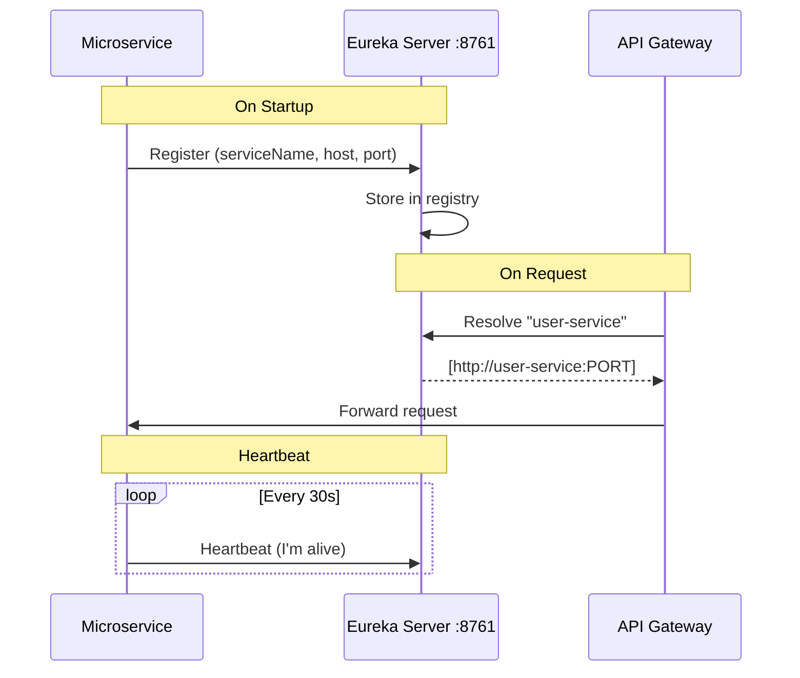
```mermaid
sequenceDiagram
    participant MS as Microservice
    participant EU as Eureka Server :8761
    participant GW as API Gateway

    Note over MS,EU: On Startup
    MS->>EU: Register (serviceName, host, port)
    EU->>EU: Store in registry

    Note over GW,EU: On Request
    GW->>EU: Resolve "user-service"
    EU-->>GW: [http://user-service:PORT]
    GW->>MS: Forward request

    Note over MS,EU: Heartbeat
    loop Every 30s
        MS->>EU: Heartbeat (I'm alive)
    end
```

---

## 10. Feature Flows (End-to-End)

### 10.1 Resume Builder (LaTeX) - Full Flow

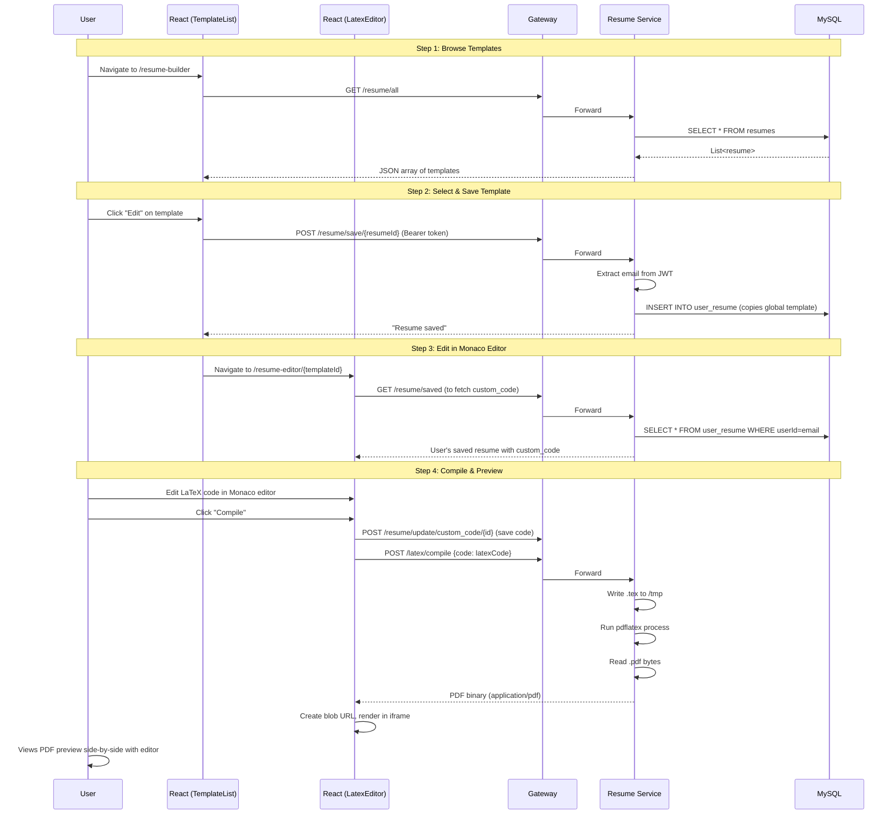
```mermaid
sequenceDiagram
    participant U as User
    participant FE as React (TemplateList)
    participant ED as React (LatexEditor)
    participant GW as Gateway
    participant RS as Resume Service
    participant DB as MySQL

    Note over U,DB: Step 1: Browse Templates
    U->>FE: Navigate to /resume-builder
    FE->>GW: GET /resume/all
    GW->>RS: Forward
    RS->>DB: SELECT * FROM resumes
    DB-->>RS: List<resume>
    RS-->>FE: JSON array of templates

    Note over U,DB: Step 2: Select & Save Template
    U->>FE: Click "Edit" on template
    FE->>GW: POST /resume/save/{resumeId} (Bearer token)
    GW->>RS: Forward
    RS->>RS: Extract email from JWT
    RS->>DB: INSERT INTO user_resume (copies global template)
    RS-->>FE: "Resume saved"

    Note over U,DB: Step 3: Edit in Monaco Editor
    FE->>ED: Navigate to /resume-editor/{templateId}
    ED->>GW: GET /resume/saved (to fetch custom_code)
    GW->>RS: Forward
    RS->>DB: SELECT * FROM user_resume WHERE userId=email
    RS-->>ED: User's saved resume with custom_code

    Note over U,DB: Step 4: Compile & Preview
    U->>ED: Edit LaTeX code in Monaco editor
    U->>ED: Click "Compile"
    ED->>GW: POST /resume/update/custom_code/{id} (save code)
    ED->>GW: POST /latex/compile {code: latexCode}
    GW->>RS: Forward
    RS->>RS: Write .tex to /tmp
    RS->>RS: Run pdflatex process
    RS->>RS: Read .pdf bytes
    RS-->>ED: PDF binary (application/pdf)
    ED->>ED: Create blob URL, render in iframe
    U->>U: Views PDF preview side-by-side with editor
```

### 10.2 Resume ATS Analysis Flow

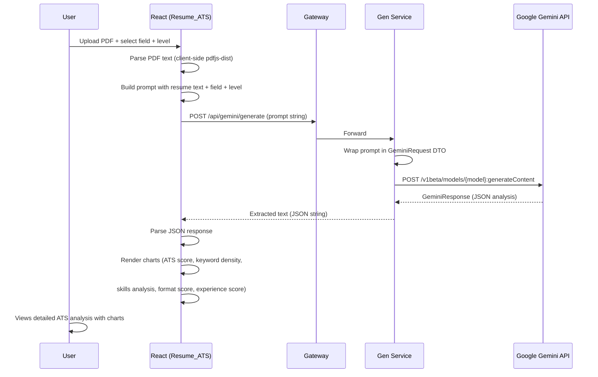
```mermaid
sequenceDiagram
    participant U as User
    participant FE as React (Resume_ATS)
    participant GW as Gateway
    participant GS as Gen Service
    participant AI as Google Gemini API

    U->>FE: Upload PDF + select field + level
    FE->>FE: Parse PDF text (client-side pdfjs-dist)
    FE->>FE: Build prompt with resume text + field + level
    FE->>GW: POST /api/gemini/generate (prompt string)
    GW->>GS: Forward
    GS->>GS: Wrap prompt in GeminiRequest DTO
    GS->>AI: POST /v1beta/models/{model}:generateContent
    AI-->>GS: GeminiResponse (JSON analysis)
    GS-->>FE: Extracted text (JSON string)
    FE->>FE: Parse JSON response
    FE->>FE: Render charts (ATS score, keyword density,
    FE->>FE: skills analysis, format score, experience score)
    U->>U: Views detailed ATS analysis with charts
```

### 10.3 DSA Sheet - Question Tracking Flow

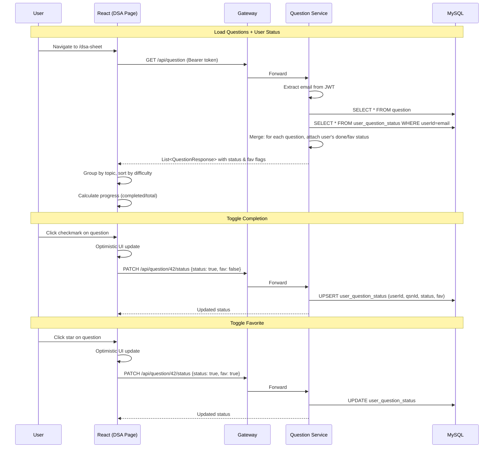
```mermaid
sequenceDiagram
    participant U as User
    participant FE as React (DSA Page)
    participant GW as Gateway
    participant QS as Question Service
    participant DB as MySQL

    Note over U,DB: Load Questions + User Status
    U->>FE: Navigate to /dsa-sheet
    FE->>GW: GET /api/question (Bearer token)
    GW->>QS: Forward
    QS->>QS: Extract email from JWT
    QS->>DB: SELECT * FROM question
    QS->>DB: SELECT * FROM user_question_status WHERE userId=email
    QS->>QS: Merge: for each question, attach user's done/fav status
    QS-->>FE: List<QuestionResponse> with status & fav flags

    FE->>FE: Group by topic, sort by difficulty
    FE->>FE: Calculate progress (completed/total)

    Note over U,DB: Toggle Completion
    U->>FE: Click checkmark on question #42
    FE->>FE: Optimistic UI update
    FE->>GW: PATCH /api/question/42/status {status: true, fav: false}
    GW->>QS: Forward
    QS->>DB: UPSERT user_question_status (userId, qsnId, status, fav)
    QS-->>FE: Updated status

    Note over U,DB: Toggle Favorite
    U->>FE: Click star on question #42
    FE->>FE: Optimistic UI update
    FE->>GW: PATCH /api/question/42/status {status: true, fav: true}
    GW->>QS: Forward
    QS->>DB: UPDATE user_question_status
    QS-->>FE: Updated status
```

### 10.4 User Profile Dashboard Flow

```mermaid
sequenceDiagram
    participant U as User
    participant FE as React (Profile)
    participant GW as Gateway
    participant US as User Service
    participant QS as Question Service
    participant DB as MySQL

    U->>FE: Navigate to /profile
    FE->>FE: Lazy load profile components

    par Fetch User Details
        FE->>GW: GET /api/users/profile (Bearer token)
        GW->>US: Forward
        US->>DB: SELECT * FROM user WHERE email=...
        US-->>FE: User {fullName, email, role}
    and Fetch DSA Progress
        FE->>GW: GET /api/question (Bearer token)
        GW->>QS: Forward
        QS-->>FE: All questions with user statuses
    end

    FE->>FE: Render tabs
    FE->>FE: Tab 1: User Details
    FE->>FE: Tab 2: DSA Distributions (Bar + Pie charts)
    FE->>FE: Tab 3: Completed Questions list
    FE->>FE: Tab 4: Favorites list
    FE->>FE: Tab 5: Activity Heatmap
```

### 10.5 Google OAuth Login Flow

```mermaid
sequenceDiagram
    participant U as User
    participant FE as React
    participant GO as Google OAuth
    participant GW as Gateway
    participant US as User Service

    U->>FE: Click "Continue with Google"
    FE->>GO: Redirect to /api/auth/google/login/
    GO->>GO: Google consent screen
    U->>GO: Authorize
    GO->>FE: Redirect to /api/auth/google/callback?code=AUTH_CODE
    FE->>FE: GoogleCallback component extracts code
    FE->>GW: POST /api/auth/google/login/ {code}
    GW->>US: Forward
    US->>GO: Exchange code for user info
    US->>US: Find or create user
    US->>US: Generate JWT tokens
    US-->>FE: {access, refresh}
    FE->>FE: Store tokens, update Redux state
    FE->>FE: Navigate to "/"
```

---

## 11. Deployment Architecture

### 11.1 Docker Compose Topology

```mermaid
graph TB
    subgraph "Docker Network: careerhubs-net"
        subgraph "Infrastructure"
            MySQL["mysql-db<br/>:3306<br/>MySQL 8.0<br/>Volume: mysql-data"]
            Eureka["eureka-server<br/>:8761"]
        end

        subgraph "Gateway"
            GW["gateway-server<br/>:8080"]
        end

        subgraph "Application Services"
            US["user-service"]
            RS["resume-service"]
            QS["question-sheet<br/>:5002"]
            GS["gen-service"]
            RMS["roadmap-service"]
        end
    end

    subgraph "External"
        Vercel["Vercel (React SPA)"]
        Internet["Internet"]
    end

    Internet --> Vercel
    Vercel --> GW
    GW --> Eureka
    GW --> US
    GW --> RS
    GW --> QS
    GW --> GS
    GW --> RMS

    US --> MySQL
    RS --> MySQL
    QS --> MySQL
    US --> Eureka
    RS --> Eureka
    QS --> Eureka
    GS --> Eureka
    RMS --> Eureka

    MySQL -.->|depends_on: healthy| Eureka
    Eureka -.->|depends_on| GW
    Eureka -.->|depends_on| US
    Eureka -.->|depends_on| RS
    Eureka -.->|depends_on| QS
    Eureka -.->|depends_on| GS
    Eureka -.->|depends_on| RMS
```

### 11.2 Startup Order

```
1. MySQL (healthcheck: mysqladmin ping)
2. Eureka Server (waits for MySQL healthy)
3. All microservices + Gateway (wait for Eureka)
```

### 11.3 Build & Run Commands

```bash
# Build all Java projects
mvn clean package -DskipTests

# Build Docker images
docker-compose build

# Start entire system
docker-compose up -d

# View logs
docker-compose logs -f

# Frontend (development)
cd client && npm run dev
```

---

## 12. Key Design Decisions & Trade-offs

### 12.1 Architecture Decisions

| Decision | Rationale | Trade-off |
|----------|-----------|-----------|
| **Microservices over Monolith** | Independent deployment, scaling per service, tech flexibility | Higher operational complexity, network latency between services |
| **Eureka for Service Discovery** | Dynamic service registration, no hardcoded URLs, built-in health checks | Additional infrastructure, eventual consistency in registry |
| **API Gateway pattern** | Single entry point, centralized auth, cross-cutting concerns | Single point of failure, potential bottleneck |
| **JWT (stateless auth)** | No server-side session storage, horizontally scalable, works across services | Cannot revoke tokens instantly, token size overhead |
| **Shared JWT secret across services** | Each service can independently validate tokens without inter-service calls | Secret rotation requires coordinated deployment |
| **Email as userId across services** | Loosely coupled services (no shared User table FK) | Data consistency relies on JWT claims, not DB integrity |
| **MySQL single instance** | Simplified data management, ACID transactions | Single DB is a bottleneck/SPOF for all services |
| **Server-side LaTeX compilation** | Professional PDF output, full LaTeX support | Requires pdflatex installed, security risk from arbitrary code execution |
| **Google Gemini for ATS analysis** | State-of-the-art AI analysis, no model hosting needed | External API dependency, cost per request, latency |

### 12.2 Scalability Considerations

```mermaid
graph TD
    subgraph "Current (Single Instance)"
        A["1x Gateway"]
        B["1x each Microservice"]
        C["1x MySQL"]
    end

    subgraph "Scaled (Production)"
        D["N x Gateway (load balanced)"]
        E["N x User Service"]
        F["N x Resume Service"]
        G["N x Question Service"]
        H["MySQL Primary + Read Replicas"]
        I["Redis (caching, session)"]
        J["S3/CloudStorage (resume PDFs)"]
    end

    A -->|Scale| D
    B -->|Scale| E
    B -->|Scale| F
    B -->|Scale| G
    C -->|Scale| H
    C -->|Add| I
    C -->|Add| J
```

### 12.3 Security Summary

| Layer | Mechanism |
|-------|-----------|
| Frontend | ProtectedRoute component, token in localStorage + cookies |
| Transport | HTTPS (Vercel), proxy to backend |
| Gateway | JWT validation filter, adds userEmail header |
| Services | Spring Security, BCrypt passwords, role checks |
| DB | Parameterized queries via JPA (SQL injection safe) |
| CSRF | Disabled (stateless JWT architecture) |
| CORS | Handled at gateway level |

---

## Quick Interview Cheat Sheet

### "Explain the architecture in 2 minutes"

> CareerHubs uses a **microservices architecture** with 6 Spring Boot services behind a **Spring Cloud Gateway**. Services discover each other via **Netflix Eureka**. The frontend is a **React SPA** hosted on Vercel that proxies API calls to the gateway. Authentication uses **JWT** with access/refresh tokens - the User Service issues tokens, and every other service validates them using a shared secret. Data is stored in **MySQL**. We use **Google Gemini AI** for resume ATS analysis and **pdflatex** for server-side LaTeX compilation. Everything runs in **Docker containers** orchestrated by Docker Compose.

### "How does auth work?"

> Users sign up with email/password. Passwords are hashed with **BCrypt**. A verification email is sent with a JWT link. On login, the User Service returns an **access token (1hr)** and **refresh token (7 days)** signed with **HS256**. The frontend stores these in both **localStorage** and **cookies**. A Redux middleware auto-refreshes tokens every 40 minutes. The API Gateway has an **AuthenticationFilter** that validates JWTs and injects the user's email into downstream request headers. Each microservice also has its own `AuthService` that can independently parse JWT claims.

### "How do microservices communicate?"

> Services communicate through the **API Gateway** (synchronous REST). There's no direct service-to-service calls - the frontend sends all requests to the gateway which routes them via Eureka discovery. The JWT token flows through from client to gateway to service, maintaining the user context. Services are **loosely coupled** - they share the JWT secret but have independent databases (separate tables in the same MySQL instance).

---

# Architecture (HLD) Cross-Questions

## Q: Give me the 60-second architecture pitch.

**A:** It’s a React SPA (Vite + Tailwind) hosted on Vercel. All API calls go to a Spring Cloud API Gateway which routes requests to multiple Spring Boot microservices using Eureka service discovery. Auth is JWT-based (access + refresh). Data is stored in MySQL via Spring Data JPA. Resume ATS analysis uses Gemini via a dedicated gen-service, and LaTeX resumes are compiled to PDF server-side using pdflatex.

---

## Q: Why microservices here instead of a monolith?

**A:** Logical separation by domain (users, resumes, questions, AI). Each service can scale and deploy independently, and the gateway centralizes routing. Trade-off: more ops complexity (discovery, gateway, multiple builds, network calls).

---

## Q: What’s the role of the API Gateway in your system?

**A:** Single entry point for clients, routes requests to services, optionally validates JWT (AuthenticationFilter) and can attach derived context (like userEmail) to downstream requests. It also enables cross-cutting concerns (security, rate limiting, logging) in one place.

---

## Q: What’s the role of Eureka?

**A:** Services register themselves at startup; gateway discovers service instances dynamically. This avoids hardcoding service URLs and supports scaling (multiple instances).

---

## Q: If Eureka is down, what breaks?

**A:** New service registrations and service discovery. If the gateway can’t resolve service instances, routing fails. Some setups can cache registry data briefly, but generally it’s a critical dependency.

---

# Authentication & Security Cross-Questions

## Q: Explain your login flow end-to-end.

**A:** Frontend calls POST /api/auth/login (User Service). User Service authenticates via Spring Security, checks verified, then returns access + refresh JWT. Frontend stores tokens (localStorage + cookies in your code). Protected pages use ProtectedRoute which checks Redux auth.user.

---

## Q: What’s inside your JWT? What do you use it for?

**A:** The subject is the user email; expiry is set. Services parse email from the token to identify the caller. The user-service also uses a verification token JWT for email verification links.

---

## Q: Where do you validate JWT?

**A:** At the gateway via AuthenticationFilter (validates token, extracts email, adds userEmail header). Also inside services (e.g., resume-service and question-sheet have an AuthService that parses JWT using the shared secret; user-service uses Spring Security filter JwtAuthenticationFilter).

---

## Q: What’s the difference between access token and refresh token?

**A:** Access token is short-lived for API calls. Refresh token is longer-lived and used to obtain a new access token without re-login. This reduces frequent credential prompts and limits the impact of access token leakage.

---

## Q: How do you refresh tokens in the frontend?

**A:** Redux middleware checks lastRefresh; if more than ~40 minutes, it dispatches a refresh thunk which calls refresh endpoint (as implemented). There’s also a 12-hour localStorage cleanup/refresh attempt.

---

## Q: Where do you store tokens and what’s the risk?

**A:** Stored in localStorage and also set in cookies in authService.js. localStorage is vulnerable to XSS token theft; httpOnly cookies mitigate XSS but need CSRF protections. In an interview, I’d say the safer production approach is httpOnly, Secure cookies + CSRF defenses, or a strict CSP + avoid localStorage.

---

## Q: How do you do authorization (roles)?

**A:** Role is stored on the User entity (USER, ADMIN, SUPER_ADMIN). Endpoints like “get all users” check role. Some services also hardcode admin email checks (e.g., adding resume templates restricted to a specific email).

---

## Q: How do you handle email verification?

**A:** On signup, user is created with verified=false. A verification JWT link is emailed. GET /api/auth/verify?token=... validates token and sets verified=true.

---

## Q: What security concerns exist in the LaTeX compile feature?

**A:** It runs pdflatex on user-supplied code, which can be abused (resource exhaustion, potential command/file access depending on TeX config). Mitigations: run in a locked-down container/sandbox, disable shell-escape, apply timeouts, memory limits, restrict file I/O, and queue compilation jobs.

---

# Backend / Microservices Cross-Questions

## Q: Walk me through the User Service layers.

**A:** Controller (AuthController, UserController) → Service (AuthService, UserService) → Repository (UserRepository) → Entity (User). AuthService handles signup/login/verification and issues JWT. UserService handles profile and admin listing logic.

---

## Q: What happens in login if the user isn’t verified?

**A:** Login rejects and triggers a resend verification email, asking user to verify first.

---

## Q: How does the resume template system work?

**A:** resumes table stores global templates. When a user chooses a template, it’s copied into userResume (user-specific record) with custom_code. Updates modify custom_code for that user.

---

## Q: How do you ensure users only see their own saved resumes?

**A:** Resume-service extracts the email from JWT and queries userResume by userId=email. The service uses the token claim as the identity boundary.

---

## Q: How does DSA progress tracking work?

**A:** Questions are in Question. Per-user state is in UserQuestionStatus keyed by (userId, qsnId). On GET, backend merges all questions with the user’s statuses to produce a response containing done/favorite.

---

## Q: Do you have transactions or consistency concerns?

**A:** Mostly simple single-row operations. Consistency is per service database operations. Cross-service consistency is not transactional; it relies on JWT identity and each service’s local data.

---

# Database / Data Modeling Cross-Questions

## Q: What are your main tables and relationships?

**A:** User, Question, UserQuestionStatus, resumes, userResume. Relationships are conceptual; not strict foreign keys everywhere (user is referenced by email string in other tables), which simplifies coupling but reduces referential integrity.

---

## Q: Why store userId as email instead of user numeric ID?

**A:** It avoids cross-service dependency on the user-service DB schema. Trade-off: email changes become painful and there’s no DB-level FK integrity.

---

## Q: What indexes would you add for performance?

**A:** On User.email (already unique). On UserQuestionStatus(userId, qsnId) composite index for fast lookups and upserts. On userResume(userId, resumeId) for saved resume operations.

---

# API Gateway & Routing Cross-Questions

## Q: How does the gateway decide where to send /api/question?

**A:** Via gateway route configuration (not present as a YAML file in this repo snapshot, but implied by the service names and endpoint patterns). In a typical setup, path predicates map to service IDs registered in Eureka.

---

## Q: Why validate JWT at gateway if services also validate?

**A:** Gateway validation provides early rejection and standard behavior. Service validation is defense-in-depth and allows services to be called internally (or if gateway rules are permissive). In a mature system, you’d define clear responsibility (gateway as policy enforcement point) and avoid duplication.

---

## Q: What’s the purpose of adding userEmail header?

**A:** Convenience for downstream services so they can read the derived identity without re-parsing JWT. But it’s only safe if downstream trusts the gateway and/or strips client-sent userEmail headers.

---

# Frontend Cross-Questions (React)

## Q: How is routing structured?

**A:** App.jsx defines public + protected routes using React Router. ProtectedRoute checks Redux auth state and redirects to /login.

---

## Q: How does the frontend talk to backend locally vs production?

**A:** Vite dev server proxies /api to VITE_BACKEND_API. In production, Vercel rewrites to serve SPA and backend is reached via configured domain/proxy.

---

## Q: Where is auth state stored and why Redux?

**A:** In Redux authSlice so it’s global and accessible by components like navbar/protected route. Redux thunks handle async login/register/logout.

---

## Q: Why use SWR on DSA page?

**A:** Efficient caching and revalidation control. It simplifies data fetching, and the UI can optimistically update without full reload.

---

## Q: How do you handle 401 on frontend?

**A:** In fetchers, if response is 401, tokens are cleared and user is redirected to /login with a toast message.

---

# AI / Gemini Cross-Questions

## Q: Why a separate gen-service instead of calling Gemini from frontend directly?

**A:** Keeps the Gemini API key off the client, centralizes prompt shaping, logging, rate limiting, and allows swapping models/providers without redeploying frontend.

---

## Q: How do you ensure Gemini returns valid JSON for ATS analysis?

**A:** Prompt enforces “return ONLY valid JSON”. In real systems, you still need robust parsing + schema validation + retry with correction prompts.

---

# Docker / Deployment Cross-Questions

## Q: Explain your Docker Compose stack.

**A:** MySQL + Eureka + gateway + microservices on one Docker bridge network. MySQL has a healthcheck; Eureka depends on MySQL healthy; others depend on Eureka.

---

## Q: How would you run this locally end-to-end?

**A:** Build Java services with Maven, run docker-compose for backend infra/services, run npm run dev in client for frontend with proxy to gateway.

---

# Scaling / Reliability / System Design Cross-Questions

## Q: What becomes the bottleneck first?

**A:** Likely gateway throughput, MySQL load, and pdflatex compilation CPU/IO. Gemini calls also add latency and cost.

---

## Q: How would you scale LaTeX compilation safely?

**A:** Move compilation to a job queue (RabbitMQ/Kafka/SQS), run worker pool with strict CPU/memory/time limits in isolated containers, return job status + downloadable PDF when ready.

---

## Q: How would you make DSA page faster for large question sets?

**A:** Pagination and filtering, cache question list, store user status separately and fetch only deltas, add indexes, and avoid merging large lists on every request (or do it server-side with optimized queries).

---

## Q: How would you handle secret rotation for JWT?

**A:** Use JWKS/public-private signing (RS256) or maintain multiple secrets during rotation window; update gateway and all services in coordinated rollout.

---

# “Catch Inconsistencies” (Senior Interviewer Style)

## Q: I see frontend hitting endpoints like /api/careerhub/questions/... but your Java services expose /api/question. Explain.

**A:** That indicates there’s likely an additional backend layer or gateway rewrite rules not included here (or endpoints changed over time). In a real interview explanation, I’d say: “The frontend uses /api/... paths and the gateway maps them to the appropriate microservice routes; exact path mapping lives in gateway route config.”

---

## Q: Your question-sheet AuthService.extractRoleFromToken returns "ADMIN" always. Is that correct?

**A:** As coded, it’s a placeholder/bug—role isn’t actually extracted. A correct implementation should either include role as a JWT claim (issued by user-service) and validate it, or call user-service for role, or maintain role locally.

---

## Q: What’s your plan if someone sends huge LaTeX code repeatedly (DoS)?

**A:** Add gateway rate limiting + request size limits, compile timeouts (already partially there), isolate compile workers, require auth, and implement quotas per user.

---

# Rapid-Fire (Short but Correct Answers)

## Q: Why BCrypt?

**A:** Adaptive hashing that’s slow by design; mitigates brute force if DB leaks.

---

## Q: Why stateless auth?

**A:** Easier horizontal scaling; no session store required.

---

## Q: What is eventual consistency here?

**A:** Across services there’s no distributed transaction; data can diverge temporarily (or permanently if bugs), so designs should be resilient.

---

## Q: What’s one improvement you’d do first?

**A:** Fix role extraction/authorization correctness across services and unify API contracts (endpoint paths) with an explicit gateway routing configuration.

---

# Mock Interview Script (15–20 Minutes) — CareerHubs End-to-End

## 0) Warm-up (1 min)

### Q1. What is CareerHubs and what problem does it solve?

**Strong answer:** CareerHubs is a career-prep platform: resume builder (LaTeX + form), resume ATS analysis using Gemini, DSA sheet with tracking, tutorials/resources/roadmaps, and interview prep links. Frontend is a React SPA; backend is microservices behind an API gateway with Eureka discovery and MySQL.

**Follow-ups:**
- What are your top 2 user journeys?

---

## 1) HLD / Architecture Pitch (2–3 min)

### Q2. Give me the architecture in 60 seconds.

**Strong answer:** React SPA on Vercel. All /api/* calls go to Spring Cloud Gateway. Gateway routes to multiple Spring Boot microservices registered in Eureka. Auth is JWT-based; user-service issues tokens, other services validate with shared secret. MySQL stores user/question/resume data. Gen-service calls Gemini API for ATS analysis. Resume-service compiles LaTeX using pdflatex.

**Follow-ups (senior):**
- Why do you need Eureka if you already have Docker networking?
- What would break if gateway is down?

---

## 2) Frontend Deep Dive (3–4 min)

### Q3. How is routing and access control done in the frontend?

**Strong answer:** Routes are defined in App.jsx using React Router. Protected pages are wrapped with ProtectedRoute, which checks Redux auth.user; if missing, it redirects to /login.

**Follow-ups:**
- Where is auth.user set and persisted?
- What happens on refresh (page reload)?

---

### Q4. How does the frontend talk to backend in dev vs production?

**Strong answer:** In dev, Vite proxies /api to VITE_BACKEND_API. In production, Vercel rewrites to serve SPA and backend is accessed via configured proxy/domain.

**Follow-ups:**
- What’s CORS strategy here?

---

### Q5. Why both Axios and fetch + SWR? Any risk?

**Strong answer:** Axios is used in some pages; SWR with fetch is used for cached data (DSA). Risk is inconsistent error handling/auth header injection. Better is one shared API client with interceptors and consistent 401 handling.

---

## 3) Auth End-to-End (4–5 min)

### Q6. Walk me through signup + email verification.

**Strong answer:** User posts signup to user-service. Password is BCrypt-hashed, user saved with verified=false. Service generates a verification JWT and emails a link. When user hits verify endpoint with token, server validates token and flips verified=true.

**Follow-ups:**
- What prevents someone from verifying another user?
- What’s in the verification token and expiry?

---

### Q7. Walk me through login and token lifecycle.

**Strong answer:** Login validates credentials; if verified, service returns access + refresh JWT. Frontend stores tokens (localStorage + cookies in current code). Middleware refreshes access token periodically using refresh token.

**Follow-ups (senior):**
- Why is localStorage risky? What’s safer?
- If tokens are in cookies, how do you prevent CSRF?
- How do you revoke tokens early?

---

### Q8. Where is JWT validated—gateway or service?

**Strong answer:** Gateway validates in AuthenticationFilter and can attach userEmail. Services also validate JWT (defense-in-depth) by parsing token using shared secret.

**Follow-ups:**
- If downstream trusts userEmail header, how do you stop header spoofing?
- Should gateway permit-all routes still validate JWT?

---

## 4) Backend Services and Data Flows (5–6 min)

### Q9. Explain each microservice’s responsibility.

**Strong answer:**
- user-service: auth, email verification, user profile, role-based admin endpoints  
- resume-service: global templates, user saved resumes/custom code, LaTeX compile  
- question-sheet: questions + per-user status/favorite tracking  
- gen-service: Gemini API proxy for AI features  
- roadmap-service: roadmap endpoints/health (minimal in code)  
- eureka-server: service discovery  
- gateway-server: routing + auth filter  

**Follow-ups:**
- What is a clean boundary between services? What data do they share?

---

### Q10. Resume Builder (LaTeX) end-to-end flow.

**Strong answer:** User loads templates from resume-service, saves one which creates a userResume copy. In editor, user edits LaTeX in Monaco; code is saved back to userResume and compile endpoint runs pdflatex, returns PDF bytes which frontend previews.

**Follow-ups (senior):**
- What happens if compile takes 30 seconds?
- How do you prevent DoS via compile?
- Is running pdflatex safe? What mitigations?

---

### Q11. DSA sheet tracking end-to-end.

**Strong answer:** Backend returns all questions merged with user-specific status from UserQuestionStatus keyed by (userId=email, qsnId). UI groups by topic and lets users toggle done/favorite; backend upserts the status row.

**Follow-ups:**
- What indexes do you need?
- How do you handle large lists (10k questions)?

---

### Q12. ATS analyzer end-to-end.

**Strong answer:** Frontend extracts resume text from PDF and builds a strict JSON-only prompt. It calls gen-service which calls Gemini and returns the response; frontend parses JSON and renders charts + recommendations.

**Follow-ups (senior):**
- What if Gemini returns invalid JSON?
- How do you prevent prompt injection (resume content contains instructions)?

---

## 5) Data Modeling + MySQL (2–3 min)

### Q13. Describe the main tables and relationships.

**Strong answer:** User, Question, UserQuestionStatus, resumes (global templates), userResume (user copies). Other services reference user by email string rather than numeric FK—loose coupling, but weaker referential integrity.

**Follow-ups:**
- What breaks if user changes email?
- Why not use a userId UUID?

---

## 6) System Design / Scalability (2–3 min)

### Q14. What are the top bottlenecks and how would you scale?

**Strong answer:** Gateway throughput, MySQL as shared dependency, and pdflatex CPU spikes. Scale gateway and services horizontally, add DB read replicas + indexes, cache frequent reads, and move LaTeX compile to async workers with queue + quotas.

**Follow-ups (senior):**
- How do you handle distributed tracing across gateway + services?
- What metrics would you alert on?

---

## 7) Senior “Catch” Questions (2–3 min)

### Q15. Frontend calls endpoints like /api/careerhub/questions/... but the Java service exposes /api/question. Explain.

**Strong answer:** The intended design is that gateway rewrites/map paths to services; mismatch suggests API evolved or some routing config isn’t in this repo snapshot. In production, I’d ensure a single source of truth: gateway route config + shared API contract, and update frontend to match.

---

### Q16. In question-sheet, extractRoleFromToken returns ADMIN. Is that correct?

**Strong answer:** That’s a placeholder/bug. Proper fix: include role claim in JWT issued by user-service and validate it, or call user-service for role, or maintain RBAC consistently per service.

---

# How to Practice (Fast)

- Do one run answering without reading notes.  
- Second run: keep answers to 2–4 sentences each.  
- Third run: focus on trade-offs + risks + mitigations (that’s what seniors want).
