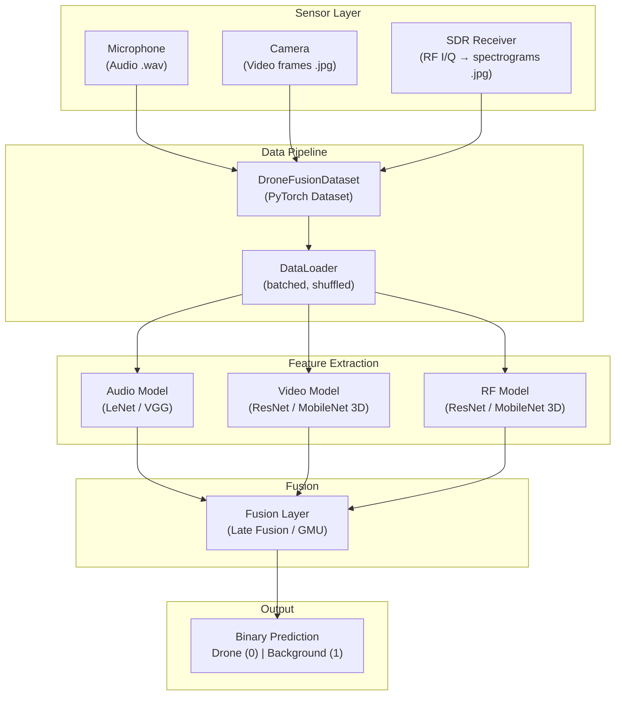
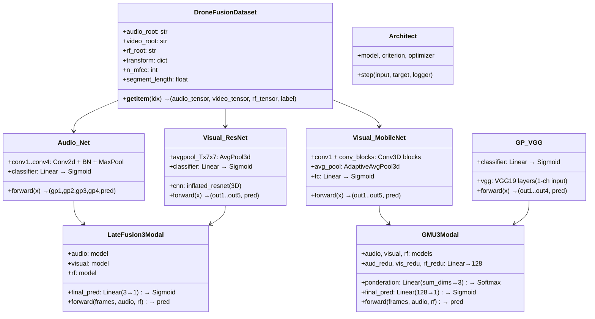
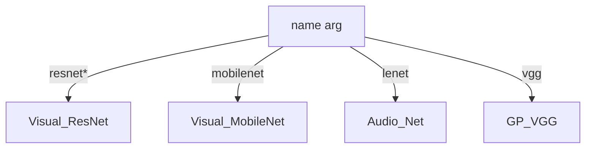
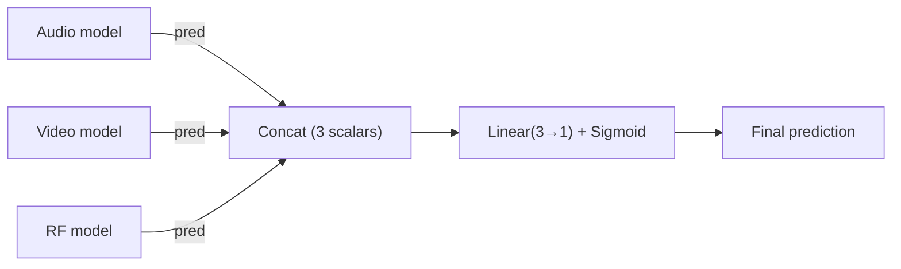
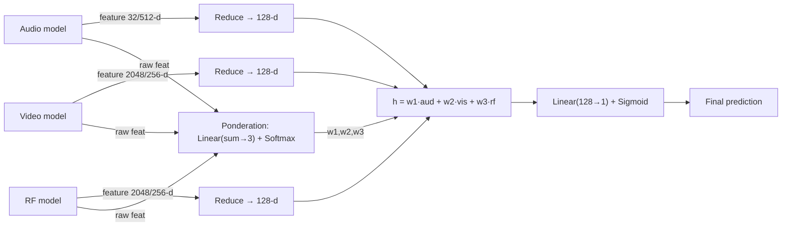
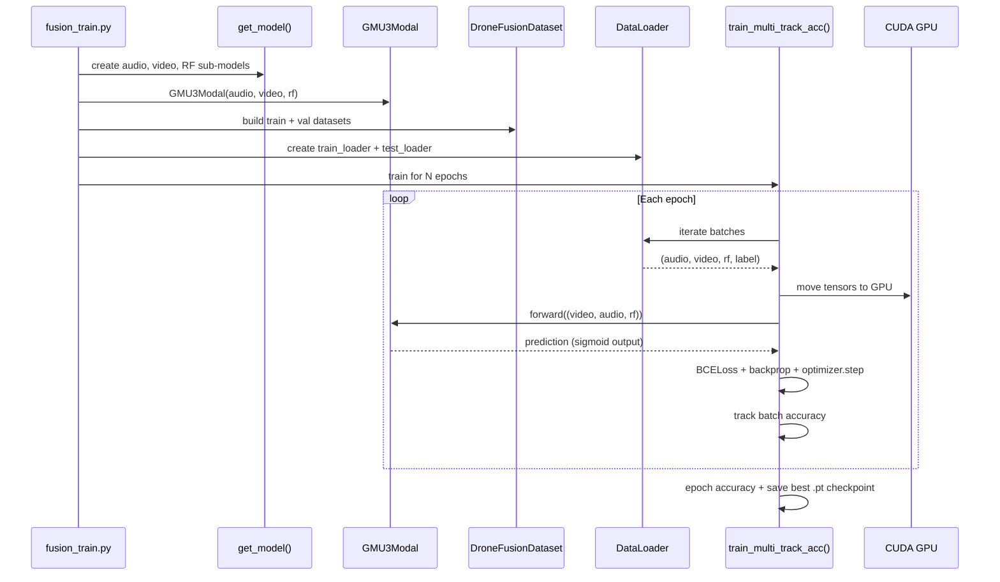
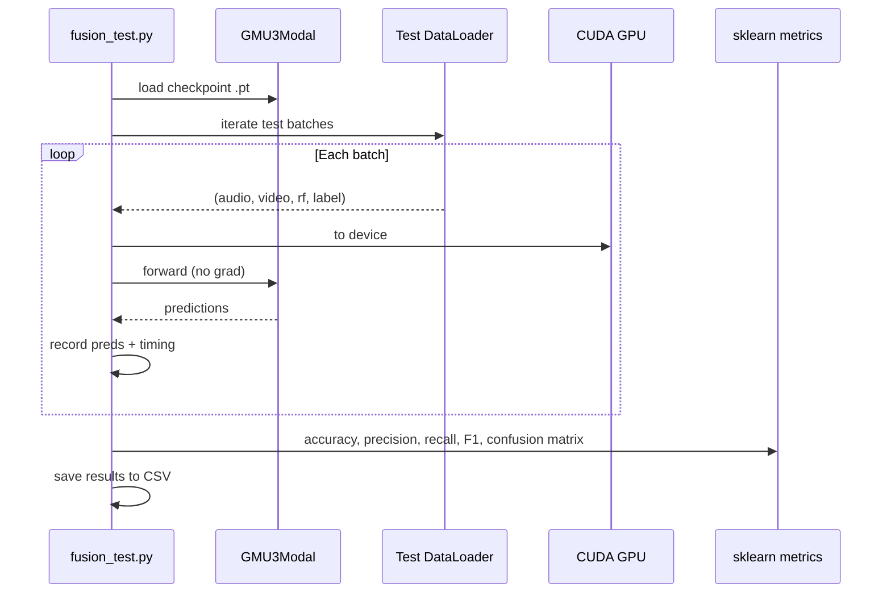
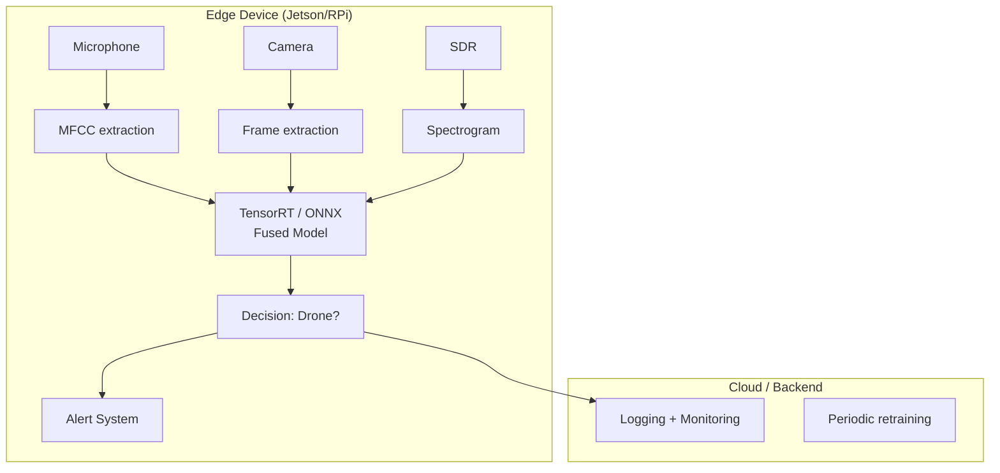

# DroneGuard — End-to-End Architecture, HLD/LLD, Flows, Interview Prep

## Table of Contents
- [1. Project overview](#1-project-overview)
- [2. Repo structure & tech stack](#2-repo-structure--tech-stack)
- [3. High level design (HLD)](#3-high-level-design-hld)
- [4. Low level design (LLD)](#4-low-level-design-lld)
- [5. Data pipeline](#5-data-pipeline)
- [6. Model architectures](#6-model-architectures)
- [7. Fusion strategies](#7-fusion-strategies)
- [8. Training & evaluation flows](#8-training--evaluation-flows)
- [9. System design discussion](#9-system-design-discussion)
- [10. Senior cross-questions + strong fresher answers](#10-senior-cross-questions--strong-fresher-answers)
- [11. Mock interview script (15–20 min)](#11-mock-interview-script-1520-min)

---

## 1. Project overview

**DroneGuard** is a real-time drone detection system that uses **tri-modal sensor fusion** — combining **Audio**, **Video**, and **RF (Radio Frequency)** signals — to classify whether a drone is present or not (binary classification: Drone vs Background).

### Key results (tri-modal GMU fusion)
| Metric | Value |
|--------|-------|
| Accuracy | 99.62% |
| Precision | 100% |
| Recall | 99.4% |
| F1-score | 99.7% |
| Avg inference time | 0.006 sec |

### Why multi-modal?
- Audio alone fails in noisy environments
- Video alone fails in poor visibility / camouflage
- RF alone fails with frequency-hopping drones
- Combining all three dramatically improves robustness

---

## 2. Repo structure & tech stack

```
DroneGuard/
├── fusion_train.py          # Entry point: train multi-modal (2 or 3 modality) models
├── fusion_test.py           # Entry point: test multi-modal models
├── unimodal_train.py        # Entry point: train single-modality models
├── unimodal_test.py         # Entry point: test single-modality models
├── requirements.txt
├── dataset/
│   ├── get_dataset.py       # DroneFusionDataset (PyTorch Dataset), DataLoader
│   └── get_transform.py     # Audio/Video/RF augmentations & transforms
├── models/
│   ├── get_model.py         # Model factory
│   ├── unimodel_audio.py    # Audio_Net (LeNet-style), GP_VGG
│   ├── unimodel_seq.py      # Visual_ResNet (inflated 3D), Visual_MobileNet (3D)
│   ├── av_fusion.py         # LateFusion, LateFusion3Modal, GMU, GMU3Modal
│   ├── inflated_resnet.py   # 3D inflated ResNet backbone
│   ├── aux_models.py        # GlobalPooling2D
│   └── resnet/              # ResNet building blocks
├── training/
│   ├── unimodal_train.py    # train_uni_track_acc, test_uni_track_acc, Architect
│   └── multimodal_train.py  # train_multi_track_acc, test_multi_track_acc, Architect
└── utils/
    ├── functions.py          # count_parameters, save
    └── scheduler.py          # LRCosineAnnealingScheduler, FixedScheduler
```

### Tech stack
- **Python 3.8+**, **PyTorch 2.1** (CUDA GPU)
- **torchvision**, **torchaudio**, **librosa** (audio MFCC)
- **scikit-learn** (metrics), **scipy** (sparse), **augly** (audio augmentation)
- **OpenCV**, **Pillow** (image processing)

---

## 3. High level design (HLD)

### 3.1 System architecture



### 3.2 Modality support matrix

| Config | Audio model | Video model | RF model | Fusion |
|--------|------------|-------------|----------|--------|
| Unimodal Audio | LeNet/VGG | - | - | None |
| Unimodal Video | - | ResNet/MobileNet | - | None |
| Unimodal RF | - | - | ResNet/MobileNet | None |
| Dual (2-modal) | ✓ | ✓ | - | Late/GMU |
| **Tri-modal** | ✓ | ✓ | ✓ | Late/GMU |

---

## 4. Low level design (LLD)

### 4.1 Class diagram



### 4.2 get_model factory



---

## 5. Data pipeline

### 5.1 Dataset structure
```
Dataset/
├── Audio/{Train,Validation,Test}/{Drone,Background}/scenario_N/*.wav
├── Video/{Train,Validation,Test}/{Drone,Background}/scenario_N/Images_Extracted/*.jpg
└── RF_Spectrograms/{Train,Validation,Test}/{Drone,Background}/scenario_N/Images_Spectrograms/*.jpg
```

### 5.2 Sample construction flow

```mermaid
flowchart TD
  A[10-sec .wav file] --> B[Split into 0.25-sec segments]
  B --> C[Each segment = 1 sample]
  C --> D["Audio: librosa.load(offset, duration) → MFCC(40×40)"]
  C --> E["Video: 7 frames (28fps × 0.25s) → resize 112×112"]
  C --> F["RF: 1 spectrogram frame (4fps × 0.25s) → resize 112×112"]
  D --> G[audio_tensor: (1, 40, 40)]
  E --> H[video_tensor: (7, 3, 112, 112)]
  F --> I[rf_tensor: (1, 3, 112, 112)]
  G --> J[DroneFusionDataset.__getitem__]
  H --> J
  I --> J
  J --> K["label: 0 (Drone) or 1 (Background)"]
```

### 5.3 Data augmentations
| Modality | Training | Testing |
|----------|----------|---------|
| Audio | None (pass-through) | Background noise, harmonic, pitch shift, clicks, volume change |
| Video | Resize + ToTensor | Resize + flip + rotation + color jitter + Gaussian blur + salt/pepper noise |
| RF | Resize + ToTensor | Resize + ToTensor |

---

## 6. Model architectures

### 6.1 Audio models

**Audio_Net (LeNet-style)**
- 4 Conv2d layers with BN + ReLU + MaxPool
- GlobalPooling2D after each conv → multi-scale features (gp1..gp4)
- Classifier: Linear(32→1) + Sigmoid
- Input: MFCC spectrogram (1, 40, 40)

**GP_VGG**
- VGG19 backbone (modified: 1-channel input)
- GlobalPooling2D at 4 intermediate layers
- Classifier: Linear(512→1) + Sigmoid

### 6.2 Video / RF models

**Visual_ResNet (3D Inflated ResNet)**
- Inflated 2D ResNet (resnet10/18/34) → 3D convolutions
- Input: (B, T, C, H, W) → rearranged to (B, C, T, H, W)
- AvgPool3d for temporal pooling → 2048-dim feature
- Classifier: Linear(2048→1) + Sigmoid
- Video uses T=7 frames; RF uses T=1 frame

**Visual_MobileNet (3D)**
- Lightweight 3D conv blocks
- AdaptiveAvgPool3d → 256-dim feature
- Classifier: Linear(256→1) + Sigmoid

---

## 7. Fusion strategies

### 7.1 Late Fusion (3-modal)



Each sub-model produces its own prediction (sigmoid output). The 3 predictions are concatenated and fed through a small linear layer to produce the final prediction.

### 7.2 GMU — Gated Multimodal Unit (3-modal)



GMU **learns gating weights** (via softmax ponderation) to dynamically weight each modality's contribution. This is more powerful than simple late fusion because it operates on **feature-level** representations rather than decision-level outputs.

### 7.3 Why GMU > Late Fusion
- Late fusion only sees final scalar predictions (information loss)
- GMU sees rich feature vectors and learns to weight modalities adaptively
- GMU can learn to rely less on a noisy modality for a given sample

---

## 8. Training & evaluation flows

### 8.1 Tri-modal training flow



### 8.2 Tri-modal testing flow



### 8.3 Training hyperparameters
| Parameter | Value |
|-----------|-------|
| Optimizer | Adam |
| LR schedule | Cosine annealing (0.001–0.01) |
| Loss | BCELoss |
| Batch size | 112 |
| Epochs | 20 |
| Seed | 42 |

---

## 9. System design discussion

### 9.1 Real-time deployment architecture (production)



### 9.2 Latency budget (0.006s per sample)
- Preprocessing: ~2ms (MFCC + resize)
- Forward pass: ~4ms (GPU)
- Total: ~6ms → supports **166 inferences/sec**

### 9.3 Scaling considerations
- **Model optimization**: quantization (INT8), pruning, ONNX export, TensorRT
- **Edge deployment**: Jetson Nano/Xavier for field use
- **Handling missing modalities**: if one sensor fails, fall back to dual/unimodal

---

## 10. Senior cross-questions + strong fresher answers

### Architecture & HLD

- **Q: Explain the system in 60 seconds.**
  - **A:** DroneGuard detects drones using three sensors: microphone, camera, and SDR receiver. Each produces time-synchronized data (audio .wav, video frames, RF spectrograms). A PyTorch dataset aligns 0.25-sec segments across modalities. Each modality has its own CNN backbone that extracts features. A fusion layer (Late Fusion or GMU) combines these features to produce a binary Drone/Background prediction. GMU learns gating weights via softmax to adaptively weight each modality. The system achieves 99.62% accuracy with 6ms inference.

- **Q: Why three modalities instead of just video?**
  - **A:** Video fails at night, in fog, or with camouflaged drones. Audio provides complementary information (rotor sound patterns) but fails in noisy environments. RF captures the communication/control signal but can be evaded with frequency hopping. Combining all three provides robustness across diverse real-world conditions.

### Data pipeline

- **Q: How are the three modalities synchronized?**
  - **A:** Each 10-second recording is split into 0.25-sec segments. Audio uses `librosa.load(offset, duration)`. Video uses 7 frames at 28fps. RF uses 1 frame at 4fps. All are indexed by the same segment number within the same scenario, ensuring temporal alignment.

- **Q: What is MFCC and why use it?**
  - **A:** Mel-Frequency Cepstral Coefficients represent the short-term power spectrum of audio on a mel scale (mimicking human hearing). They compress raw audio into a compact spectrogram-like representation (40×40) that CNNs can process efficiently. They capture timbral qualities like the distinctive buzzing of drone rotors.

- **Q: Why convert RF I/Q data to spectrograms?**
  - **A:** Raw I/Q samples are complex-valued time series. Converting to spectrograms (time-frequency images) lets us reuse vision CNNs (ResNet/MobileNet) on RF data without designing specialized RF architectures.

### Models

- **Q: Why inflated 3D ResNet for video?**
  - **A:** Video has a temporal dimension (7 frames). Inflating 2D ResNet to 3D enables the model to learn spatio-temporal features (motion patterns) rather than treating each frame independently.

- **Q: Why is the audio model 2D Conv and not 1D?**
  - **A:** The input is an MFCC spectrogram which is a 2D matrix (frequency bins × time steps). 2D convolutions are natural for this representation, similar to how CNNs process images.

### Fusion

- **Q: Explain Late Fusion vs GMU. Why is GMU better?**
  - **A:** Late Fusion concatenates final scalar predictions from each sub-model and passes through a linear layer — it only sees decision-level outputs (information loss). GMU operates on high-dimensional feature vectors (32/512/2048-d), reduces them to 128-d each, and learns softmax gating weights to dynamically combine features. GMU can learn to suppress a noisy modality per-sample, which Late Fusion cannot.

- **Q: What does the ponderation layer do?**
  - **A:** It concatenates raw features from all modalities, passes through a linear layer, and applies softmax to produce 3 weights (one per modality) that sum to 1. These weights gate the reduced features before final prediction.

- **Q: What loss function and why?**
  - **A:** BCELoss (Binary Cross Entropy) because this is binary classification (Drone=0, Background=1) with sigmoid output. BCE is the standard loss for binary classification with probabilistic outputs.

### Training

- **Q: Why cosine annealing LR schedule?**
  - **A:** It starts with a higher LR for fast initial convergence, gradually decreases to a minimum for fine-tuning, and can cycle to escape local minima. It's widely used in deep learning for smoother convergence.

- **Q: What is the Architect class?**
  - **A:** It implements a secondary optimization step (architecture search / validation-based parameter update). It runs the model on validation data and backpropagates through architecture parameters, following a bilevel optimization approach (inspired by DARTS).

### Evaluation

- **Q: Your confusion matrix shows [[835 5],[0 480]]. Interpret it.**
  - **A:** 835 drones correctly detected, 5 drones missed (false negatives), 480 backgrounds correctly identified, 0 false alarms. So recall is 835/840=99.4% and precision is 835/835=100%. The system is very conservative on false alarms — critical for defense applications.

- **Q: Why is high recall more important than high precision here?**
  - **A:** Missing a real drone (false negative) could be a security threat. A false alarm (false positive) just triggers unnecessary investigation. In defense/security, maximizing recall (detecting every real drone) is critical.

### System design

- **Q: How would you deploy this for real-time field use?**
  - **A:** Export to ONNX/TensorRT, deploy on edge GPU (Jetson Xavier), run preprocessing + inference pipeline in a loop, trigger alert on positive detection. Add a sliding window for temporal smoothing (e.g., 3 consecutive positives = confirmed drone). Log results to cloud for monitoring and retraining.

- **Q: What if one sensor fails in the field?**
  - **A:** Maintain trained unimodal and dual-modal checkpoints as fallbacks. On sensor failure, switch to the best available combination dynamically.

---

## 11. Mock interview script (15–20 min)

### Warm-up (1–2 min)
**Q1. What is DroneGuard and why multi-modal?**
Answer: Real-time drone detection fusing audio, video, and RF. Each modality covers the others' weaknesses (noise, visibility, frequency hopping).

### Data pipeline (3 min)
**Q2. How do you prepare and synchronize the three inputs?**
Follow-ups: What is MFCC? Why spectrograms for RF? What augmentations?

### Models (4 min)
**Q3. Describe the audio and video model architectures.**
Follow-ups: Why 3D ResNet? Why 2D conv for audio? What are the feature dimensions?

### Fusion (5 min)
**Q4. Explain GMU fusion step by step.**
Follow-ups: What is ponderation? Why softmax? How does it compare to Late Fusion? What happens if one modality is noisy?

### Training & metrics (3 min)
**Q5. Walk through training: loss, optimizer, LR schedule, what gets saved.**
Follow-ups: Interpret the confusion matrix. Why BCELoss?

### System design (3 min)
**Q6. How would you deploy this on an edge device for real-time use?**
Follow-ups: Latency budget? What if a sensor fails? How to update the model in the field?

### Quick-fire
- **Why binary (not multi-class)?** Drone vs no-drone is the critical detection task; drone type classification is a secondary problem.
- **How to handle new drone types?** Collect new data, fine-tune, evaluate. Transfer learning from existing checkpoints.
- **Best single modality?** Depends on environment; typically video (highest resolution) but audio is most robust to visual occlusion.

---

# Final “tomorrow-ready” script for DroneGuard (Junior SWE) — what to say + what to draw

## 60–90 sec pitch (memorize)

DroneGuard is a tri-modal drone detection system that classifies Drone vs Background using Audio + Video + RF together. The dataset aligns all three sensors by splitting each 10-second recording into 0.25-second segments. For each segment, I extract MFCC features from audio, take a short sequence of video frames, and take the corresponding RF spectrogram image. Each modality has its own CNN backbone (audio CNN, 3D video/RF CNN), producing features. Then I fuse them using either Late Fusion (concat scalar predictions) or GMU fusion (feature-level gated fusion). GMU learns softmax weights per sample so if one modality is noisy, the model can rely more on the others. We evaluate with accuracy/precision/recall/F1 and confusion matrix; the reported result is ~99.6% accuracy with ~6ms inference per sample.

---

## Whiteboard (draw these 2)

Audio  
Dataset: 0.25s segments  
Video  
RF spectrogram  
Audio model  
Video model  
RF model  
Fusion: Late or GMU  
Output: Drone / Background  

---

Audio features  
Softmax gates w1,w2,w3  
Video features  
RF features  
h = w1*A + w2*V + w3*R  
Sigmoid -> probability  

---

## Senior cross-questions (rapid) + strong fresher answers (say exactly this)

### Q: How do you synchronize audio/video/RF?

A: I split each recording into fixed 0.25s segments and for the same segment index I load audio with offset+duration, map video frames by FPS, and map RF frames by its sampling rate so all represent the same time window.

---

### Q: Late Fusion vs GMU?

A: Late fusion combines final scalar predictions, so it’s decision-level. GMU is feature-level, learns gating weights with softmax to dynamically weight each modality per sample, so it handles noisy/missing information better.

---

### Q: Why MFCC for audio?

A: MFCC compresses audio into a compact time–frequency representation capturing timbre patterns like rotor signatures, and it’s CNN-friendly.

---

### Q: Why 3D CNN/inflated ResNet for video?

A: It learns spatio-temporal features (motion + appearance) across a short frame sequence, not just per-frame texture.

---

### Q: If one sensor fails in production?

A: Keep dual/unimodal checkpoints and fall back automatically, or train with modality-dropout so the fusion model is robust to missing inputs.

---

### Q: What matters more here: precision or recall?

A: Usually recall—missing a real drone is higher risk than a false alarm, depending on deployment policy
