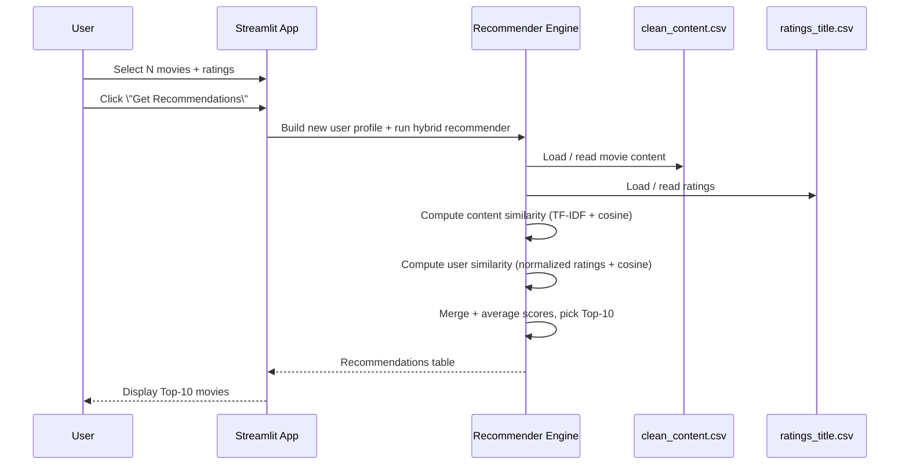
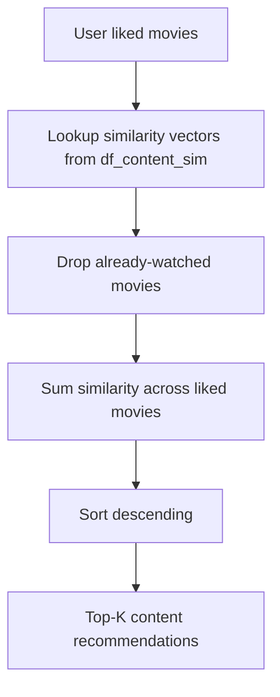
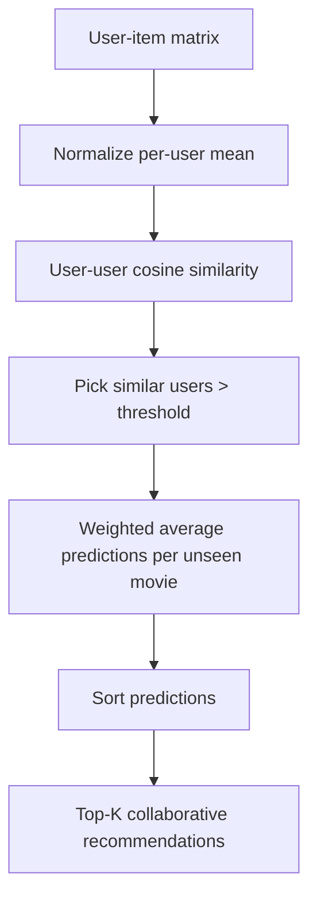
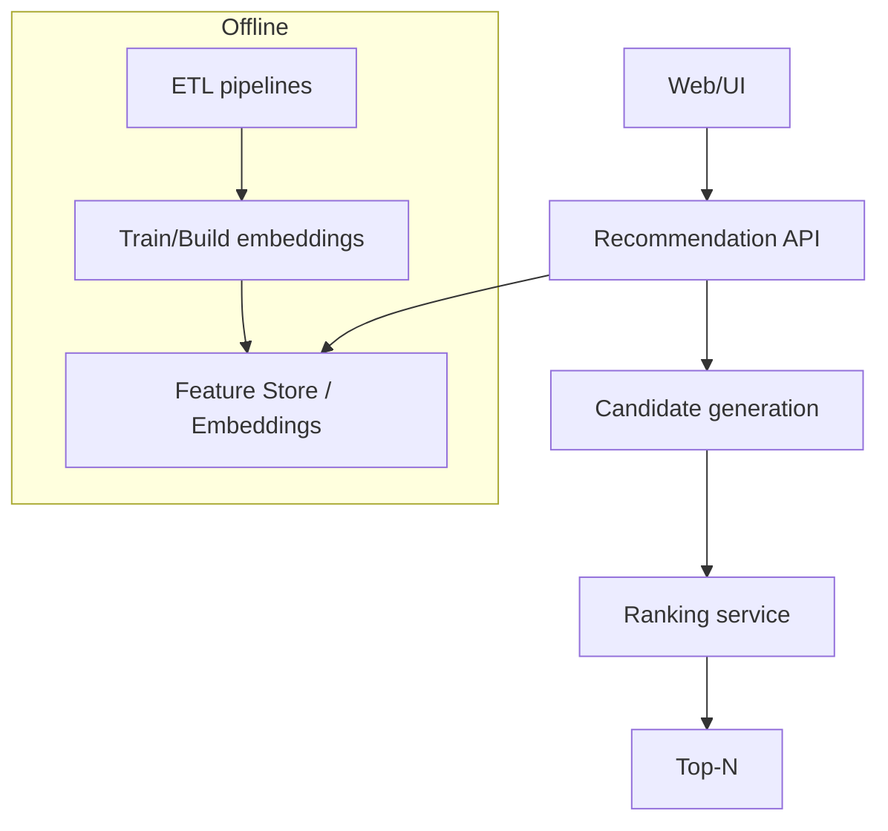

# Hybrid-Movie-Recommender — End-to-End (App + ML) Architecture, HLD/LLD, Flows, Interview Prep

## Table of contents
- [1. What this project is](#1-what-this-project-is)
- [2. Repo structure](#2-repo-structure)
- [3. Tech stack](#3-tech-stack)
- [4. High level design (HLD)](#4-high-level-design-hld)
- [5. Low level design (LLD)](#5-low-level-design-lld)
- [6. Data & features](#6-data--features)
- [7. Recommendation algorithms](#7-recommendation-algorithms)
- [8. End-to-end user flows (with Mermaid)](#8-end-to-end-user-flows-with-mermaid)
- [9. System design discussion (scaling, latency, quality)](#9-system-design-discussion-scaling-latency-quality)
- [10. Senior cross-questions + strong fresher answers](#10-senior-cross-questions--strong-fresher-answers)
- [11. Mock interview script (15–20 min)](#11-mock-interview-script-1520-min)

---

## 1. What this project is

This is a **hybrid movie recommender system** built using:
- **Content-based filtering** (movie-to-movie similarity from text + metadata)
- **User-based collaborative filtering** (user-to-user similarity from ratings)
- A **hybrid ensemble** that averages both signals to rank recommendations.

It also ships a **Streamlit app** where a user:
1) selects a number of movies to rate  
2) submits ratings  
3) gets top-N personalized recommendations

Problem statement (from README): Given user-movie ratings, predict a ranked list of movies a user would like to watch.

---

## 2. Repo structure

```
hybridmovierec/Hybrid-Movie-Recommender/
├── README.md
├── requirements.txt
├── data/
│   ├── content.csv
│   └── ratings_title.csv
├── code/                            # Jupyter notebooks (EDA, content, CF, hybrid)
│   ├── 1-Data-Cleaning-EDA.ipynb
│   ├── 2-Content-Based-Filtering.ipynb
│   ├── 3-Collaborative-Filtering .ipynb
│   └── 4-Hybrid-Recommendation-System.ipynb
├── images/                          # plots used in README
└── recommender_app/
    ├── app.py                       # Streamlit UI + runtime recommender build
    ├── functions.py                 # helper functions (older version)
    ├── clean_content.csv            # app-ready content dataset (with body column)
    └── ratings_title.csv            # app-ready ratings dataset
```

Key point for interviews: This project is primarily **Python + ML + Streamlit** (no separate frontend/backend microservices). The “frontend” is the Streamlit UI, and the “backend” is Python code running in the same process.

---

## 3. Tech stack

- **Python**
- **Streamlit** (UI)
- **pandas / numpy** (data)
- **scikit-learn** (TF-IDF, cosine similarity)
- **scipy.sparse** (sparse matrices for user-item normalization)
- **nltk** (sentiment tooling mentioned in notebooks/README; app uses TF-IDF on a prepared `body` field)

---

## 4. High level design (HLD)

### 4.1 Runtime architecture

```mermaid
graph TB
  U[User] --> UI[Streamlit UI]
  UI --> REC[Recommender Engine (Python)]
  REC --> DATA1[(clean_content.csv)]
  REC --> DATA2[(ratings_title.csv)]
  REC --> OUT[Top-N Recommendations Table]
  OUT --> UI
```

### 4.2 HLD flow (what happens on “Get Recommendations”)

```mermaid
flowchart TD
  A[User selects movies + ratings] --> B[Create new_userId]
  B --> C[Append ratings to df_user]
  C --> D[Build user-item matrix]
  D --> E[Normalize per-user mean]
  E --> F[Compute user-user cosine similarity]
  A --> G[Compute content similarity from TF-IDF on body]
  F --> H[Collaborative candidate scores]
  G --> I[Content candidate scores]
  H --> J[Hybrid score = avg(content, collaborative)]
  I --> J
  J --> K[Return Top-10 ranked recommendations]
```

### 4.3 Offline vs online
- **Offline** notebooks in `code/` describe data cleaning, feature engineering, and algorithm experimentation.
- **Online app** (`recommender_app/app.py`) recomputes key similarity matrices at runtime and produces recommendations.

---

## 5. Low level design (LLD)

## 5.1 Streamlit UI (presentation layer)

`recommender_app/app.py`:
- loads `clean_content.csv` and `ratings_title.csv`
- asks: “How many movies would you like to rate?” (min 3)
- for each row:
  - selectbox of movie title from content dataset
  - slider for rating 0.5–5
- on button click:
  - creates a new userId (max existing + 1)
  - appends user ratings into the ratings dataset
  - builds matrices + similarity
  - prints `st.table(hybrid_recommender(new_userId))`

### 5.2 Recommender engine (domain layer)

In `app.py` the engine is built from these functions (defined inside the button click block):
- `calculate_cosine_similarity(df_content)` → TF-IDF on `df_content['body']` → cosine similarity
- `get_content_similar_movies(user)` → recommend based on movies “liked” by user (>= mean rating)
- `get_user_similar_movies(user, similarity_threshold)` → weighted average of similar users’ normalized ratings
- `hybrid_recommender(user)` → merge content + collaborative and average the scores

### 5.3 Data structures
- `df_content`: one row per movie; includes `movie_id`, `title`, `genres`, `year`, ratings info, and a text field `body` used by TF-IDF (already prepared in `clean_content.csv`)
- `df_user`: one row per rating; `user_id`, `movie_id`, `rating`, `title`, `genres`, `year`
- `user_item`: pivot matrix \(users \times titles\) with ratings
- `norm_user_item`: row-centered by subtracting each user’s mean rating
- `df_user_sim`: user-user similarity matrix
- `df_content_sim`: movie-movie similarity matrix

### 5.4 LLD component diagram

```mermaid
graph LR
  subgraph Streamlit
    UI[Widgets: selectbox + slider + button]
  end

  subgraph Data
    C[clean_content.csv -> df_content]
    R[ratings_title.csv -> df_user]
  end

  subgraph Models
    TFIDF[TfidfVectorizer]
    CS1[Cosine Similarity (movies)]
    CS2[Cosine Similarity (users)]
  end

  UI --> ENG[Hybrid Recommender Functions]
  ENG --> C
  ENG --> R
  ENG --> TFIDF
  TFIDF --> CS1
  ENG --> CS2
  ENG --> OUT[Top-10 recommendations]
  OUT --> UI
```

---

## 6. Data & features

### 6.1 Data sources (from README)
- MovieLens: user ratings (610 users, ~9.7k movies, 100k ratings)
- IMDb: popularity/ratings/votes
- TMDB: metadata (synopsis/tagline/keywords/director/cast) and popularity signals

### 6.2 Feature engineering (conceptual)
Content model uses a text “document” per movie (the `body` column in app data) which typically includes:
- overview/synopsis
- tagline
- keywords
- cast/director tokens
- genre tokens
- sentiment score (mentioned in README/notebooks; app consumes already-cleaned data)

---

## 7. Recommendation algorithms

## 7.1 Content-based filtering

### Goal
Recommend movies similar to movies the user **liked** (defined as rating >= user mean rating).

### Steps
1) TF-IDF vectorize each movie’s `body` text  
2) Compute cosine similarity between movie vectors → movie-movie similarity matrix  
3) For each liked movie, take similarity scores to unseen movies  
4) Sum scores across liked movies → content similarity score per candidate  
5) Rank descending

Complexity (big picture):
- TF-IDF matrix build: \(O(N \cdot V)\) sparse
- Similarity full matrix: \(O(N^2)\) in worst-case (but sparse optimizations help)

## 7.2 User-based collaborative filtering (memory-based)

### Goal
Predict a target user’s preference for unseen movies from “similar users”.

### Steps
1) Build user-item matrix  
2) Normalize each user by subtracting their mean (reduces rating-scale bias)  
3) Compute user-user cosine similarity  
4) Select similar users above threshold (e.g., 0.1)  
5) For each candidate movie not rated by target user:
   - predicted score = weighted average of similar users’ normalized ratings  

### Why threshold matters
It avoids noisy users with low similarity pulling scores down.

## 7.3 Hybrid recommender

### Idea
Combine both recommenders to reduce weaknesses:
- content-based helps cold start & sparse ratings
- collaborative adds diversity and popularity signal from community behavior

### Combination rule (as implemented)
\[
hybrid\_score = \frac{content\_similarity + user\_similarity}{2}
\]

Then take Top-10 by `hybrid_score`.

---

## 8. End-to-end user flows (with Mermaid)

### 8.1 “Get Recommendations” (single-request flow)



### 8.2 Content-only path (for explanation)



### 8.3 Collaborative-only path (for explanation)



---

## 9. System design discussion (scaling, latency, quality)

### 9.1 Current constraints (as coded)
- Similarity matrices are recomputed in-app (costly as data grows)
- Memory-based CF needs access to large user-item matrix
- Streamlit runs as a single process (state in memory)

### 9.2 What you’d do in “production system design”



Practical upgrades:
- **Precompute**:
  - content TF-IDF vectors and similarity/top-neighbors per movie
  - user-user similarity for active users, or switch to model-based MF (SVD/SVD++)
- **Serve**:
  - store embeddings / top neighbors in a key-value store
  - keep online inference \(O(K)\) not \(O(N^2)\)
- **Evaluation**:
  - offline: RMSE/precision@k/recall@k/coverage
  - online: CTR/watch-time/user satisfaction, A/B testing

---

## 10. Senior cross-questions + strong fresher answers

### 10.1 End-to-end explanation
- **Q: Explain this project in 90 seconds, including the hybrid logic.**
  - **A:** It’s a Streamlit app on top of a hybrid recommender. The user rates a few movies; we append those ratings to the dataset, build a normalized user-item matrix, compute user-user cosine similarity, and predict unseen movie scores using weighted averages from similar users. In parallel, we compute movie-movie similarity using TF-IDF on a prepared text field representing movie metadata and use cosine similarity to score candidate movies similar to the user’s liked movies. We then merge candidates and average both similarity scores to produce a final ranked Top-10 list.

### 10.2 Content-based details
- **Q: Why TF-IDF and cosine similarity for content?**
  - **A:** TF-IDF turns text into sparse vectors emphasizing discriminative terms. Cosine similarity measures angle between vectors, which works well for sparse text features where magnitude is less important than direction.

- **Q: What does the `body` field contain and why?**
  - **A:** It’s a concatenation of relevant text signals (overview/tagline/keywords/people/genres) so the model can compare movies by semantic similarity. It’s engineered offline and stored in `clean_content.csv` so the app can run quickly.

### 10.3 Collaborative filtering details
- **Q: Why normalize by subtracting each user’s mean rating?**
  - **A:** Different users have different rating scales (some are strict, some generous). Centering removes that bias so cosine similarity and predictions reflect preference patterns rather than absolute rating levels.

- **Q: Why user-based CF and not item-based CF here?**
  - **A:** With MovieLens small, the number of users is lower than movies; user-user similarity matrix is smaller than item-item. User-based is cheaper to compute in that scenario.

- **Q: What is the weighted average formula?**
  - **A:** For a movie \(m\): \(\hat r_{u,m} = \frac{\sum_{v \in N(u)} sim(u,v)\cdot r'_{v,m}}{\sum_{v \in N(u)} sim(u,v)}\), where \(r'\) is normalized rating.

### 10.4 Hybrid design
- **Q: Why combine by a simple average?**
  - **A:** It’s a simple ensemble baseline that balances both signals. In production, we’d tune weights (e.g., \(0.7/0.3\)) or train a learning-to-rank model to combine signals based on outcomes.

- **Q: How does hybrid reduce cold start?**
  - **A:** For new users with few ratings, collaborative signals are weak because similar users aren’t reliable; content-based can still recommend based on the metadata of the few rated movies.

### 10.5 Quality, evaluation, and trade-offs
- **Q: How would you evaluate this recommender?**
  - **A:** Offline: split ratings by time/user, compute metrics like precision@k/recall@k, MAP/NDCG, and coverage/diversity. Online: A/B test, measure engagement/watch-time and explicit feedback.

- **Q: What are the biggest performance bottlenecks?**
  - **A:** Computing full cosine similarity matrices (movie-movie and user-user) and building the user-item pivot. These are expensive as data grows.

- **Q: What would you change for scalability?**
  - **A:** Precompute embeddings/similarities offline, store top neighbors, serve recommendations in \(O(K)\), and move to model-based CF (matrix factorization) or approximate nearest neighbor search.

---

## 11. Mock interview script (15–20 min)

### Warm-up (1 min)
**Q1. What does this project do and what’s the main algorithm?**  
Answer: Hybrid recommender combining content-based TF-IDF + cosine with user-based CF cosine similarity on normalized ratings.

### HLD (2 min)
**Q2. Draw and explain the system components.**  
Answer: Streamlit UI + recommender engine + CSV datasets. Mention offline notebooks for training/feature engineering.

### Content model (4 min)
**Q3. Explain TF-IDF and cosine similarity in your content model.**  
Follow-ups: why stopwords, why sparse, what is `body`.

### Collaborative model (5 min)
**Q4. Explain user-item matrix, normalization, and weighted average prediction.**  
Follow-ups: threshold, sparsity, cold start.

### Hybrid (3 min)
**Q5. How exactly do you combine both models and rank results?**  
Follow-ups: weighting, de-duplication, filtering watched movies.

### System design (3–4 min)
**Q6. If this needs to serve 1M users, what architecture changes?**  
Answer: offline pipelines, embeddings store, candidate generation + ranking, caching.

