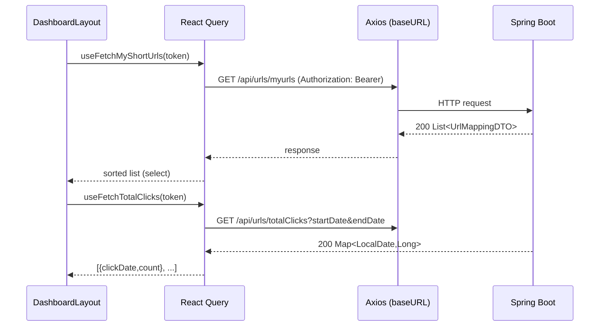
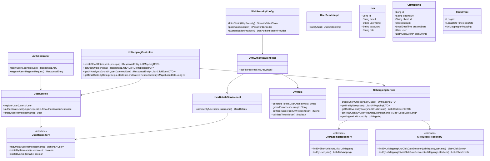
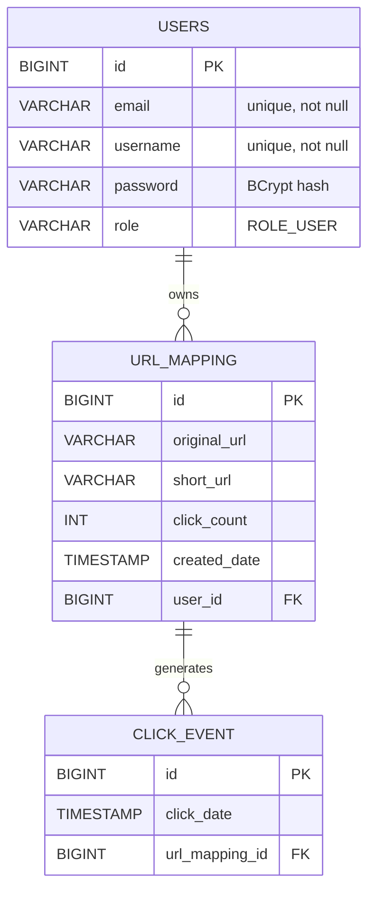
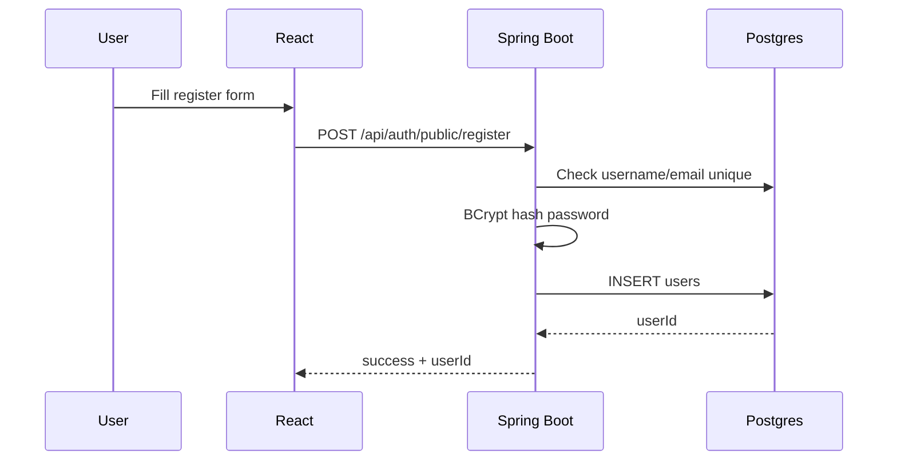
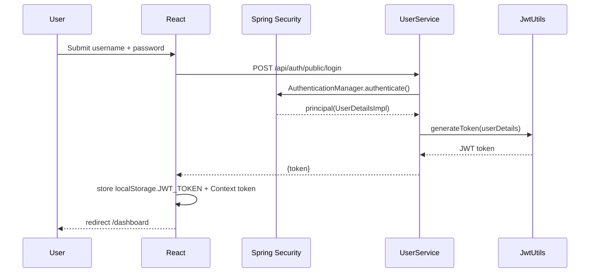
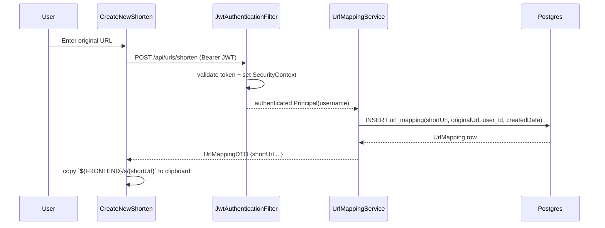
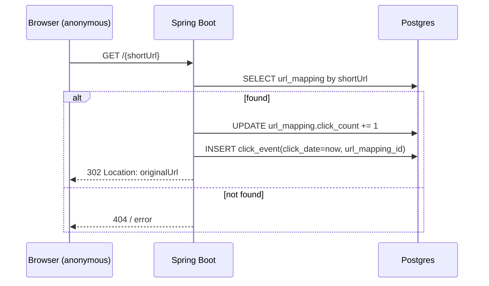
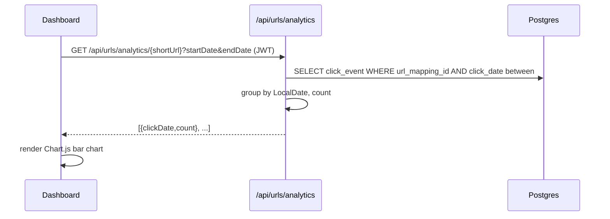
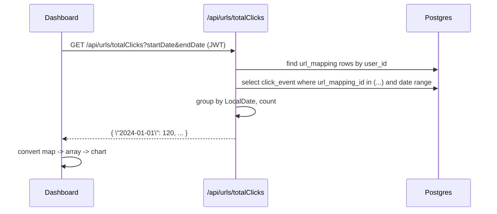
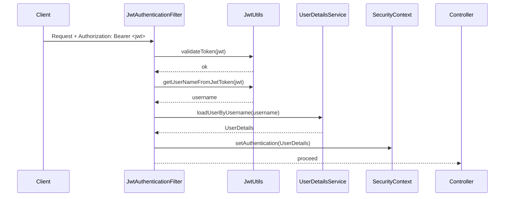

# Linklytics (URL Shortener) — End-to-End Architecture + HLD/LLD + Interview Prep

## Table of contents
- [1. Project overview](#1-project-overview)
- [2. Tech stack](#2-tech-stack)
- [3. High level design (HLD)](#3-high-level-design-hld)
- [4. Low level design (LLD)](#4-low-level-design-lld)
- [5. Database design](#5-database-design)
- [6. API design (endpoints + contracts)](#6-api-design-endpoints--contracts)
- [7. End-to-end flows](#7-end-to-end-flows)
- [8. Security design](#8-security-design)
- [9. Deployment & runtime](#9-deployment--runtime)
- [10. Senior-style cross questions + strong fresher answers](#10-senior-style-cross-questions--strong-fresher-answers)

---

## 1. Project overview

**Linklytics** is a URL shortening platform with analytics.

### Core capabilities
- **User auth**: register + login, JWT-based auth.
- **Create short URLs**: user submits `originalUrl`, backend generates an 8-char `shortUrl`.
- **Redirect**: visiting `/{shortUrl}` redirects to the original URL.
- **Analytics**:
  - Per-short-url click events aggregated by date.
  - Total clicks per user aggregated by date (across all their URLs).
- **Dashboard UI**: list of user URLs + charts.

Repository structure:
```
linklytics/Linklytics/
├── client/   # React SPA
└── server/   # Spring Boot app (REST + redirect)
```

---

## 2. Tech stack

### Frontend (`client/`)
- **React 18** + **React Router**
- **Vite** build tooling
- **TailwindCSS** + **MUI** components
- **React Query** for data fetching/caching
- **Axios** as HTTP client (baseURL via `VITE_BACKEND_URL`)
- **Chart.js** for analytics visualization
- **Context API** for auth token storage (`JWT_TOKEN` in localStorage)

### Backend (`server/`)
- **Java 21**
- **Spring Boot 3.4**
- **Spring Web** (REST)
- **Spring Security** + Method Security (`@PreAuthorize`)
- **Spring Data JPA**
- **PostgreSQL** JDBC driver (configured in deps)
- **JWT** via `io.jsonwebtoken` (jjwt 0.12.6)

---

## 3. High level design (HLD)

### 3.1 System components
- **Client (React SPA)**: login/register + dashboard + create short URL + charts.
- **Backend (Spring Boot)**:
  - Auth endpoints (`/api/auth/public/*`)
  - URL endpoints (`/api/urls/*`) protected by JWT
  - Redirect endpoint (`/{shortUrl}`) public
- **Database**:
  - `users` table
  - `url_mapping` table
  - `click_event` table

### 3.2 HLD architecture diagram

```mermaid
graph TB
  U[User Browser] --> FE[React SPA - Linklytics]
  FE -->|Axios: VITE_BACKEND_URL| BE[Spring Boot API]
  BE --> DB[(PostgreSQL)]
  U -->|Open short URL: /{shortUrl}| BE
```

### 3.3 Request types
- **API calls** (JSON):
  - Login/Register/Shorten/List/Analytics
- **Redirect calls** (browser navigation):
  - `GET /{shortUrl}` → 302 redirect to original URL

---

## 4. Low level design (LLD)

### 4.1 Frontend design

#### Routing & subdomain routing
The app supports subdomain-based routing using `getApps()` and `subDomainList`:
- Main: `www` (main app)
- Subdomain: `url`

Conceptually:

```mermaid
flowchart TD
  H[hostname] --> SD[getSubDomain()]
  SD -->|'' or www| Main[AppRouter]
  SD -->|url| Sub[SubDomainRouter]
```

#### Auth state
- Token is stored in **Context API** and persisted in `localStorage` as `JWT_TOKEN`.
- Route protection uses `PrivateRoute`:
  - **publicPage=true**: if logged in → redirect to `/dashboard`
  - otherwise: if not logged in → redirect to `/login`

```mermaid
flowchart TD
  LS[localStorage.JWT_TOKEN] --> Ctx[ContextApi token state]
  Ctx --> PR[PrivateRoute]
  PR -->|no token| Login[/login]
  PR -->|token| Dash[/dashboard]
```

#### Data fetching
React Query hooks wrap the backend API:
- `useFetchMyShortUrls(token)` → `GET /api/urls/myurls` then sorts by `createdDate desc`
- `useFetchTotalClicks(token)` → `GET /api/urls/totalClicks?startDate=...&endDate=...` then converts `{date:count}` map to array for Chart.js



---

### 4.2 Backend design

#### Layering
- **Controller layer**: `AuthController`, `UrlMappingController`, (Redirect controller exists by route rule `/{shortUrl}`)
- **Service layer**: `UserService`, `UrlMappingService`
- **Repository layer**: `UserRepository`, `UrlMappingRepository`, `ClickEventRepository`
- **Security layer**: `WebSecurityConfig`, `JwtAuthenticationFilter`, `JwtUtils`, `UserDetailsServiceImpl`

#### Core domain objects (entities)
- `User` (table: `users`)
- `UrlMapping` (maps original → short, belongs to User)
- `ClickEvent` (timestamped click record, belongs to UrlMapping)

#### Backend class diagram (LLD)



---

## 5. Database design

### 5.1 ER diagram



### 5.2 Why store click events as rows?
- Enables flexible analytics queries later (by date range, by URL, by user).
- Trade-off: more rows; needs indexing and retention policy at scale.

Recommended indexes (production thinking):
- `url_mapping.short_url` unique index
- `url_mapping.user_id` index
- `click_event.url_mapping_id` index
- `click_event.click_date` index
- composite `(url_mapping_id, click_date)`

---

## 6. API design (endpoints + contracts)

### 6.1 Auth API

| Method | Endpoint | Auth | Request | Response |
|---|---|---|---|---|
| POST | `/api/auth/public/register` | Public | `{ username, email, password }` | `{ status, message, userId }` |
| POST | `/api/auth/public/login` | Public | `{ username, password }` | `{ token }` |

### 6.2 URL shortener API (JWT protected)

| Method | Endpoint | Auth | Request | Response |
|---|---|---|---|---|
| POST | `/api/urls/shorten` | Bearer JWT + `ROLE_USER` | `{ originalUrl }` | `UrlMappingDTO` |
| GET | `/api/urls/myurls` | Bearer JWT + `ROLE_USER` | - | `UrlMappingDTO[]` |
| GET | `/api/urls/analytics/{shortUrl}?startDate&endDate` | Bearer JWT + `ROLE_USER` | ISO_LOCAL_DATE_TIME | `ClickEventDTO[]` (daily counts) |
| GET | `/api/urls/totalClicks?startDate&endDate` | Bearer JWT + `ROLE_USER` | ISO_LOCAL_DATE | `Map<LocalDate,Long>` |

DTOs:
- `UrlMappingDTO`: `{ id, originalUrl, shortUrl, clickCount, createdDate, username }`
- `ClickEventDTO`: `{ clickDate: LocalDate, count: Long }`

### 6.3 Redirect endpoint (public)

| Method | Endpoint | Auth | Behavior |
|---|---|---|---|
| GET | `/{shortUrl}` | Public | Lookup shortUrl → increment clickCount → insert ClickEvent → 302 redirect |

---

## 7. End-to-end flows

### 7.1 Register flow



### 7.2 Login flow (JWT)



### 7.3 Create short URL flow



### 7.4 Redirect + click tracking flow



### 7.5 Analytics flow (per URL)



### 7.6 Total clicks flow (across user URLs)



---

## 8. Security design

### 8.1 What is protected vs public?
- Public:
  - `/api/auth/**`
  - `GET /{shortUrl}` redirect endpoint
- Protected:
  - `/api/urls/**` requires JWT authentication

### 8.2 How JWT auth works
- On login, backend issues a JWT whose **subject is username** and includes a `roles` claim.
- `JwtAuthenticationFilter` runs for each request:
  - extracts Bearer token from `Authorization`
  - validates signature/expiry via `JwtUtils.validateToken`
  - loads `UserDetails` and sets `SecurityContext`
- Controllers then use `Principal principal` + `@PreAuthorize("hasRole('USER')")`.



### 8.3 CORS
Backend allows CORS only from `frontend.url` property (single origin), allows credentials, and permits `OPTIONS`.

### 8.4 Security gaps / improvements (good interview points)
- **Short URL collisions**: random 8 chars can collide; add uniqueness check + retry; DB unique constraint.
- **Brute force guessing**: rate-limit redirect endpoint and analytics endpoints.
- **Token storage**: client stores JWT in localStorage → XSS risk. Prefer httpOnly cookies in production.
- **ClickEvent retention**: at scale, store aggregates daily + keep raw events for limited time.

---

## 9. Deployment & runtime

### 9.1 Backend Dockerfile
- Multi-stage build: Maven wrapper builds JAR, runtime image runs `java -jar`.
- Exposes `8080`.

### 9.2 Environment variables (client)
- `VITE_BACKEND_URL`: axios base URL for backend.
- `VITE_REACT_FRONT_END_URL`: used to construct the final shareable URL.

### 9.3 Typical run commands

Frontend:
```bash
cd client
npm install
npm run dev
```

Backend:
```bash
cd server
./mvnw spring-boot:run
```

---

## 10. Senior-style cross questions + strong fresher answers

### 10.1 Architecture & HLD

- **Q: Explain the system end-to-end in 60 seconds.**
  - **A:** React SPA handles auth and a dashboard. It calls a Spring Boot REST API via Axios. Login issues a JWT; the client stores it and sends it in `Authorization` headers for protected endpoints. Backend stores users, URL mappings, and click events in Postgres through JPA. The redirect endpoint is public: it resolves the short code, records a click event, increments click count, and redirects.

- **Q: Why is `GET /{shortUrl}` public? Isn’t that unsafe?**
  - **A:** It must be public because anyone clicking a short link shouldn’t need to log in. Security is handled via randomness of short code, rate limiting, and abuse prevention.

- **Q: What happens if two users generate the same shortUrl?**
  - **A:** Collision risk exists. Fix: enforce unique index on `short_url` and on collision retry generation. For stronger guarantees, use base62 encoding of an ID (or Snowflake) instead of pure random.

### 10.2 Authentication & security

- **Q: Walk me through how JWT authentication works in Spring Security here.**
  - **A:** JWT filter reads Bearer token from `Authorization`, validates with HMAC secret, extracts username, loads user details, and sets `SecurityContext`. Then controllers can rely on `Principal` and `@PreAuthorize` role checks.

- **Q: Why BCrypt for passwords?**
  - **A:** BCrypt is adaptive hashing (slow on purpose), making brute-force harder if the DB leaks.

- **Q: Is storing JWT in localStorage safe?**
  - **A:** It’s vulnerable to XSS token theft. In production, I’d prefer httpOnly Secure cookies + CSRF protections, plus a strong CSP.

### 10.3 Backend design & data model

- **Q: Why do you store `ClickEvent` as a separate table?**
  - **A:** It enables analytics by date range and per link. If we only stored clickCount, we couldn’t build graphs. At scale, we can store daily aggregates and keep raw events for limited retention.

- **Q: How do you compute `/totalClicks`?**
  - **A:** Fetch all UrlMappings of the user, then fetch ClickEvents in that date range for those mappings, then group by LocalDate and count.

- **Q: What indexes would you add first?**
  - **A:** Unique index on `url_mapping.short_url`; index on `url_mapping.user_id`; composite index on `(click_event.url_mapping_id, click_event.click_date)`.

### 10.4 Frontend design

- **Q: How do you protect routes?**
  - **A:** `PrivateRoute` checks context token; if missing it redirects to `/login`. For public pages like login/register, if already logged in it redirects to dashboard.

- **Q: Why React Query?**
  - **A:** It caches server state, handles loading/error states, and supports refetching. Here it also uses `select` to sort/shape data before rendering.

### 10.5 System design improvements

- **Q: How would you make redirect endpoint fast under huge traffic?**
  - **A:** Use cache (Redis) for `shortUrl -> originalUrl`, write click events asynchronously (queue), and keep counters in Redis with periodic flush to DB.

- **Q: How would you prevent abuse (bots) hitting short URLs?**
  - **A:** Rate limit by IP/user agent, add WAF rules, detect anomalies, optionally require captcha for suspicious patterns (not for normal users).

### 10.6 “Senior catch” questions

- **Q: Your frontend builds share URL as `${FRONTEND}/s/{shortUrl}` but backend redirect is `/{shortUrl}`. Isn’t that inconsistent?**
  - **A:** Yes, it implies there is a frontend route `/s/:shortUrl` that likely forwards to backend or a reverse proxy that maps `/s/*` to backend `/*`. If not present, the fix is to align: either generate links as `/{shortUrl}` (backend-owned), or create a client route that calls backend and redirects.

- **Q: Why is `useFetchTotalClicks` hardcoding date range?**
  - **A:** It’s a simplification. In production, the dashboard would allow date range selection and pass it dynamically.

