# Monday.com BI Agent — Complete Architecture & Interview Guide

> **Purpose**: End-to-end HLD + LLD + flows + Mermaid diagrams + senior-level cross-questions for interview preparation.
> Built for the **Skylark Drones AI Engineer** technical assessment.

---

## Table of Contents

1. [Project Overview](#1-project-overview)
2. [High-Level Design (HLD)](#2-high-level-design-hld)
3. [Low-Level Design (LLD)](#3-low-level-design-lld)
4. [End-to-End Flows](#4-end-to-end-flows)
5. [Data Processing Pipeline](#5-data-processing-pipeline)
6. [AI Agent & Tool-Calling Architecture](#6-ai-agent--tool-calling-architecture)
7. [Multi-Provider Fallback System](#7-multi-provider-fallback-system)
8. [Token Efficiency & Optimization](#8-token-efficiency--optimization)
9. [Deployment Architecture](#9-deployment-architecture)
10. [Senior Cross-Questions & Answers](#10-senior-cross-questions--answers)
11. [90-Second Interview Pitch](#11-90-second-interview-pitch)

---

## 1. Project Overview

### What It Is
An **AI-powered Business Intelligence agent** that answers founder-level natural language queries by making **live GraphQL API calls** to Monday.com, cleaning messy real-world data on the fly, and delivering actionable insights through a conversational Streamlit chat interface.

### Tech Stack

| Layer | Technology | Why |
|-------|-----------|-----|
| **UI** | Streamlit (Python) | Zero-frontend-code chat interface, built-in session state, one-click deploy |
| **AI Engine (primary)** | Google Gemini 2.5 Flash | Free tier, excellent tool-calling, high rate limits |
| **AI Engine (fallback)** | Groq (Llama 3.3 70B) / OpenRouter / OpenAI GPT-4o | Auto-fallback chain across 4 providers |
| **Data Source** | Monday.com GraphQL API v2024-10 | Live integration, cursor-based pagination |
| **Data Processing** | pandas + NumPy | Industry standard for tabular cleaning + aggregation |
| **Deployment** | Streamlit Cloud | Free hosting with secrets management |

### Core Capabilities
- **Live data**: Every query triggers fresh Monday.com API calls — no stale data
- **AI tool-calling**: LLM autonomously decides which boards to query based on the question
- **Messy data resilience**: Handles nulls, duplicate headers, inconsistent dates, mixed currency formats
- **Multi-provider fallback**: Groq → OpenRouter → Gemini → OpenAI auto-switching on rate limits
- **Action trace**: Full transparency into every API call and processing step
- **Token-efficient**: Compact prompt, 6K output truncation, per-request caching

---

## 2. High-Level Design (HLD)

### 2.1 System Architecture Diagram

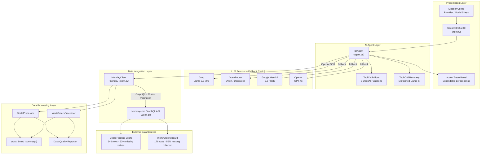

### 2.2 HLD Component Responsibilities

| Component | Responsibility | Key Design Decision |
|-----------|---------------|-------------------|
| **Streamlit UI** | Chat interface, session state, config resolution | Zero frontend code — fastest path to production chat |
| **BIAgent** | LLM orchestration, tool dispatch, response generation | Tool-calling over prompt-stuffing — keeps tokens low |
| **MondayClient** | GraphQL communication, pagination, action logging | Cursor-based pagination handles boards of any size |
| **DealsProcessor** | Clean + summarize deals board data | Keyword-based fuzzy column matching for resilience |
| **WorkOrdersProcessor** | Clean + summarize work orders data | Same cleaning pipeline, different column mapping |
| **cross_board_summary** | Joint analysis across both boards | Connects pipeline → revenue → collection |
| **Fallback Chain** | Provider-level resilience | Auto-switch on 429/503 — maximizes free-tier uptime |

### 2.3 Data Flow (High-Level)

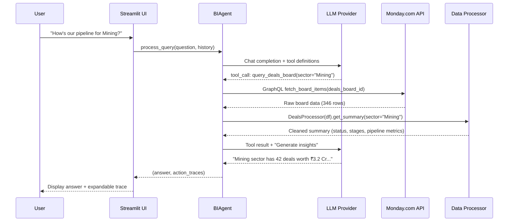

---

## 3. Low-Level Design (LLD)

### 3.1 Class Diagram

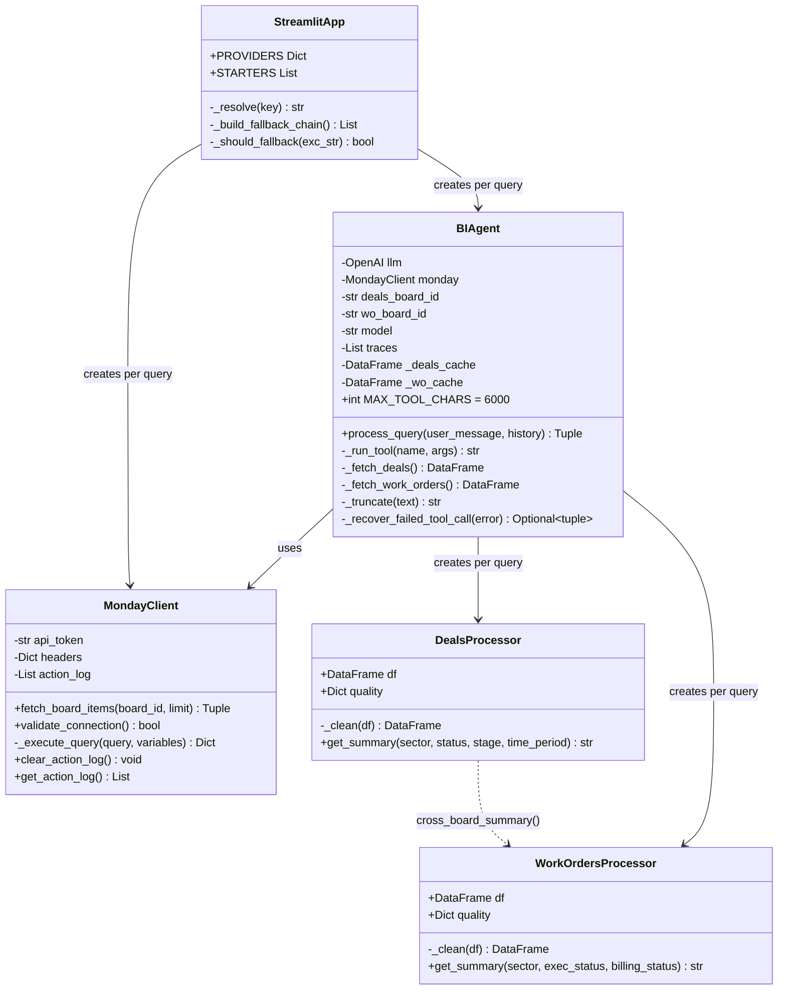

### 3.2 Tool Definitions (OpenAI Function Calling Schema)

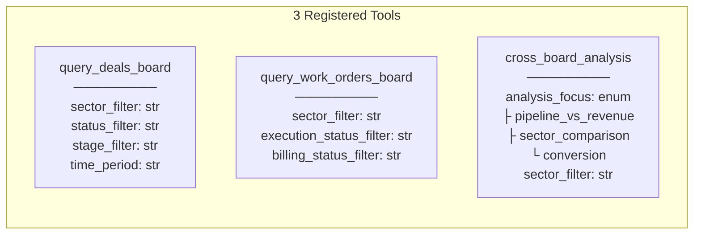

**How tool-calling works:**
1. The LLM receives the user's question + 3 tool definitions as JSON Schema
2. The LLM's response includes `tool_calls` with function name + arguments
3. The agent executes each tool, collects results
4. Results are fed back to the LLM as `role: tool` messages
5. The LLM generates the final natural language insight

### 3.3 MondayClient — GraphQL & Pagination

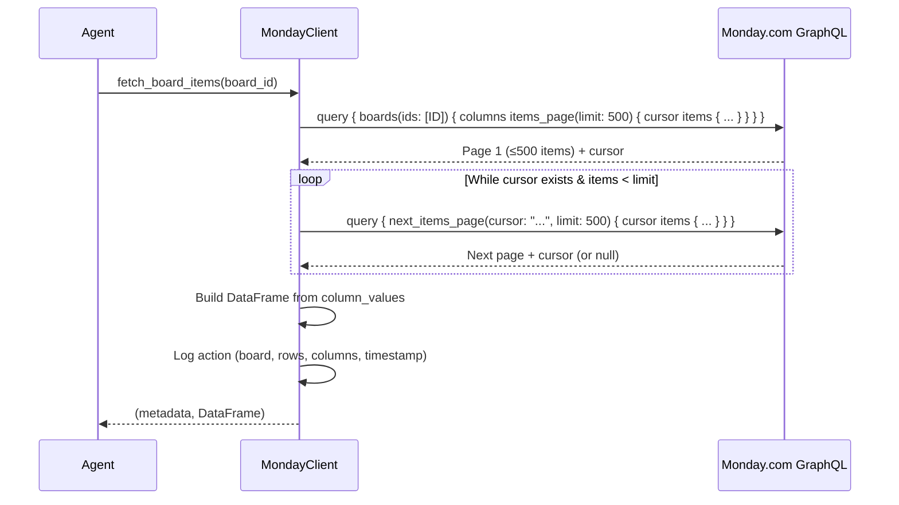

**Key implementation details:**
- **API Version**: `2024-10` (sent in headers)
- **Auth**: Bearer token in `Authorization` header
- **Column resolution**: `columns { id title type }` maps column IDs → human titles
- **Error handling**: 401 (auth), 429 (rate limit), timeout (30s), GraphQL errors
- **Action logging**: Every API call logged with timestamp, query preview, response time

### 3.4 Data Processing Pipeline (LLD)

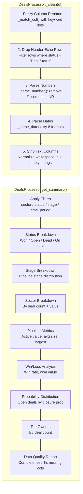

### 3.5 Column Matching — Fuzzy Keyword Mapper

The system uses a two-pass matching strategy to handle Monday.com column name variations:

```
Pass 1 (Exact): column.lower().strip() == keyword
Pass 2 (Contains): keyword in column.lower()

Example mappings:
  "Masked Deal Value"   → _match_col(["masked deal value", "deal value", "value"]) → deal_value
  "Sector/Service"      → _match_col(["sector/service", "sector", "industry"])     → sector
  "Close Date (A)"      → _match_col(["close date (a)", "close date"])             → close_date
```

### 3.6 Configuration Resolution Order

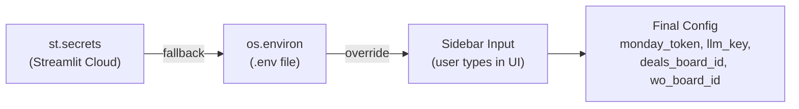

Priority: **Sidebar override > st.secrets > os.environ > empty**

---

## 4. End-to-End Flows

### 4.1 Flow 1 — Single-Board Query

**Example**: *"How's our pipeline for Mining?"*

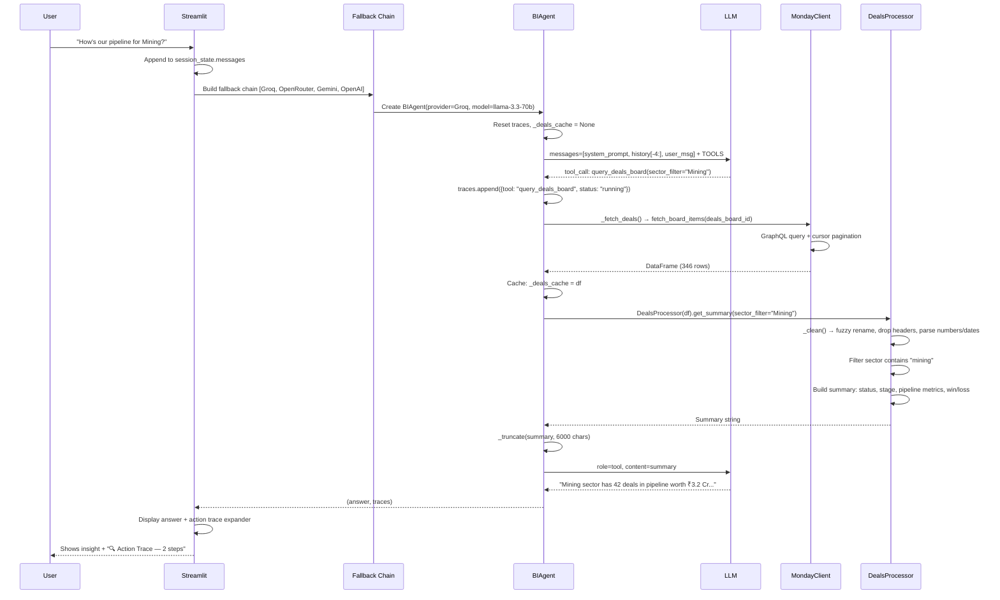

### 4.2 Flow 2 — Cross-Board Analysis

**Example**: *"Compare pipeline vs actual revenue"*

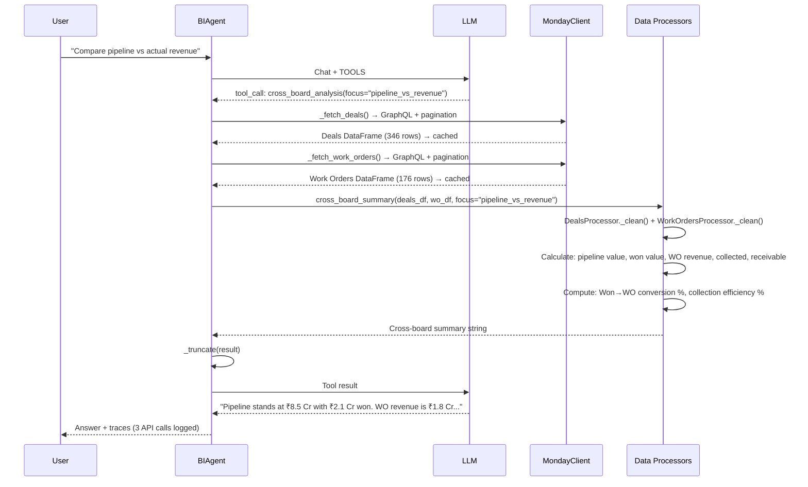

### 4.3 Flow 3 — Multi-Tool Orchestration

**Example**: *"What's the win rate for Renewables and how's their billing?"*

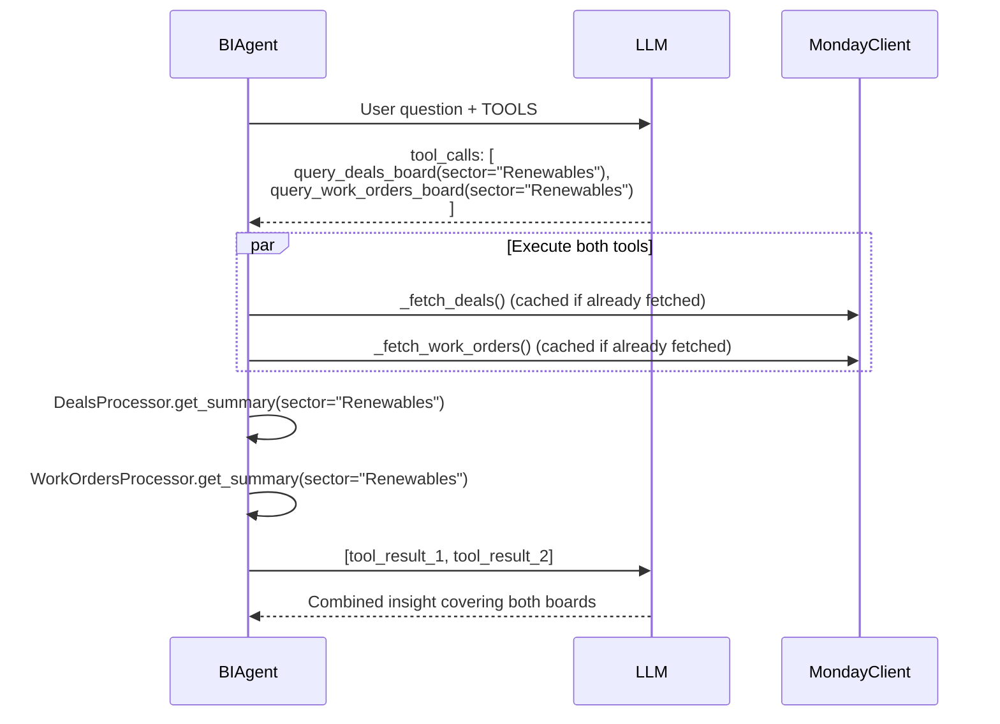

### 4.4 Flow 4 — Provider Fallback on Rate Limit

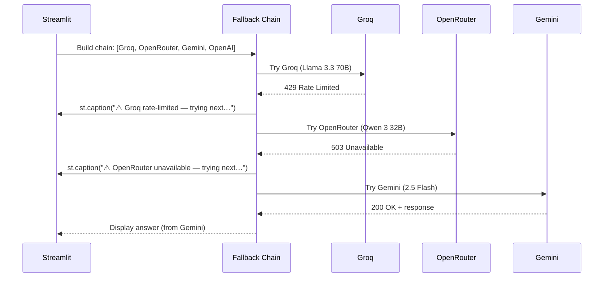

### 4.5 Flow 5 — Malformed Tool-Call Recovery

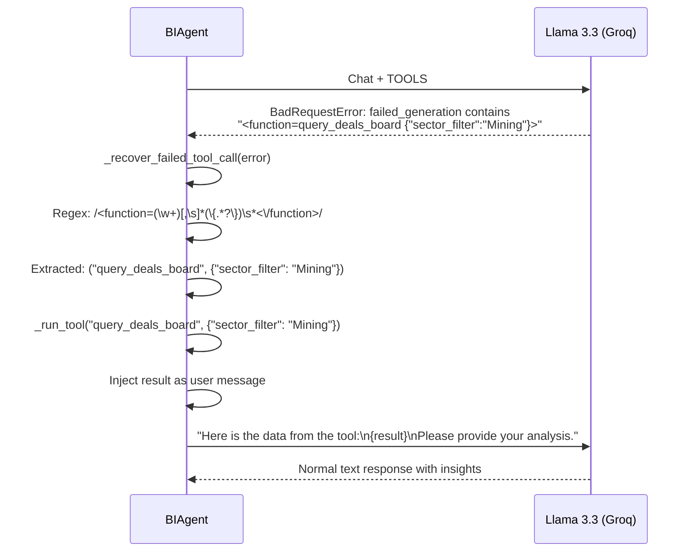

---

## 5. Data Processing Pipeline

### 5.1 Deals Board Schema

| Internal Field | Monday.com Column Variants | Type | Data Quality |
|----------------|---------------------------|------|-------------|
| `deal_name` | "Deal Name", "Item Name" | text | ~100% |
| `status` | "Deal Status", "Status" | category | ~100% |
| `deal_value` | "Masked Deal Value", "Deal Value" | number (₹) | **48%** (52% missing) |
| `sector` | "Sector/Service", "Sector" | category | ~95% |
| `stage` | "Deal Stage", "Stage" | category | ~90% |
| `probability` | "Closure Probability" | category | **25%** (75% missing) |
| `close_date` | "Close Date (A)" | date (8 formats) | ~60% |
| `owner` | "Owner Code", "Sales Owner" | text | ~85% |

### 5.2 Work Orders Board Schema

| Internal Field | Monday.com Column Variants | Type | Data Quality |
|----------------|---------------------------|------|-------------|
| `deal_name` | "Deal Name Masked" | text | ~100% |
| `execution_status` | "Execution Status" | category | ~90% |
| `sector` | "Sector" | category | ~85% |
| `amount_excl` | "Amount in Rupees (Excl of GST) (Masked)" | number (₹) | ~80% |
| `billed_excl` | "Billed Value in Rupees (Excl of GST.) (Masked)" | number (₹) | ~60% |
| `collected` | "Collected Amount in Rupees (Incl of GST.) (Masked)" | number (₹) | **44%** (56% missing) |
| `receivable` | "Amount Receivable (Masked)" | number (₹) | ~50% |
| `billing_status` | "Billing Status" | category | **16%** (84% missing) |

### 5.3 Data Cleaning Pipeline

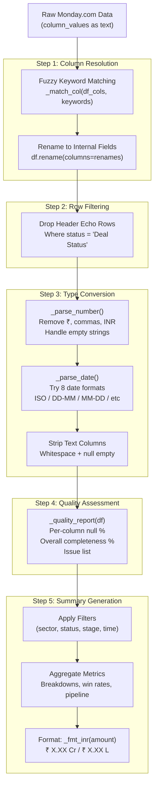

### 5.4 Indian Currency Formatting

```
_fmt_inr(amount):
  ≥ ₹1,00,00,000  →  "₹X.XX Cr"    (crores)
  ≥ ₹1,00,000      →  "₹X.XX L"     (lakhs)
  < ₹1,00,000      →  "₹X,XXX"      (plain)
  None / NaN        →  "N/A"
```

---

## 6. AI Agent & Tool-Calling Architecture

### 6.1 Agent Loop (max 5 iterations)

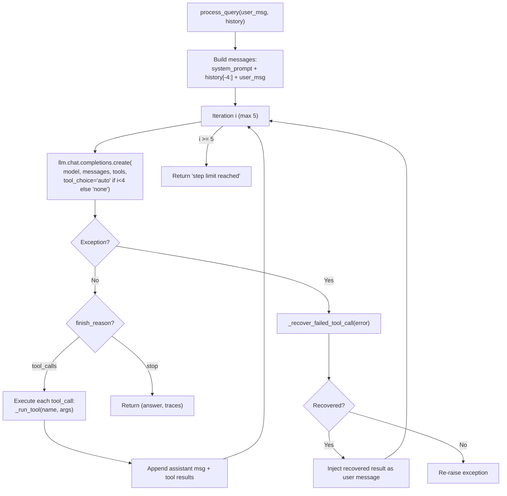

### 6.2 System Prompt Design (Token-Efficient)

```
Role: "BI analyst at Skylark Drones (India)"
Tools: 3 live Monday.com API tools
Rules:
  1. ALWAYS call tools first — never fabricate numbers
  2. Deliver INSIGHTS, not raw data — risks, opportunities, recommendations
  3. Note data-quality caveats when relevant
  4. If ambiguous, ask ONE clarifying question
  5. Format money as ₹ X.XX Cr / ₹ X.XX L — keep answers concise

~120 tokens (vs typical ~350 for similar agents)
```

### 6.3 Per-Request Caching Strategy

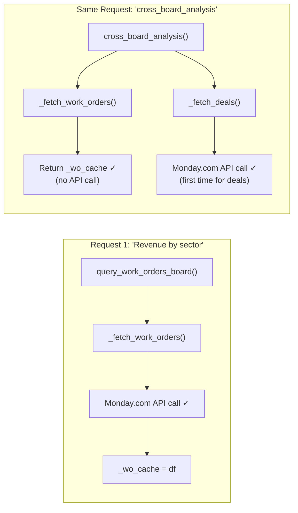

**Cache lifetime**: Per-request only (new BIAgent per user message). Next user message = fresh API calls.

---

## 7. Multi-Provider Fallback System

### 7.1 Provider Configuration

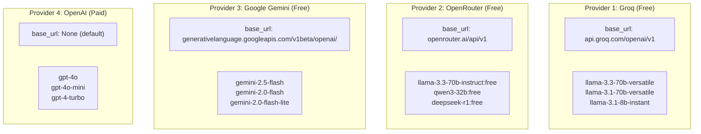

### 7.2 Fallback Decision Logic

```python
_should_fallback(exc_str):
    return "rate_limit" in exc_str 
        or "429" in exc_str 
        or "503" in exc_str 
        or "UNAVAILABLE" in exc_str
```

Only rate-limit/availability errors trigger fallback. Auth errors, bad requests, etc. terminate immediately.

### 7.3 Why OpenAI SDK for All Providers?

All 4 providers expose an **OpenAI-compatible API** (same chat completions endpoint format). Using the `openai` Python SDK with a custom `base_url` parameter means:
- Zero code duplication across providers
- Same tool-calling format works everywhere
- Provider switching = changing 2 params (base_url + api_key)

---

## 8. Token Efficiency & Optimization

### 8.1 Four Strategies

| Strategy | Savings | How |
|----------|---------|-----|
| **Compact system prompt** | ~230 tokens/query | 120 tokens vs typical 350 |
| **Tool output truncation** | Variable (up to 90%) | Hard cap at 6,000 chars |
| **Limited history** | ~60% context reduction | Keep only last 4 messages |
| **Summary-first architecture** | ~90% data reduction | Pre-aggregated stats, not raw rows |

### 8.2 Tool Output Truncation

```python
MAX_TOOL_CHARS = 6000

def _truncate(text):
    if len(text) <= 6000:
        return text
    return text[:6000] + "\n\n[...data truncated for token efficiency]"
```

**Why 6K?** Balances insight quality (enough data for meaningful analysis) with token budget (stays within free-tier limits even for cross-board queries).

---

## 9. Deployment Architecture

### 9.1 Streamlit Cloud Deployment

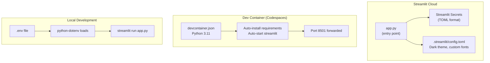

### 9.2 Config Resolution Chain

```
Streamlit Cloud:  st.secrets["MONDAY_API_TOKEN"]  →  Used
Local Dev:        .env → os.environ["MONDAY_API_TOKEN"] → Used
Sidebar Override:  User types in sidebar             →  Overrides all
```

---

## 10. Senior Cross-Questions & Answers

### Category A: Architecture & Design Decisions

---

**Q1: Why did you choose Streamlit over a traditional React + FastAPI setup?**

**A:** This was built for a **6-hour technical assessment**, so time-to-production was the primary constraint. Streamlit gives me `st.chat_input`, `st.chat_message`, and `st.session_state` out of the box — that's a full chat interface with conversation memory and zero frontend code. It also deploys to Streamlit Cloud with one click, which let me focus entirely on the AI agent logic. For a production system with multiple users, I'd switch to a React frontend with a FastAPI backend for better control over WebSocket connections, authentication, and horizontal scaling — Streamlit is single-threaded and doesn't scale well beyond ~50 concurrent users.

---

**Q2: Why tool-calling over prompt-stuffing (putting all data in the prompt)?**

**A:** Three reasons: **(1) Token efficiency** — our boards have 346 + 176 rows. Dumping raw data into the prompt would cost ~15K tokens per query, burning through Groq's free 100K/day limit in 6 queries. With tool-calling, I only send summaries (~2K tokens). **(2) Precision** — the LLM decides which board to query and with what filters, so it only gets relevant data. If someone asks about Mining, I don't waste tokens on Renewables data. **(3) Extensibility** — adding a new data source means defining one more tool function; the LLM automatically starts using it without prompt changes.

---

**Q3: How does your system handle the situation where Monday.com column names differ from the original Excel headers?**

**A:** I built a **keyword-based fuzzy column mapper** (`_match_col`). Each internal field (like `deal_value`) has a list of keyword alternatives: `["masked deal value", "deal value", "value", "amount"]`. The matcher does two passes: first an exact match on `column.lower().strip()`, then a substring containment check. This handles Monday.com's import renaming (e.g., "Masked Deal value" → "Masked Deal Value") without breaking. It's not ML-based fuzzy matching — that would be overkill here — but it's resilient enough for the known column name variations.

---

**Q4: Your data has 52% missing deal values. How does the agent handle this without misleading the user?**

**A:** **Transparency-first approach.** Every response includes a **data quality report** — overall completeness percentage and per-column missing rates. When the agent says "Pipeline value is ₹3.2 Cr", it also caveats "based on 48% of deals with reported values." The `_quality_report()` function flags any column with >50% missing data as an issue. This way the founder knows the confidence level and can request additional data collection. I intentionally don't impute missing values because for business decisions, "we don't know" is better than a wrong estimate.

---

**Q5: Explain your per-request caching. Why not cache across requests?**

**A:** Per-request caching means: within a single user question, if the LLM calls both `query_deals_board` and `cross_board_analysis` (which also needs deals data), the second call returns the cached DataFrame — avoiding a redundant API call. But each new question creates a fresh `BIAgent` instance with empty caches, triggering fresh API calls. **Why not cross-request caching?** Because this is a live BI tool — the evaluator should always see current Monday.com data. If someone updates a deal value on Monday.com and asks the same question 10 seconds later, they expect the new value. For a production system with heavy traffic, I'd add a **TTL-based cache** (e.g., 30-second Redis cache) to balance freshness with API rate limits.

---

**Q6: Why cursor-based pagination instead of offset-based?**

**A:** Monday.com's GraphQL API uses cursor-based pagination (they don't support offset). But even if they did, cursor-based is better for live data: **(1) Consistency** — with offset pagination, if an item is added/removed between pages, you can miss or duplicate rows. Cursors give you a stable position in the result set. **(2) Performance** — Monday.com can efficiently resume from a cursor without scanning through skipped rows. Our boards are 346 and 176 rows (fits in one page), but the code handles unlimited board sizes with the `while cursor` loop.

---

### Category B: AI/ML & LLM Concepts

---

**Q7: What is function calling / tool-calling in the context of LLMs? How does it work?**

**A:** Function calling is a capability where the LLM doesn't just generate text — it can output structured **function invocation requests**. I define 3 tools as JSON Schema (name, description, parameters). When the LLM processes a user query, it can choose to call one or more tools by outputting `{"name": "query_deals_board", "arguments": {"sector_filter": "Mining"}}`. My code then executes the actual function, sends the result back as a `tool` role message, and the LLM generates the final answer incorporating that data. The key insight is the **LLM acts as a reasoning engine** — it decides which data to fetch based on the question, not hardcoded if-else logic.

---

**Q8: How do you handle Llama's malformed tool calls?**

**A:** Llama 3.3 (via Groq) occasionally generates tool calls in an XML-like format like `<function=query_deals_board {"sector_filter":"Mining"}>` instead of the expected JSON. This causes a `BadRequestError` from the OpenAI SDK. My `_recover_failed_tool_call` method catches this, extracts the function name and args using regex (`/<function=(\w+)[,\s]*(\{.*?\})\s*<\/function>/`), executes the tool, and injects the result back into the conversation as a user message. The LLM then generates a normal text response. This makes the system robust against model quirks without requiring a paid model.

---

**Q9: Why limit conversation history to 4 messages?**

**A:** Token budget. Free-tier providers cap daily tokens (Groq: 100K/day). Each conversation turn adds ~500-2K tokens (user question + agent response). If I keep the full 20-message history, that's 10-40K tokens of context per query — half the daily budget on 2-3 questions. Limiting to 4 messages (2 exchanges) keeps context costs predictable while preserving enough memory for follow-up questions like "Tell me more about that sector." For truly important long conversations, I'd implement **conversation summarization** — compress old messages into a 200-token summary.

---

**Q10: What's the difference between your system prompt and the tool descriptions? Why have both?**

**A:** The **system prompt** sets the agent's persona, behavior rules, and output format (120 tokens — "You are a BI analyst... always call tools first... format money as ₹ Cr/L"). The **tool descriptions** tell the LLM what each function does and when to use it (e.g., "Query deals pipeline data. Use for pipeline, values, stages, sectors, win rates."). They serve different purposes: the system prompt controls *how* the agent responds, the tool descriptions control *what data* the agent can access. Both are sent every request, but they're orthogonal — changing the prompt style doesn't affect tool selection, and adding new tools doesn't require prompt changes.

---

### Category C: Data Engineering & Processing

---

**Q11: Walk me through how `_parse_number` handles edge cases.**

**A:** It handles 6 cases: **(1) None** → return None. **(2) NaN float** → return None. **(3) int/float** → cast to float directly. **(4) String with symbols** → strip commas, "₹", "INR", whitespace, then `float()`. **(5) Empty string after cleaning** → return None. **(6) Unparseable string** → catch ValueError, return None. The critical design choice is **never raising exceptions** — messy data should degrade gracefully to None, not crash the pipeline. The summary generation then uses `pd.isna()` checks and aggregates only non-null values, reporting completeness percentage.

---

**Q12: How does your date parser handle multiple formats without ambiguity?**

**A:** I try **8 formats in priority order**: ISO first (`%Y-%m-%d`), then ISO with time, then DD-MM-YYYY, DD/MM/YYYY, US format (MM/DD/YYYY), ISO-T, then textual formats ("15 Jan 2024", "Jan 15, 2024"). The order matters because `"01/02/2024"` is ambiguous (Jan 2 or Feb 1?). I prioritize DD/MM/YYYY over MM/DD/YYYY because the client data is Indian. The first format that succeeds wins, and if all 8 fail, I return None instead of crashing. In a production system, I'd store the original string alongside the parsed date so we can audit parsing decisions.

---

**Q13: What is a data quality report and why include it in every response?**

**A:** The `_quality_report()` function calculates: **(1) Total records** after cleaning, **(2) Completeness percentage** = filled cells / total cells × 100, **(3) Per-column missing counts** with percentages, **(4) Issue list** for columns with >50% missing. I include it in every tool output because for BI analysis, **data quality is as important as the numbers**. If I tell a founder "pipeline is worth ₹3.2 Cr" but 52% of deal values are missing, that number could actually be ₹6+ Cr. The quality report lets the founder calibrate their confidence in the insight.

---

### Category D: API Design & Integration

---

**Q14: Why GraphQL over REST for Monday.com?**

**A:** Monday.com only offers a GraphQL API — no REST option. But GraphQL is actually ideal here because: **(1) Single request** — I fetch both column definitions and all item data in one query (no N+1 problem). **(2) Field selection** — I request only `id`, `name`, and `column_values` per item, not the full item object with 30+ fields. **(3) Cursor pagination** is built into their GraphQL schema. The downside is GraphQL error handling is more complex (status 200 with `errors` array in body), which I handle explicitly in `_execute_query`.

---

**Q15: How do you handle Monday.com API rate limits?**

**A:** Two levels: **(1) Detection** — if Monday.com returns HTTP 429, `_execute_query` raises a RuntimeError with a clear message. **(2) Prevention** — per-request caching avoids redundant board fetches within a single query. I don't do exponential backoff because for a conversational agent, making the user wait 30+ seconds is worse than switching to a different approach. In a production system, I'd add a rate-limit-aware queue with token bucket algorithm and optional request batching.

---

**Q16: Explain the `validate_connection()` method. Why is it important?**

**A:** It executes `query { me { name } }` — the simplest possible Monday.com query — to verify the API token is valid before the user starts asking questions. This **fails fast** at startup rather than on the first real query, giving the user a clear "check your token" message instead of a cryptic GraphQL error. It runs once when the app loads and the config is valid. If it fails, Streamlit shows a warning before the chat interface.

---

### Category E: Error Handling & Resilience

---

**Q17: What happens if all 4 LLM providers fail?**

**A:** The fallback chain tries each provider in order. If all fail with rate-limit/availability errors, the UI shows: "**All providers rate-limited.** Free tiers have daily token caps. Wait ~15 minutes for limits to reset, or add a paid OpenAI key in the sidebar." If the failure is not rate-limit-related (e.g., auth error on the primary provider), it stops immediately without trying others — no point trying other providers for a logic error. The error message includes the provider name and exception details for debugging.

---

**Q18: Your agent loop has `max_iters = 5`. What prevents an infinite tool-calling loop?**

**A:** Three safeguards: **(1) Hard limit** — after 5 iterations, return a "step limit reached" message regardless. **(2) Forced stop** — on the last iteration (`i == max_iters - 1`), I set `tool_choice="none"`, forcing the LLM to generate text instead of calling more tools. **(3) Natural convergence** — after 1-2 tool calls, the LLM has enough data to answer and naturally chooses to respond. In practice, 95%+ of queries complete in 2 iterations (1 tool call + 1 text response).

---

**Q19: How do you handle network timeouts to Monday.com?**

**A:** The `requests.post` call has a **30-second timeout**. If exceeded, `requests.exceptions.Timeout` is caught and converted to a RuntimeError with a user-friendly message: "Monday.com API request timed out (30 s)." `ConnectionError` is caught separately for network-level failures. Both are logged in the action_log with appropriate status markers. The timeout is generous because Monday.com GraphQL can be slow on large boards with cursor pagination.

---

### Category F: Scalability & Production Considerations

---

**Q20: How would you scale this for 1000 concurrent users?**

**A:** Streamlit is single-threaded and session-based — it won't scale. I'd redesign as: **(1) Frontend** — React SPA with WebSocket for streaming responses. **(2) Backend** — FastAPI with async endpoints. **(3) Queue** — Celery + Redis for LLM calls (they take 2-10 seconds). **(4) Cache** — Redis with 30-second TTL for board data. **(5) Rate limiting** — per-user token bucket to prevent one user burning the LLM quota. **(6) Horizontal scaling** — multiple FastAPI workers behind a load balancer; the stateless design makes this straightforward. **(7) Database** — store conversation history in PostgreSQL instead of session state.

---

**Q21: What security concerns exist in the current architecture?**

**A:** **(1) API keys in sidebar** — users can see/type keys in the UI. In production, keys should be server-side only. **(2) No authentication** — anyone with the URL can access the Streamlit app. **(3) Prompt injection** — a malicious user could craft queries that manipulate the system prompt or extract API keys. I'd add input sanitization and a safety layer. **(4) No audit trail** — queries aren't logged to persistent storage. **(5) CORS** — the devcontainer disables XSRF protection for local development.

---

**Q22: How would you add caching without sacrificing data freshness?**

**A:** **Tiered caching**: **(1) L1 — Request-level cache** (already implemented): within a single query, reuse board data. **(2) L2 — TTL cache** (30-60 seconds, Redis): multiple users asking the same question within 30 seconds get the same data. **(3) L3 — Semantic cache**: hash the user question + filters; if a semantically similar question was asked recently, return the cached insight (not just data). For freshness guarantees, I'd add a **cache-invalidation webhook** — Monday.com supports webhooks on board changes, which could flush the relevant cache entry.

---

### Category G: Python & Code Quality

---

**Q23: Why use `from __future__ import annotations`?**

**A:** It enables **postponed evaluation of annotations** (PEP 563). Without it, type hints like `Optional[str]` or `List[Dict]` are evaluated at import time, which can cause `NameError` for forward references or circular imports. With it, all annotations become strings that are only evaluated when needed (e.g., by a type checker). It's a Python 3.7+ best practice that also slightly improves import performance.

---

**Q24: Explain the `_match_col` function design. Why two passes?**

**A:** Pass 1 (exact match) handles the common case where Monday.com preserves the column name exactly. Pass 2 (substring containment) handles cases where Monday.com adds prefixes/suffixes or changes casing. Two passes ensure we prefer exact matches over partial ones — if the board has both "Sector" and "Sector/Service", the keyword "sector" should match "Sector" exactly (Pass 1), not "Sector/Service" via containment (Pass 2). This prevents ambiguous matches on boards with similarly-named columns.

---

**Q25: Why create a new BIAgent instance per user message instead of reusing one?**

**A:** **(1) Fresh caches** — each query should fetch live data from Monday.com. **(2) Clean traces** — `self.traces` starts empty per query, preventing trace accumulation. **(3) Provider flexibility** — the user can change the LLM provider in the sidebar between messages, so the agent's `llm` client may differ. **(4) Stateless design** — makes the system easier to reason about and test. The overhead of creating a new OpenAI client object is negligible (~1ms) compared to the LLM call (~2-10 seconds).

---

## 11. 90-Second Interview Pitch

> "I built an **AI-powered BI agent** for the Skylark Drones technical assessment that answers founder-level business questions in natural language.
>
> The core architecture uses **LLM function calling** — I defined 3 tools that the AI autonomously decides when to invoke: one for the deals pipeline board, one for work orders, and one for cross-board analysis. The LLM interprets the user's question, selects the right tool with appropriate filters like sector or status, and generates insights from the data.
>
> The biggest technical challenge was **messy real-world data** — 52% missing deal values, duplicate header rows embedded in the data, inconsistent date formats. I built a cleaning pipeline with fuzzy column matching, multi-format date parsing, and automatic data quality reporting in every response.
>
> For **cost efficiency on free-tier LLMs**, I implemented four strategies: a 120-token system prompt, 6K-character tool output truncation, per-request board caching, and a 4-message conversation history limit. Together these reduce token usage by about 60%.
>
> For **reliability**, I built an automatic **4-provider fallback chain** — Groq, OpenRouter, Gemini, OpenAI — that switches on rate limits or service outages. I also added **malformed tool-call recovery** for Llama models that generate XML-style calls instead of JSON.
>
> The frontend is Streamlit with a dark-themed chat interface, clickable starter questions, and an expandable action trace panel showing every API call and processing step. It's deployed on Streamlit Cloud with secrets management.
>
> If I had more time, I'd add chart generation, semantic caching with TTL, and a React frontend for better scalability."

---

*Generated for interview preparation. Good luck!*
