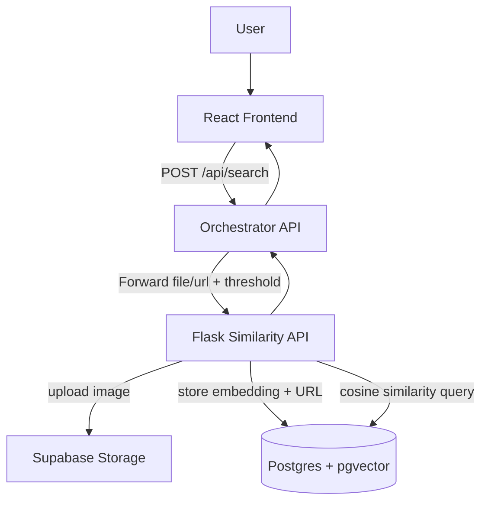
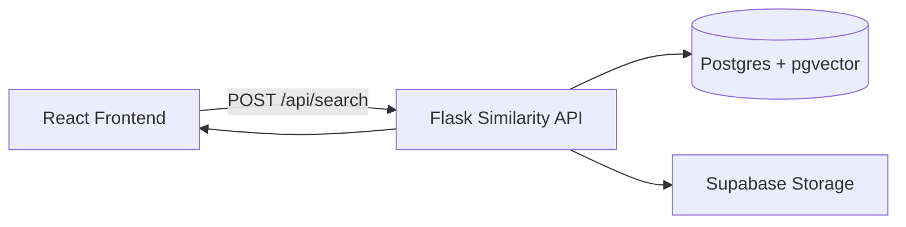
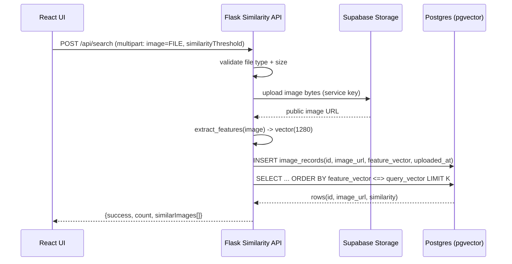
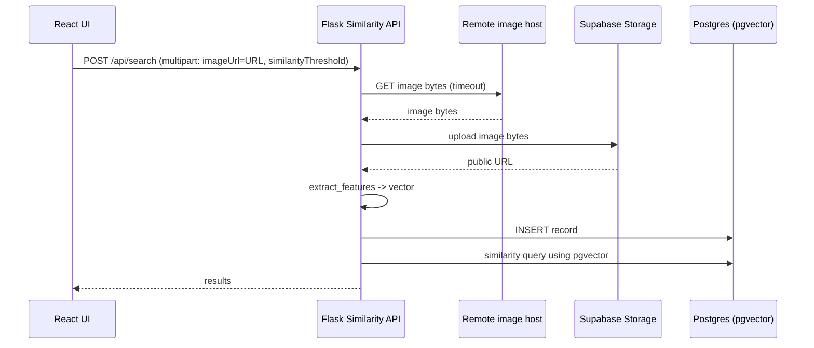
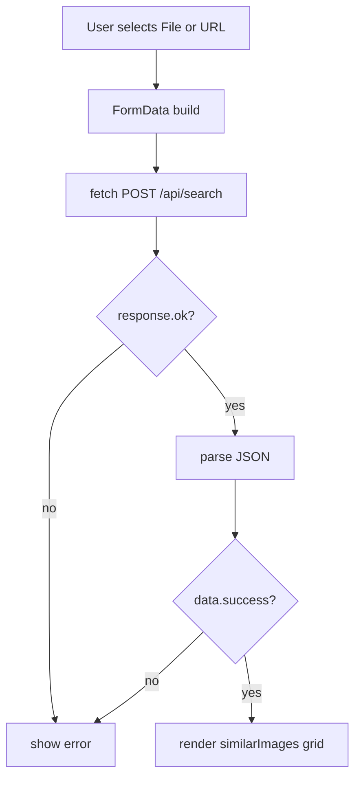
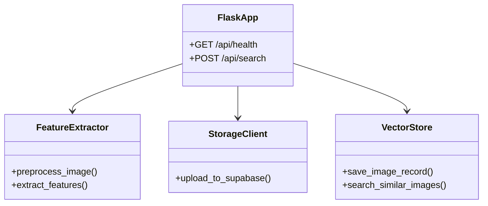
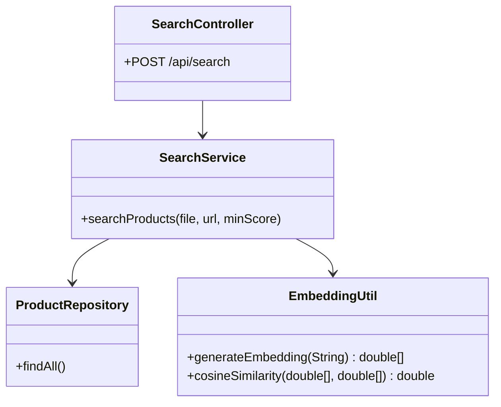
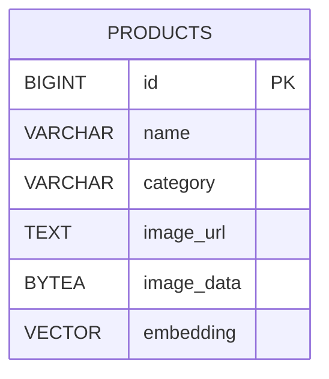

# Visual Product Matcher — End‑to‑End Architecture (HLD + LLD) + Flows + Senior Cross‑Questions (Interview Pack)

## Table of contents
- [1. What this assignment is](#1-what-this-assignment-is)
- [2. Repo structure](#2-repo-structure)
- [3. Tech stack](#3-tech-stack)
- [4. High level design (HLD)](#4-high-level-design-hld)
- [5. End-to-end flows](#5-end-to-end-flows)
- [6. Low level design (LLD)](#6-low-level-design-lld)
- [7. Data model (pgvector)](#7-data-model-pgvector)
- [8. Deployment (Docker) + local run](#8-deployment-docker--local-run)
- [9. Key design decisions + tradeoffs (what seniors probe)](#9-key-design-decisions--tradeoffs-what-seniors-probe)
- [10. Senior cross‑questions + strong fresher answers](#10-senior-cross-questions--strong-fresher-answers)
- [11. 90‑second pitch (memorize)](#11-90-second-pitch-memorize)

---

## 1. What this assignment is

**Visual Product Matcher** is an image similarity search assignment: users upload an image (or provide an image URL) and the system returns the most visually similar product images with similarity scores.

This repo contains **three pieces**:

1. **`frontend/`**: React (Vite) UI that collects input (file/URL + similarity threshold) and calls `POST /api/search`.
2. **`embed-aap/`**: Python Flask microservice that:
   - accepts file or URL
   - extracts a fixed-size feature vector (**default 1280-dim**)
   - stores the image and embedding (Supabase storage + Postgres/pgvector)
   - runs cosine similarity search using pgvector
   - returns `{ success, count, similarImages[] }`
3. **`backend/`**: Spring Boot service with `GET /api/products` and `POST /api/search` that currently uses a **placeholder embedding** (`EmbeddingUtil` generates deterministic random vectors) and compares against products from DB.

### Important interview reality
The **frontend response handling** is aligned with the **Flask API response shape** (`success/count/similarImages`), and the top-level `API.md` documents the Flask service. So, in practice, the system is meant to run as:

- **Frontend → Flask API** (directly), or
- **Frontend → Spring Boot orchestrator → Flask API** (intended in README), but the Java code in this repo currently does **not** call Flask yet.

In an interview, you can confidently present the **target architecture** (Frontend → Spring Orchestrator → Flask/Vector Search) and also be honest about what’s implemented vs. stubbed in this assignment version.

---

## 2. Repo structure

```
Visual-Product-Matcher/
├── frontend/                 # React + Vite UI
├── embed-aap/                # Flask similarity API + pgvector + Supabase
├── backend/                  # Spring Boot (products + placeholder search)
├── README.md
└── API.md                    # Flask API cURL examples
```

---

## 3. Tech stack

### Frontend
- React 19 + Vite
- Tailwind CSS
- Fetch API (multipart form upload)

### Similarity service (Python)
- Flask + flask-cors
- Pillow + NumPy (image preprocessing + feature extraction)
- Postgres + `pgvector` via `pgvector.psycopg2`
- Supabase Storage (image hosting via REST)
- Gunicorn for production serving

### Backend (Java)
- Java 17, Spring Boot 3.3.x
- Spring Web + Spring Data JPA + validation
- PostgreSQL driver

---

## 4. High level design (HLD)

### 4.1 Target architecture (what you should draw)



### 4.2 Implemented runtime (in this repo)



This is consistent with `API.md` and the frontend expecting `success/count/similarImages`.

---

## 5. End-to-end flows

### 5.1 Flow A — Search by **uploading a file**



### 5.2 Flow B — Search by **image URL**



### 5.3 Similarity math (what to say)
- The Flask service stores normalized vectors and uses **cosine distance** via pgvector’s `<=>`.
- Similarity is computed as:

\[
similarity = 1 - cosine\_distance(query, stored)
\]

Then it filters `similarity >= similarityThreshold`.

---

## 6. Low level design (LLD)

### 6.1 Frontend LLD (key points)
- UI supports two input modes:
  - file upload (`image`)
  - URL input (`imageUrl`)
- Sends `FormData` to `${VITE_BACKEND_URL}/api/search` and passes `similarityThreshold`.
- Renders results as cards: `imageUrl + similarityScore%`.



### 6.2 Flask API LLD (main modules)

**Core functions**
- `extract_features(image_bytes)`:
  - resize to 224×224
  - convert to RGB float array
  - compute mean+std over an 8×8 grid for each channel
  - pad/trim to 1280 dims
  - L2 normalize
- `upload_to_supabase(image_bytes, filename)` → public URL
- `save_image_record(url, vector)` → INSERT into DB
- `search_similar_images(vector, threshold, max_results)` → SELECT with pgvector distance



### 6.3 Spring Boot backend LLD (what exists)

The Java service has:
- `GET /api/products` → returns all `Product` rows via `JpaRepository`
- `POST /api/search` → returns a list of `SearchResponse` (product metadata + similarityScore)

**Current limitation**: `EmbeddingUtil` generates a deterministic random vector from the **filename/url string**, not from image pixels. This is a placeholder technique for scaffolding.



---

## 7. Data model (pgvector)

### 7.1 Flask DB table (`image_records`)
The Flask service writes to a table called `image_records` (see `embed-aap/app.py` SQL).

At minimum it needs:
- `id` (uuid)
- `image_url` (text)
- `feature_vector` (vector(1280))
- `uploaded_at` (timestamp)

### 7.2 Spring schema (`products`)
`backend/src/main/resources/schema.sql` defines:
- `products.embedding VECTOR(10)`

This is consistent with the placeholder Java embedding length (10), but it’s different from the Flask service’s 1280-d vectors. In interviews, explain this as “assignment scaffolding vs production target”.



### 7.3 Similarity query (pgvector)

```sql
SELECT id, image_url,
       (1 - (feature_vector <=> :query_vector)) AS similarity
FROM image_records
WHERE (1 - (feature_vector <=> :query_vector)) >= :threshold
ORDER BY feature_vector <=> :query_vector
LIMIT :k;
```

---

## 8. Deployment (Docker) + local run

### 8.1 Flask service (Docker)
`embed-aap/docker-compose.yml` runs the API on port **8081** and expects env vars:
- `DATABASE_URL`
- `SUPABASE_URL`
- `SUPABASE_SERVICE_KEY`
- `SUPABASE_BUCKET`

### 8.2 Frontend
Frontend uses `VITE_BACKEND_URL` and posts to `${VITE_BACKEND_URL}/api/search`.

### 8.3 Suggested local run order
- Start Postgres with pgvector (or Supabase hosted Postgres)
- Run Flask API (Docker Compose or `python app.py`)
- Run frontend (`npm install` then `npm run dev`) with `VITE_BACKEND_URL` pointing to Flask

---

## 9. Key design decisions + tradeoffs (what seniors probe)

- **Why separate Flask ML service from Java?**
  - Python ecosystem fits image processing better; independent scaling; swap feature extractor later (e.g., CLIP) without touching UI.

- **Why pgvector in Postgres vs a dedicated vector DB?**
  - Lower infra overhead; good enough at small/medium scale; easy transactional metadata + vectors together.
  - Tradeoff: at very large scale, you’d consider specialized ANN indexes and vector stores.

- **Why store images in Supabase not DB?**
  - Keeps DB lean; image storage is cheaper and optimized; DB holds URLs + vectors.

- **What are the bottlenecks?**
  - feature extraction time (CPU), DB similarity scan/index, image upload latency, cold start of free hosting.

- **Data quality & duplicates**
  - every search inserts a new record; in production you’d dedupe by content hash or by URL to avoid bloating.

---

## 10. Senior cross‑questions + strong fresher answers

### Architecture / flows
- **Q: Explain the full end-to-end flow in 60 seconds.**
  - **A:** The user uploads an image or provides an image URL. The frontend sends a multipart request to the similarity API with a similarity threshold. The API validates the image, uploads it to storage, extracts a fixed-size feature vector, stores the vector and URL in Postgres with pgvector, then runs a cosine similarity query to retrieve top matches above the threshold and returns them to the frontend.

- **Q: Why do you compute `1 - (vector <=> query)`?**
  - **A:** `<=>` gives cosine distance. `1 - distance` converts it to a similarity score in \([0,1]\) where higher is more similar.

### Feature extraction
- **Q: What embedding model are you using?**
  - **A:** In this assignment version, I used a lightweight handcrafted embedding: mean and standard deviation of RGB values over an 8×8 grid. It’s deterministic, fast, and produces a fixed 1280-d vector. In production I’d switch to a pretrained model like CLIP/ResNet for semantic similarity.

- **Q: What are the limitations of handcrafted features?**
  - **A:** They capture low-level texture/color patterns but miss high-level semantics. Two different products with similar colors can match incorrectly; two same products in different lighting might score lower. Deep embeddings improve that.

### Data & storage
- **Q: Why store images in Supabase and not in Postgres?**
  - **A:** Images are large binaries; object storage is cheaper and optimized. Postgres stores the URL + embedding + metadata, which keeps queries fast.

- **Q: Your API saves every searched image—won’t the DB grow fast?**
  - **A:** Yes. In a production design, I’d add deduplication using content hashes, retention policies, or separate “query images” table with TTL.

### Performance / scaling
- **Q: How would you scale similarity search to millions of vectors?**
  - **A:** Use pgvector indexes (e.g., HNSW/IVFFLAT depending on setup), tune `k` and threshold, and consider moving to a dedicated vector DB if needed. Also precompute embeddings and use async processing for uploads.

- **Q: What’s your latency budget and where is time spent?**
  - **A:** Mostly in image download/upload and feature extraction; then DB similarity query. We can cache repeated URLs, compress images, and use faster inference (GPU) if using deep embeddings.

### Reliability / security
- **Q: What can go wrong with URL search?**
  - **A:** Broken URLs, non-image content, very large files, slow servers. I handle timeouts, validate extensions, and enforce max size; in production I’d also validate MIME type from headers/content.

- **Q: Any security concerns?**
  - **A:** Protect storage keys (service key must be secret), validate uploads, rate-limit search endpoint, and avoid SSRF risks by restricting URL fetching or proxying safely.

---

## 11. 90-second pitch (memorize)

This assignment is a visual similarity search system. The React frontend lets a user upload an image or paste an image URL and set a similarity threshold. The backend similarity API is a Flask service: it validates the image, uploads it to object storage, extracts a fixed-size embedding vector, stores it in Postgres using pgvector, and runs a cosine similarity query directly in the database to return the most similar images with scores. The key design choice is separating the ML/image pipeline into Python while keeping the system modular so the feature extractor can later be swapped from handcrafted embeddings to a pretrained model like CLIP without changing the UI contract.

