# LHCA Interview Master Document (End-to-End)

This document is your interview-ready walkthrough for the LHCA internship project.  
It covers frontend, backend, architecture, system design (HLD + LLD), critical flows, deployment, and deep interview questions.

---

## 1) 60-Second Project Pitch

LHCA is a multi-tenant SaaS platform for healthcare learning organizations.  
It uses:
- Flutter Web portals for different personas (Platform Owner, Admin, Instructor, Learner)
- Spring Boot microservices on the backend
- API Gateway + Eureka discovery
- Database-per-service PostgreSQL pattern
- Billing/subscription with pluggable payment gateways
- Notification and audit services
- Docker-based deployment, with EC2/ECS-compatible architecture

Business value:
- Centralized learning operations for multiple organizations
- Subscription-led monetization
- Scalable microservice architecture for independent feature growth

---

## 2) What You Should Say About Your Contribution (Important)

You should be explicit and honest:

- Primary hands-on area: **HubSpot integration (two-way sync)**
- Secondary exploration: **AWS deployment concepts and setup** (S3, RDS, EC2, IAM, Docker Compose deployment path)
- You also explored surrounding modules to understand full platform behavior and service interactions.

Sample positioning:
> "I did not build every module end-to-end myself; senior engineers built major core services. My primary ownership was HubSpot two-way sync and AWS deployment exploration. I can still explain the full architecture and key flows because I traced service interactions and integration points."

This answer increases credibility and maturity.

---

## 3) High-Level Architecture (HLD)

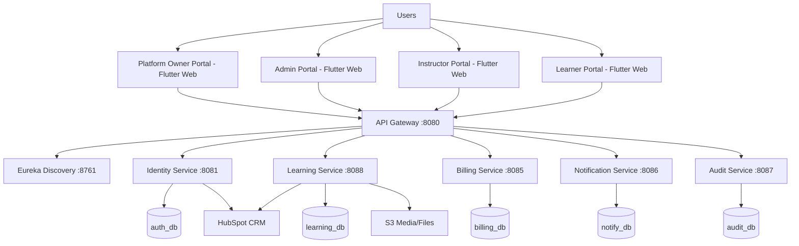

### HLD Principles
- **API Gateway as single entry point** (routing, central auth enforcement patterns)
- **Service discovery with Eureka**
- **Database per service** for bounded context ownership
- **Asynchronous/decoupled integrations** for external systems (HubSpot, notifications)
- **Containerized deployability** via Docker Compose and cloud migration path

---

## 4) Frontend Architecture

The system has role-specific Flutter Web portals:
- `Client/Platform_Owner`: orgs, billing, subscriptions, payment config
- `Client/Admin_Instructor`: admin operations, course/user/category ops
- `Client/Instructor`: course delivery and learner progress workflows
- `Client/Learner`: catalog, enrollments, progress, certificates

Common frontend patterns:
- Provider for state management
- GoRouter for route-level navigation
- API client wrapper for JWT auth calls
- Shared UI/theme/constants approach

Typical frontend data path:

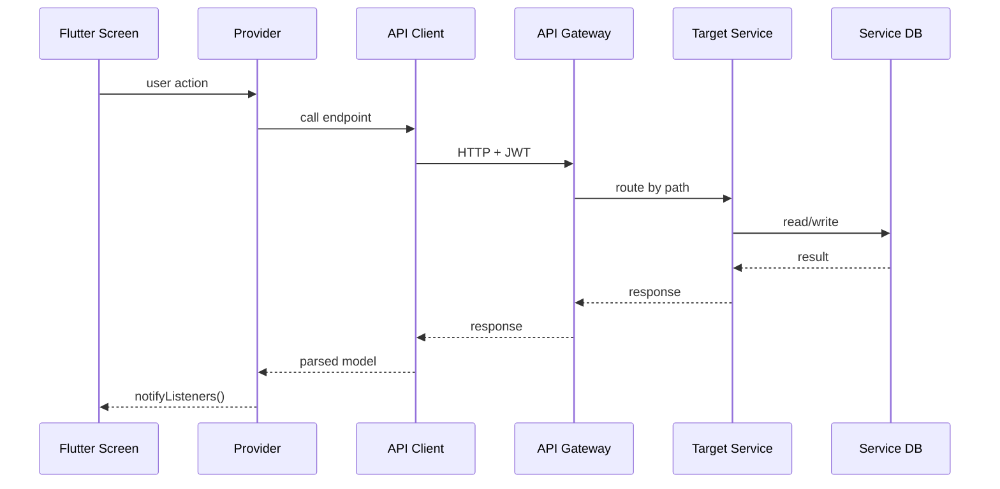

---

## 5) Backend Service Responsibilities

## `api-gateway`
- Single public ingress (`:8080`)
- Routes requests to microservices

## `iedeo-discovery`
- Eureka registry (`:8761`)
- Enables dynamic service location

## `iedeo-identity`
- Registration/login/token refresh
- Role and organization identity context
- CRM trigger points (HubSpot)

## `iedeo-learning`
- Courses, modules, lessons, enrollments, progress, quizzes/reviews
- S3 pre-signed URL logic for content/media
- HubSpot sync entities/jobs also exist here

## `iedeo-billing`
- Plans, subscriptions, payments, invoices
- Subscription group constraints and stats
- Payment gateway abstraction

## `iedeo-notify`
- Email/push notifications

## `iedeo-audit`
- Audit trail capture

---

## 6) Core Data Ownership (LLD View)

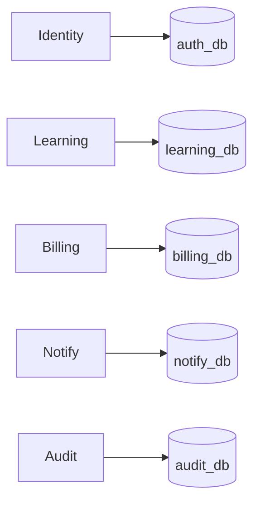

Key design point:
- No shared DB tables across services (reduced coupling, clearer ownership)

Trade-off:
- Cross-service reporting needs APIs/events instead of SQL joins

---

## 7) Security Model (JWT + Role-Based Access)

1. User authenticates via Identity APIs.
2. JWT issued (with user/role/org context).
3. Client sends JWT in `Authorization: Bearer <token>`.
4. Gateway/service security filters validate token.
5. Endpoint-level role checks enforce authorization.

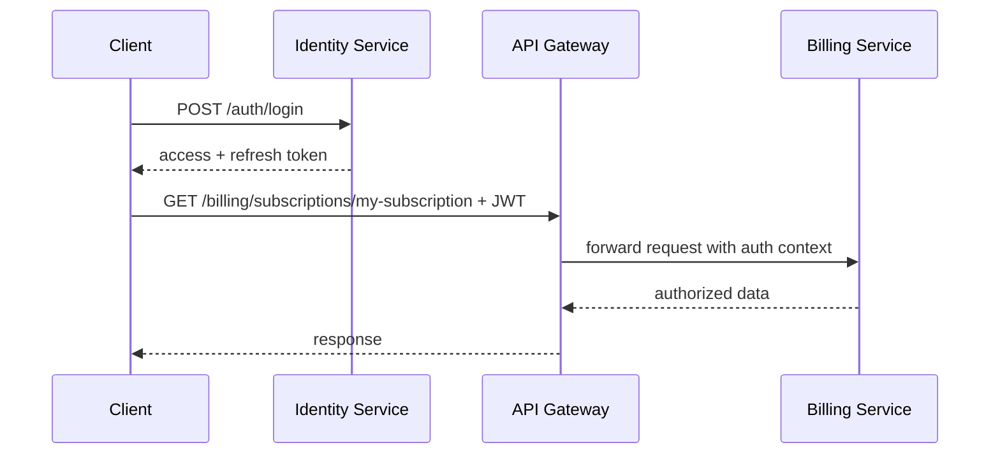

---

## 8) Critical Product Flows (End-to-End)

## Flow A: Registration + CRM Sync

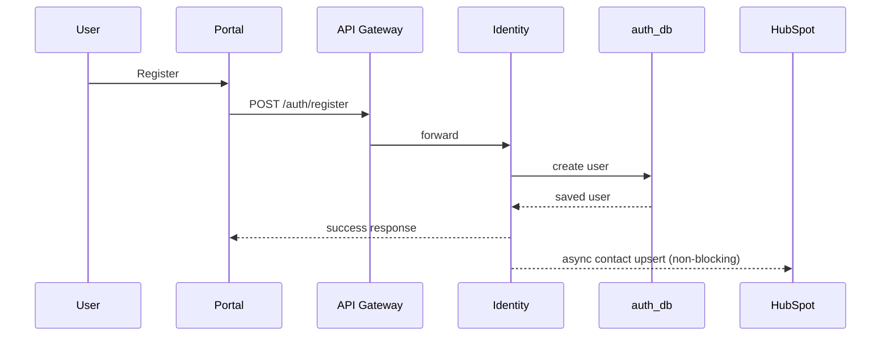

Interview point:
- HubSpot must not block registration. Failures should be retried/logged.

## Flow B: Org Subscription Lifecycle

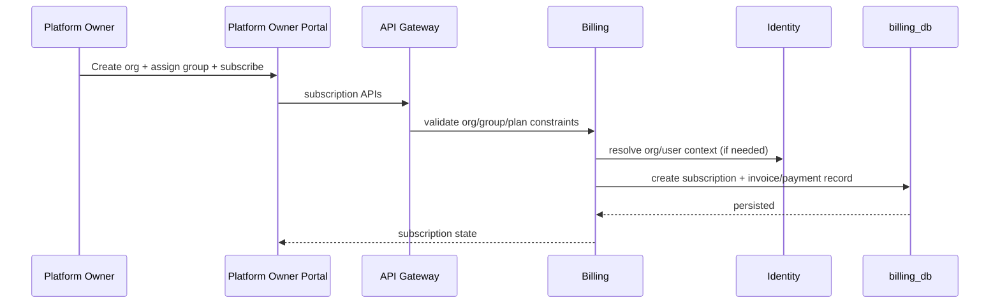

Important bug-learning (real example):
- If API returns only ACTIVE subscription, dashboard may show "No subscription" for other valid states.
- Better behavior: prefer ACTIVE, fallback to latest existing record for visibility.

## Flow C: Course Creation to Learner Consumption

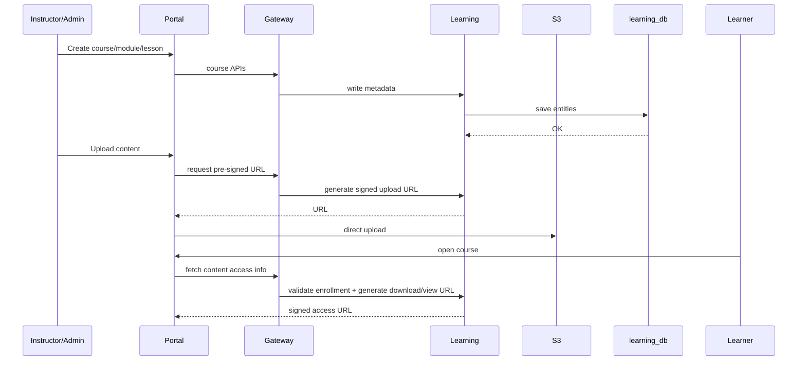

## Flow D: Payment + Enrollment + Progress

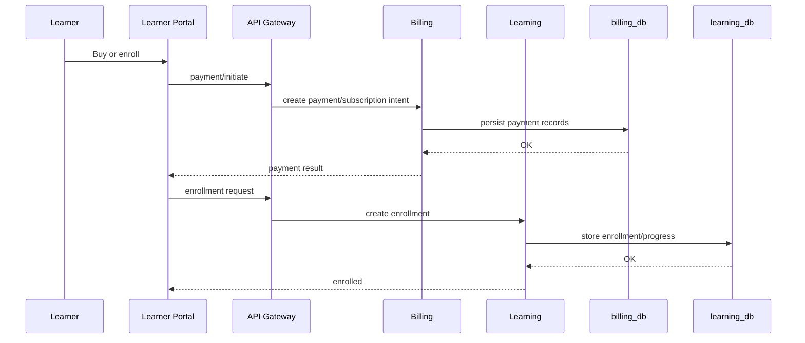

## Flow E: Notifications + Audit

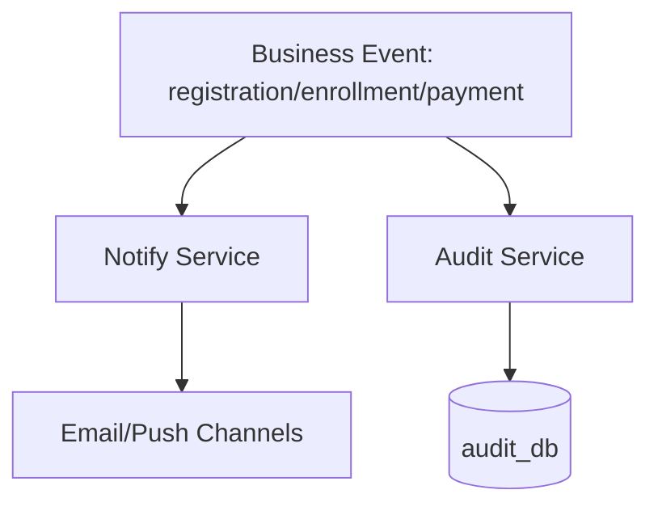

---

## 9) LLD: Service Internal Layering Pattern

Typical service structure:
- `api/controller`: REST endpoints
- `app/usecase` or `application/service`: business logic
- `domain/model`: entities/enums/domain rules
- `infra/persistence`: JPA entities/repositories/adapters
- `infra/config/security`: JWT/security setup

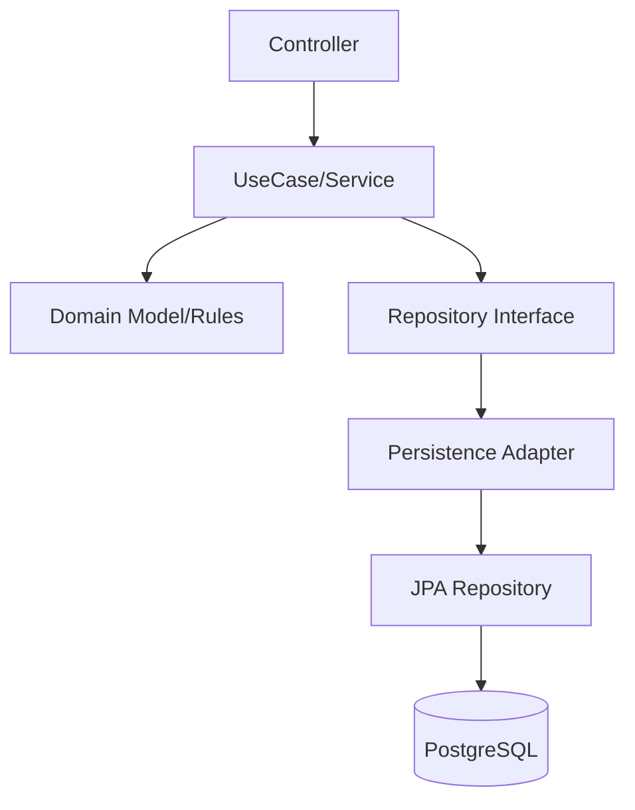

Why interviewers like this:
- Clean separation of concerns
- Easy unit testing with mocked repositories
- Domain logic not tied to framework details

---

## 10) HubSpot Two-Way Sync Deep Dive (Your Main Area)

From project notes and code layout:
- Identity has CRM adapter-style integration points for user sync.
- Learning has HubSpot-related entities/controllers/services, suggesting richer sync workflows.

### Practical two-way pattern

1. **LHCA -> HubSpot**
   - On user registration/profile update/enrollment, send upsert to HubSpot.
   - Use unique key (email or external id) for idempotent updates.

2. **HubSpot -> LHCA**
   - Webhook/subscription receives HubSpot events (contact updates, access changes).
   - Validate signature/authenticity.
   - Store job/event state in DB.
   - Apply domain changes safely (retryable/idempotent).

### Recommended reliability design
- Outbox/retry job table for failed pushes
- Exponential backoff
- Dead-letter for poison events
- Correlation IDs in logs

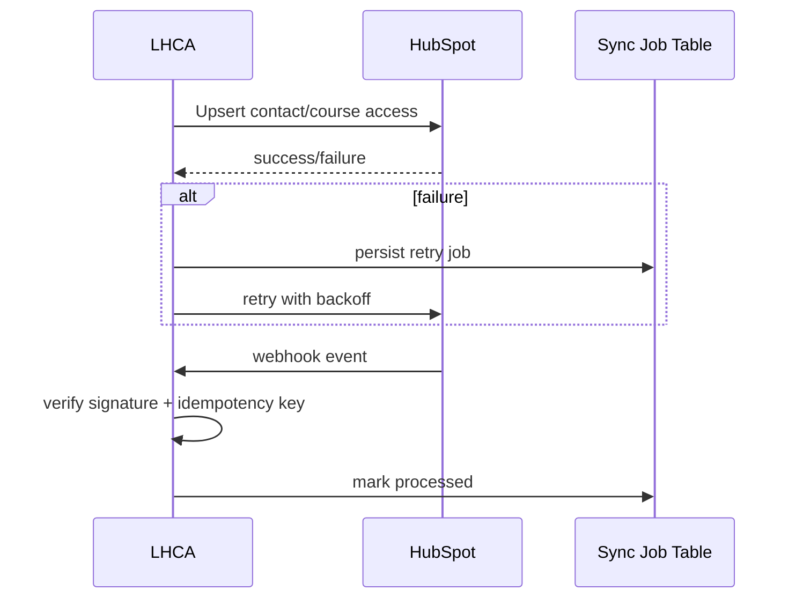

Interview-ready statement:
> "My focus was integration robustness: non-blocking API behavior, idempotent sync, retry strategy, and safe inbound event handling."

---

## 11) Deployment/System Design (AWS + Containers)

Current practical path observed:
- Docker Compose with all microservices + PostgreSQL instances
- EC2 deployment path for quick full-stack bring-up

Target cloud-ready architecture:

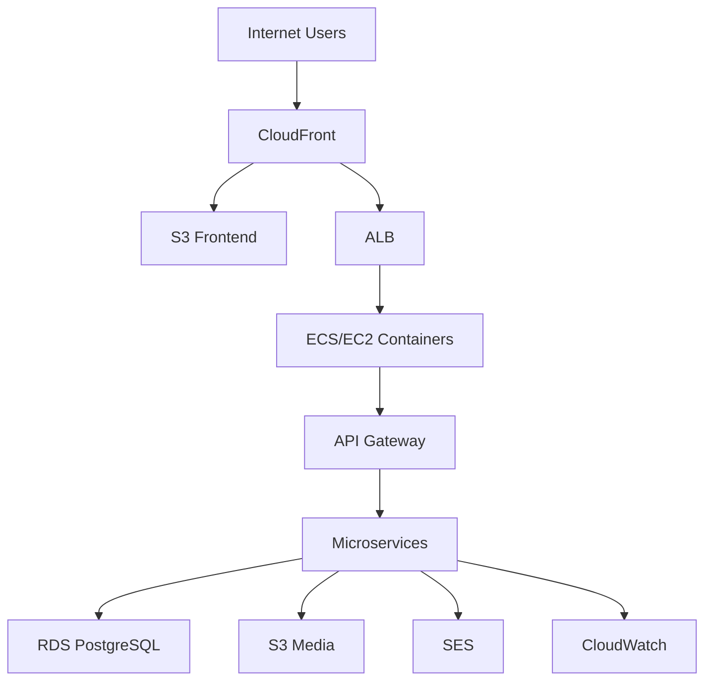

### AWS services you can discuss confidently
- **EC2**: host containers for early-stage deployment
- **RDS PostgreSQL**: managed DB, backups, patching
- **S3**: media/file storage
- **IAM**: least-privilege roles for app/services
- **CloudFront/ALB**: performance + entry routing

### Production hardening checklist
- Secrets moved from compose env to Secrets Manager/SSM
- Private subnets for DB
- WAF/rate limiting
- Observability dashboards + alerts
- CI/CD and rolling deployments

---

## 12) Key Non-Functional Requirements

- **Scalability**: independent service scaling (e.g., learning/billing)
- **Reliability**: retries + health checks + restart policies
- **Security**: JWT, RBAC, secret management, network isolation
- **Maintainability**: bounded contexts, layered services
- **Observability**: logs/metrics/alerts

---

## 13) Trade-offs and Design Decisions

## Why microservices?
- Team autonomy and domain separation
- Independent deployability
- Clear ownership boundaries

Cost:
- More DevOps complexity and distributed debugging overhead

## Why DB-per-service?
- Loose coupling and schema autonomy
- Prevents cross-service accidental tight joins

Cost:
- Harder global reporting and transaction orchestration

## Why gateway + discovery?
- Centralized routing and cross-cutting policies
- Service endpoint abstraction

Cost:
- Additional components to monitor and operate

---

## 14) Risks and Improvement Roadmap

1. **Config/Secrets hygiene**
   - Move credentials to secret stores
2. **Resilience**
   - Circuit breakers/timeouts/fallbacks
3. **Async architecture**
   - Event bus for cross-service workflows
4. **Data/analytics**
   - Reporting pipeline for cross-service insights
5. **Security**
   - API rate limiting, stricter IAM, audit correlation

---

## 15) Senior Interview Cross-Questions with Detailed Answers

## A) Architecture and Design

### Q1. Why did the platform choose microservices instead of a monolith?
**Answer:**  
Because modules (identity, learning, billing, notifications, audit) evolve at different velocity and scale. Microservices isolate failure domains and allow independent deployments. The trade-off is operational complexity (service discovery, distributed tracing, inter-service auth).

### Q2. What does API Gateway solve here?
**Answer:**  
It provides a single ingress, route abstraction, and a place for cross-cutting concerns (auth validation, request filtering, standardized API surface). It hides internal service topology from clients.

### Q3. Why use database-per-service?
**Answer:**  
To preserve domain ownership and avoid coupling by shared schema. It supports independent migration/versioning. Cross-service reports require API composition or event-driven materialized views.

### Q4. How do you handle distributed transactions?
**Answer:**  
Prefer eventual consistency and compensating actions. For example, billing success and enrollment should be coordinated with idempotent retries and reconciliation logic rather than 2PC.

### Q5. How would you evolve discovery from Eureka in AWS?
**Answer:**  
Use ECS service discovery / Cloud Map + internal DNS, keeping gateway routing stable. Eureka can be retained initially, then phased out if platform-native discovery becomes primary.

## B) Backend and APIs

### Q6. How is authentication and authorization implemented?
**Answer:**  
Identity issues JWT tokens. Services validate tokens and enforce role-based endpoint restrictions (e.g., platform owner vs organization owner/admin).

### Q7. How do you make external integrations non-blocking?
**Answer:**  
Critical user path (e.g., registration) commits locally first, then triggers async integration call. Failures are logged and retried out-of-band.

### Q8. How do you ensure idempotency in HubSpot sync?
**Answer:**  
Use deterministic identity (email/external id), maintain sync job state with unique event keys, and ignore duplicate webhooks by idempotency key checks.

### Q9. What is your retry strategy?
**Answer:**  
Exponential backoff with max attempts + dead-letter handling. Capture failure reason and correlation ID so retries are observable and debuggable.

### Q10. How would you avoid cascading failures across services?
**Answer:**  
Timeouts, bulkheads, circuit breakers, fallback responses, and queue-based decoupling for non-critical workflows.

## C) Data and Performance

### Q11. How do you optimize dashboard APIs?
**Answer:**  
Use targeted read models, avoid N+1 ORM patterns, and keep payloads compact. For frequently requested aggregates, precompute or cache with clear invalidation.

### Q12. If learning traffic spikes, what scales first?
**Answer:**  
Learning service replicas and read-heavy DB resources, plus CDN/S3 tuning for media. Gateway and identity scale if auth traffic also rises.

### Q13. How do you design audit logging?
**Answer:**  
Write immutable event records with actor, action, timestamp, entity id, and request correlation id. Keep audit queryable but append-only.

## D) DevOps and AWS

### Q14. Why start with EC2 + Docker Compose before ECS?
**Answer:**  
Faster initial delivery and lower cognitive overhead for small teams. Once workloads stabilize, migrate to ECS for better scaling and managed operations.

### Q15. What IAM principle matters most here?
**Answer:**  
Least privilege. Each compute unit gets only required permissions (S3 read/write for specific bucket prefixes, not wildcard full account access).

### Q16. How do you secure RDS?
**Answer:**  
Private subnet, security group allows only app SG, encrypted storage, backups enabled, rotation of credentials, no public exposure.

### Q17. How do you store secrets in production?
**Answer:**  
Secrets Manager/Parameter Store + task roles, never hardcoded in images or committed compose files.

## E) HubSpot-Specific (Your Strong Area)

### Q18. Explain your two-way sync design in practical terms.
**Answer:**  
Outbound events from LHCA upsert HubSpot entities; inbound HubSpot webhooks are validated and mapped back into LHCA domain changes. A sync-job table tracks status and retries.

### Q19. How do you resolve conflicts between LHCA and HubSpot updates?
**Answer:**  
Define source-of-truth per field. Use timestamps/versioning and domain precedence rules; log conflict decisions for traceability.

### Q20. How do you test HubSpot integration safely?
**Answer:**  
Use sandbox/test account, mock HTTP for unit tests, integration tests against test endpoints, and replayable webhook payload fixtures.

## F) Behavioral + Ownership

### Q21. You said seniors built most modules. How do you still claim impact?
**Answer:**  
I focus on measurable outcomes in my owned area (HubSpot reliability and AWS deployment readiness) and show architectural understanding through traced flows and concrete improvements.

### Q22. Tell me one bug and your fix.
**Answer:**  
A subscription visibility issue where org dashboard showed no subscription if status was not ACTIVE. Fix was to prefer ACTIVE but fallback to existing org subscription record for display.

### Q23. What would you improve first if given 2 more weeks?
**Answer:**  
Observability for integrations (structured logs + metrics + alerts), secret management hardening, and explicit idempotency/retry framework standardization.

---

## 16) Interview Cheat Sheet (How to Answer Clearly)

Use this answer pattern:
1. **Context**: "In LHCA, we have X services and Y requirement."
2. **Decision**: "We chose approach A because..."
3. **Trade-off**: "The downside is..."
4. **Mitigation**: "We handled that by..."
5. **Outcome**: "This improved reliability/scalability/security by..."

Example:
> "For CRM sync, we made the call asynchronous so registration latency stays low. Trade-off is eventual consistency, mitigated with retries and idempotency. Outcome: user signup remains responsive even if HubSpot is slow."

---

## 17) Final Prep Plan for Tomorrow

1. Memorize sections 1, 2, 3, 8, 10, 11.
2. Practice 10 questions from section 15 aloud.
3. Keep honesty line ready about your ownership scope.
4. Be ready to whiteboard:
   - architecture diagram
   - registration + HubSpot flow
   - subscription flow
   - AWS deployment topology

---

If you want, I can next create a **mock interview script** (interviewer + your spoken answers) from this exact doc so you can practice in 30–45 minutes tonight.

